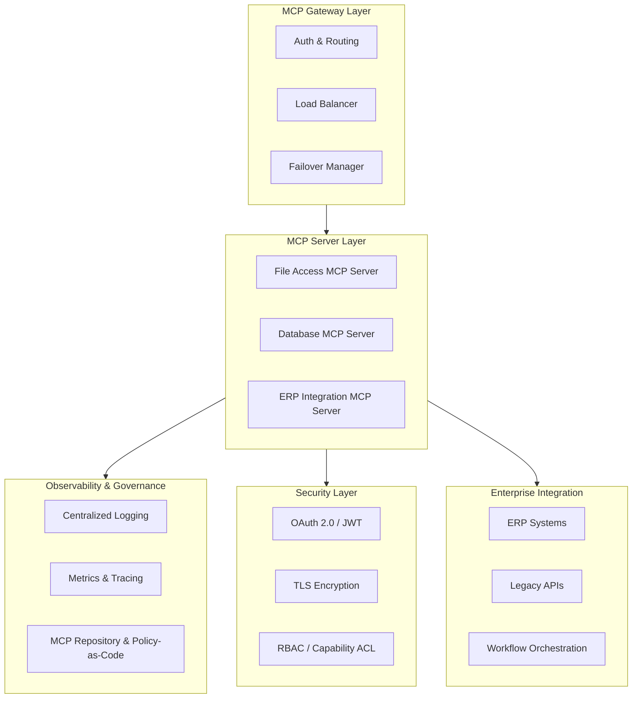
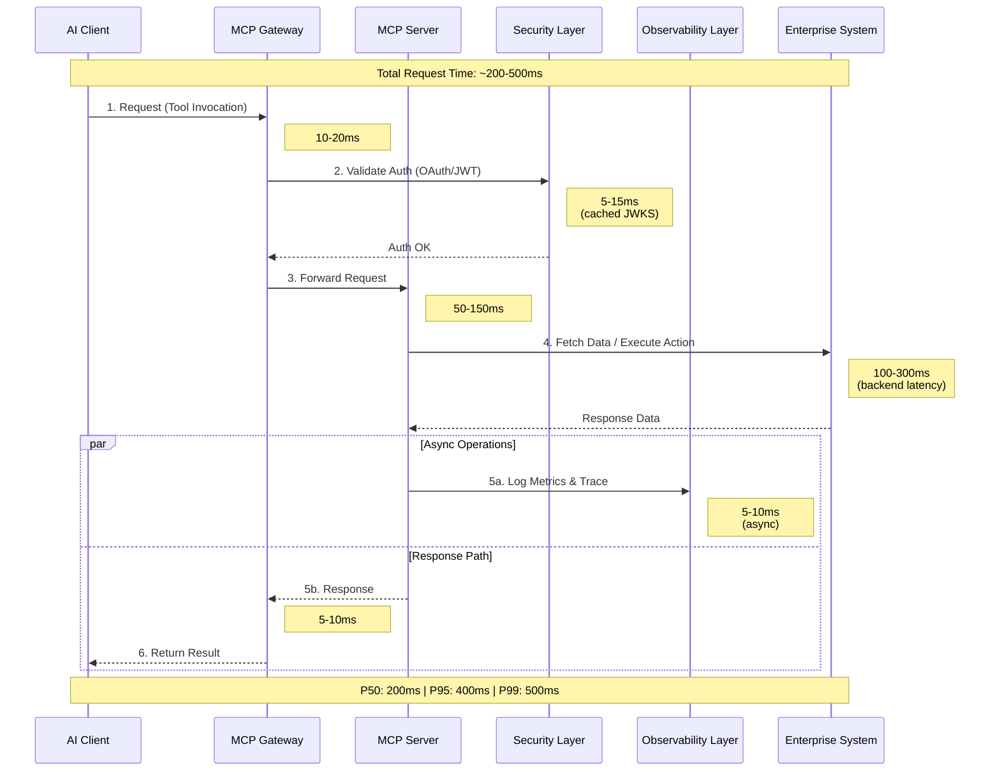
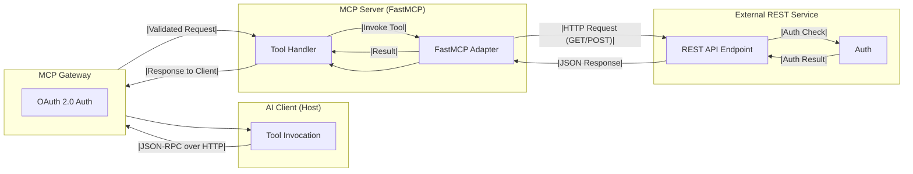
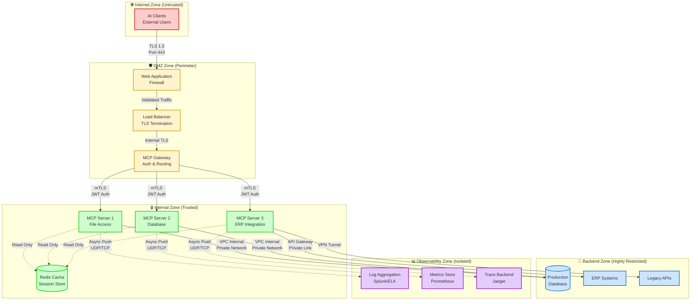

# Architecture Overview

**Navigation**: [Home](../README.md) > Core Architecture > Architecture Overview  
**Related**: [Next: Architecture Decisions →](01b-architecture-decisions.md) | [Security Architecture →](02-security-architecture.md) | [Quick Reference](99-quick-reference.md)

**Version:** 1.3.0  
**Last Updated:** November 19, 2025  
**Status:** Draft

## Introduction

This document provides a comprehensive overview of the enterprise MCP (Model Context Protocol) server architecture. It establishes the foundational patterns and components that enable secure, scalable, and maintainable agentic services.

## Executive Summary

### Key Highlights

This architecture guide covers the complete lifecycle of enterprise MCP server development, from design through deployment and operations. Key highlights include:

**Architecture & Design:**

- Five-layer enterprise architecture (Gateway, Server, Security, Observability, Integration)
- FastMCP framework integration for rapid server development
- Support for multiple communication protocols (JSON-RPC over HTTP, SSE)
- Flexible deployment models: centralized gateway and federated servers

**Security & Compliance:**

- Multi-layered security with OAuth 2.0/JWT authentication and TLS encryption
- Fine-grained authorization (RBAC and capability-based access control)
- Comprehensive data privacy controls (PII detection, masking, retention policies)
- GDPR, CCPA, and HIPAA compliance patterns

**Implementation Standards:**

- **Tools**: Action-oriented APIs with consistent naming conventions and error handling
- **Prompts**: User-controlled workflow templates with dynamic parameter completion
- **Resources**: Application-driven data access with URI templates and subscriptions
- **Sampling**: Server-initiated LLM interactions with structured output patterns

**Quality & Operations:**

- Four-tier testing strategy (unit, integration, contract, end-to-end)
- Comprehensive observability (structured logging, distributed tracing, custom metrics)
- Automated CI/CD pipelines with security scanning and quality gates
- Production runbooks for common operational scenarios

**Scalability & Performance:**

- Horizontal scaling with session affinity and distributed caching
- Performance optimization patterns (connection pooling, lazy loading, pagination)
- High availability through redundancy and graceful degradation
- Multi-region deployment strategies for global distribution

### Document Organization

The guide is structured as follows:

1. **Architecture Layers** (Sections 1-2): Core architectural patterns and decision records
2. **Security & Privacy** (Sections 2-2a): Authentication, authorization, and compliance frameworks
3. **Implementation** (Sections 3-3c): Detailed standards for tools, prompts, resources, and sampling
4. **Quality Assurance** (Sections 4-5): Testing strategies and observability patterns
5. **Development & Deployment** (Sections 6-7): Lifecycle management and deployment patterns
6. **Operations & Integration** (Sections 8-10): Runbooks, integration patterns, and best practices

### Target Audience

- **Architects**: Enterprise patterns, scaling strategies, and deployment models
- **Developers**: Implementation standards, code examples, and testing approaches
- **Security Teams**: Authentication, authorization, and compliance requirements
- **DevOps Engineers**: CI/CD pipelines, deployment automation, and monitoring
- **Operations Teams**: Runbooks, troubleshooting guides, and incident response

## Enterprise MCP Architecture Layers

The enterprise MCP architecture is organized into five primary layers, each serving distinct responsibilities while maintaining clear boundaries and interfaces.



### Layer Descriptions

#### 1. MCP Gateway Layer

The gateway layer serves as the entry point for all MCP requests, providing:

- **Authentication & Routing**: Validates credentials and routes requests to appropriate servers
- **Load Balancing**: Distributes traffic across multiple server instances
- **Failover Management**: Handles server failures and maintains high availability

**Key Responsibilities:**

- TLS termination
- Request validation
- Rate limiting (global tier)
- Request correlation ID generation
- Circuit breaker coordination

#### 2. MCP Server Layer

Individual MCP servers expose tools, resources, and prompts for specific domains:

- **Specialized Servers**: Each server focuses on a specific integration or capability
- **Tool Handlers**: Implement the business logic for MCP tools
- **Resource Providers**: Expose data and content through resource URIs
- **Prompt Systems**: Provide reusable prompt templates for LLM interactions

**Common Server Types:**

- File system access servers
- Database query servers
- API integration servers
- Workflow orchestration servers
- Analytics and reporting servers

#### 3. Security Layer

Cross-cutting security controls applied to all requests:

- **OAuth 2.0 / JWT**: Token-based authentication
- **TLS Encryption**: End-to-end encryption in transit
- **RBAC**: Role-based access control for tools and resources
- **Capability ACL**: Fine-grained permissions per operation

#### 4. Observability & Governance

Monitoring, logging, and policy enforcement:

- **Centralized Logging**: Structured logs aggregated from all servers
- **Metrics & Tracing**: Performance monitoring and distributed tracing
- **MCP Repository**: Catalog of available servers, tools, and resources
- **Policy-as-Code**: Automated enforcement of governance policies

#### 5. Enterprise Integration

Connections to backend systems:

- **ERP Systems**: Integration with enterprise resource planning
- **Legacy APIs**: Adapters for existing internal APIs
- **Workflow Orchestration**: Coordination across multiple systems

### When to Use Each Layer

Use this decision table to determine which architectural layer is appropriate for your component:

| Concern | Gateway Layer | Server Layer | Security Layer | Observability Layer | Integration Layer |
|---------|--------------|--------------|----------------|---------------------|-------------------|
| **Authentication** | ✅ Primary (JWT validation) | ❌ Rely on gateway | ✅ Policy enforcement | 📊 Audit logs | ❌ Not applicable |
| **Authorization** | ⚠️ Coarse-grained | ✅ Fine-grained (RBAC) | ✅ Policy decisions | 📊 Access logs | ❌ Not applicable |
| **Rate Limiting** | ✅ Global limits | ✅ Per-user limits | ❌ Not applicable | 📊 Rate metrics | ❌ Not applicable |
| **Request Routing** | ✅ Server selection | ❌ Not applicable | ❌ Not applicable | 📊 Routing metrics | ❌ Not applicable |
| **Load Balancing** | ✅ Instance distribution | ❌ Not applicable | ❌ Not applicable | 📊 Load metrics | ❌ Not applicable |
| **Tool Implementation** | ❌ Not applicable | ✅ Business logic | ⚠️ Permission checks | 📊 Tool metrics | ⚠️ Backend calls |
| **Data Transformation** | ❌ Not applicable | ✅ Response formatting | ❌ Not applicable | ❌ Not applicable | ✅ Protocol adaptation |
| **Caching** | ✅ Response cache | ✅ Data cache | ❌ Not applicable | 📊 Cache metrics | ⚠️ Backend cache |
| **Circuit Breaking** | ✅ Server health | ❌ Not applicable | ❌ Not applicable | 📊 Failure metrics | ✅ Backend protection |
| **Error Handling** | ⚠️ Gateway errors | ✅ Business errors | ⚠️ Auth errors | 📊 Error tracking | ⚠️ Integration errors |
| **Logging** | ✅ Access logs | ✅ Application logs | ✅ Security logs | ✅ Centralized storage | ✅ Integration logs |
| **Metrics Collection** | ✅ Traffic metrics | ✅ Business metrics | ✅ Security metrics | ✅ All metrics | ✅ Integration metrics |
| **TLS Termination** | ✅ Primary point | ❌ Not applicable | ✅ mTLS between layers | ❌ Not applicable | ⚠️ Backend TLS |
| **Session Management** | ✅ Session affinity | ⚠️ Stateless preferred | ❌ Not applicable | 📊 Session tracking | ❌ Not applicable |
| **API Versioning** | ✅ Version routing | ✅ Version implementation | ❌ Not applicable | 📊 Version metrics | ⚠️ Backend versioning |

**Legend:**

- ✅ Primary responsibility - implement here
- ⚠️ Shared responsibility - coordinate between layers
- ❌ Not applicable - do not implement here
- 📊 Observability concern - monitor and track

**Usage Guidelines:**

1. **Gateway Layer**: Use for cross-cutting concerns affecting all servers (auth, routing, global rate limits)
2. **Server Layer**: Use for business logic, tool implementations, and domain-specific functionality
3. **Security Layer**: Use for centralized policy enforcement and security decisions
4. **Observability Layer**: Use for monitoring, logging, and operational insights (non-blocking)
5. **Integration Layer**: Use for adapting external systems to MCP patterns

**Anti-Patterns to Avoid:**

- ❌ Business logic in gateway layer (violates separation of concerns)
- ❌ Authentication in server layer (security should be centralized)
- ❌ Synchronous logging in request path (use async observability)
- ❌ Direct database access from gateway (bypasses server abstraction)
- ❌ Heavy computation in observability layer (impacts performance)

## Request Flow Pattern

The standard request flow through the enterprise MCP architecture follows this sequence:



### Flow Steps

1. **Client Request**: AI client invokes an MCP tool with parameters
2. **Gateway Authentication**: Gateway validates JWT token and extracts claims
3. **Authorization Check**: Security layer verifies user permissions for the requested tool
4. **Request Forwarding**: Gateway routes to appropriate MCP server instance
5. **Business Logic Execution**: Server executes tool handler logic
6. **Backend Integration**: Server calls enterprise systems as needed
7. **Observability Recording**: Metrics, logs, and traces are captured
8. **Response Return**: Result flows back through gateway to client

## FastMCP Integration Pattern

FastMCP serves as the framework for implementing individual MCP servers, providing built-in support for enterprise features.

### Architecture Components



### FastMCP Key Features

**Built-in Enterprise Capabilities:**

- **Rate Limiting**: Token bucket algorithm with configurable limits
- **Caching**: Multi-tier LRU/TTL cache with statistics
- **Metrics**: OpenTelemetry-compatible metrics collection
- **Error Recovery**: Exponential backoff and retry logic
- **Authentication**: Multi-provider auth support (JWT, OAuth, WorkOS)
- **Health Checks**: Standardized health and readiness endpoints

**Configuration-Driven:**

```python
FASTMCP_CONFIG = {
    # Authentication
    "auth_enabled": True,
    "auth_provider": "jwt",
    
    # Rate Limiting
    "rate_limit_enabled": True,
    "rate_limit_requests_per_minute": 60,
    "rate_limit_burst_size": 10,
    
    # Caching
    "cache_enabled": True,
    "cache_max_size": 1000,
    "cache_default_ttl": 300,
    
    # Monitoring
    "monitoring_enabled": True,
    "metrics_enabled": True,
}
```

## Communication Protocols

### JSON-RPC over HTTP

MCP servers communicate using JSON-RPC 2.0 over HTTP/HTTPS:

```json
{
  "jsonrpc": "2.0",
  "method": "tools/call",
  "params": {
    "name": "create_assignment",
    "arguments": {
      "title": "Implement feature X",
      "assignee": "engineer@example.com"
    }
  },
  "id": 1
}
```

**Response:**

```json
{
  "jsonrpc": "2.0",
  "result": {
    "content": [
      {
        "type": "text",
        "text": "Assignment created successfully with ID: 12345"
      }
    ]
  },
  "id": 1
}
```

### Server-Sent Events (SSE)

For streaming responses and real-time updates:

```text
data: {"type": "progress", "value": 25, "message": "Processing..."}

data: {"type": "progress", "value": 50, "message": "Halfway there..."}

data: {"type": "complete", "result": {...}}
```

## Deployment Models

### Centralized Gateway

All MCP servers behind a single gateway:

```text
┌─────────────┐
│  AI Client  │
└──────┬──────┘
       │
┌──────▼──────┐
│ MCP Gateway │ (Authentication, Rate Limiting, Routing)
└──────┬──────┘
       │
   ┌───┴───┬───────┬──────┐
   │       │       │      │
┌──▼──┐ ┌─▼──┐ ┌──▼─┐ ┌─▼──┐
│Srv1 │ │Srv2│ │Srv3│ │SrvN│
└─────┘ └────┘ └────┘ └────┘
```

**Benefits:**

- Centralized security and monitoring
- Consistent authentication
- Simplified client configuration
- Unified rate limiting

### Federated Servers

Independent MCP servers with individual authentication:

```text
┌─────────────┐
│  AI Client  │
└─┬──────┬──┬─┘
  │      │  │
┌─▼──┐ ┌─▼──┐ ┌─▼──┐
│Srv1│ │Srv2│ │Srv3│
└────┘ └────┘ └────┘
```

**Benefits:**

- Independent deployment cycles
- Domain-specific security policies
- Simplified architecture
- Direct client connections

## Scalability Patterns

### Horizontal Scaling

MCP servers scale horizontally behind load balancers:

- **Stateless Design**: No server-side session state
- **Distributed Cache**: Redis/Memcached for shared caching
- **Load Balancing**: Round-robin or least-connections
- **Auto-scaling**: Based on CPU, memory, or request rate

### Vertical Scaling

Individual server instances can be scaled up:

- **Resource Limits**: CPU and memory allocation
- **Connection Pools**: Database and API connection management
- **Thread/Process Pools**: Concurrent request handling
- **Cache Sizing**: Larger in-memory caches

## High Availability

### Redundancy

- **Multiple Instances**: At least 3 instances per server type
- **Multi-AZ Deployment**: Across availability zones
- **Geographic Distribution**: Optional cross-region deployment

### Health Monitoring

```python
@app.get("/health")
async def health_check():
    """Basic liveness check."""
    return {"status": "healthy", "timestamp": datetime.utcnow()}

@app.get("/ready")
async def readiness_check():
    """Check if ready to serve traffic."""
    # Verify database connection
    # Check backend API availability
    # Validate cache connectivity
    return {"status": "ready", "checks": {...}}
```

### Graceful Degradation

When backend systems fail:

1. **Circuit Breakers**: Stop calling failed services
2. **Fallback Responses**: Return cached or default data
3. **Partial Results**: Return available data with warnings
4. **Error Context**: Provide actionable error messages

## Security Boundaries

### Trust Zones

The architecture implements multiple trust zones with progressive security controls:



### Network Policies

**Internet Zone (Untrusted):**

- Public internet access
- No direct server access
- DDoS protection enabled
- Rate limiting at edge

**DMZ Zone (Perimeter):**

- TLS 1.3 enforcement
- Certificate pinning
- Web Application Firewall (WAF)
- Network ingress only on ports 80/443
- No direct backend access

**Internal Zone (Trusted):**

- Private VPC network
- mTLS between components
- No public IP addresses
- Security group restrictions
- Network policies enforce least privilege

**Backend Zone (Highly Restricted):**

- No internet access (egress blocked)
- Database access via private endpoints only
- API access through API Gateway or VPN
- Encryption at rest and in transit
- Network segmentation per service

**Observability Zone (Isolated):**

- Dedicated monitoring network
- One-way data flow (servers → monitoring)
- No access back to production systems
- Separate authentication realm
- Audit log immutability

## Summary

The enterprise MCP architecture provides:

- **Layered Security**: Defense in depth with multiple security controls
- **Scalable Design**: Horizontal and vertical scaling capabilities
- **High Availability**: Redundancy and failover mechanisms
- **Comprehensive Observability**: Logging, metrics, and tracing
- **Flexible Integration**: Support for various backend systems
- **Consistent Patterns**: Standardized approaches across all servers

---

**Next**: Review [Security Architecture](02-security-architecture.md) for detailed security implementation patterns.
