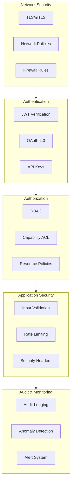
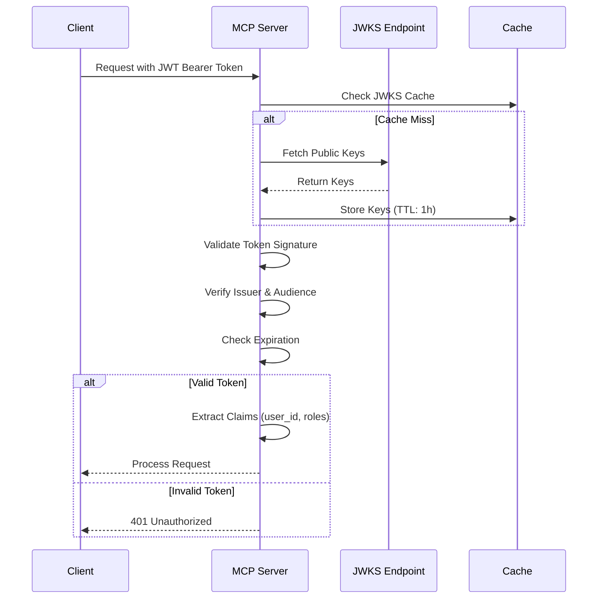

# Security Architecture

**Version:** 1.3.0  
**Last Updated:** November 19, 2025  
**Status:** Draft

## Introduction

Security is foundational to enterprise MCP servers. This document establishes comprehensive security patterns covering authentication, authorization, rate limiting, input validation, and audit logging.

For guidance on transitioning existing REST authentication flows or rotating identity providers during modernization efforts, see the **Migration Guides (12)**.

## Defense in Depth

Enterprise MCP servers implement multiple layers of security controls:



## Threat Modeling

### STRIDE Analysis

Threat modeling using the STRIDE framework identifies security risks across MCP server components. Each threat category requires specific mitigations.

#### Spoofing Identity

**Threats:**

- Attackers impersonating legitimate users or services
- Token theft and replay attacks
- Session hijacking

**Mitigations:**

- Strong authentication (JWT with signature verification)
- Multi-factor authentication (MFA) for administrative access
- Short-lived tokens with refresh rotation
- Token binding to client identity (certificate fingerprints)
- Anti-CSRF tokens for state-changing operations

**Implementation:**

```python
# JWT with short expiration and refresh tokens
jwt_config = {
    "access_token_ttl": 900,  # 15 minutes
    "refresh_token_ttl": 86400,  # 24 hours
    "require_token_binding": True
}

# Validate token freshness
def validate_token_freshness(token: dict) -> bool:
    issued_at = token.get("iat")
    if not issued_at:
        return False
    
    age_seconds = time.time() - issued_at
    return age_seconds < MAX_TOKEN_AGE
```

#### Tampering with Data

**Threats:**

- Message interception and modification
- Parameter tampering in tool calls
- Database manipulation through injection attacks

**Mitigations:**

- TLS/mTLS for transport encryption
- Message signing (HMAC or digital signatures)
- Input validation and sanitization
- Parameterized queries (no string concatenation)
- Integrity checks on critical data

**Implementation:**

```python
# Message integrity verification
import hmac
import hashlib

def verify_message_integrity(message: str, signature: str, secret: str) -> bool:
    """Verify HMAC signature on message."""
    expected = hmac.new(
        secret.encode(),
        message.encode(),
        hashlib.sha256
    ).hexdigest()
    return hmac.compare_digest(expected, signature)

# SQL injection prevention
async def safe_query(db, user_id: str):
    """Use parameterized queries."""
    # SECURE: Parameters are escaped
    result = await db.fetch(
        "SELECT * FROM users WHERE id = $1",
        user_id
    )
    # NEVER do: f"SELECT * FROM users WHERE id = '{user_id}'"
```

#### Repudiation

**Threats:**

- Users denying actions they performed
- Lack of audit trail for security events
- Insufficient logging for forensic analysis

**Mitigations:**

- Comprehensive audit logging with immutable records
- Cryptographic signatures on audit events
- Centralized log aggregation with tamper detection
- Non-repudiation through digital signatures on critical actions

**Implementation:**

```python
# Immutable audit log entry with signature
import json
from datetime import datetime

async def create_audit_entry(
    action: str,
    user_id: str,
    details: dict,
    signing_key: str
) -> dict:
    """Create signed audit log entry."""
    entry = {
        "timestamp": datetime.utcnow().isoformat(),
        "action": action,
        "user_id": user_id,
        "details": details,
        "nonce": secrets.token_hex(16)
    }
    
    # Sign entry for non-repudiation
    entry_json = json.dumps(entry, sort_keys=True)
    signature = hmac.new(
        signing_key.encode(),
        entry_json.encode(),
        hashlib.sha256
    ).hexdigest()
    
    entry["signature"] = signature
    await audit_log.write(entry)
    return entry
```

#### Information Disclosure

**Threats:**

- Sensitive data leakage in logs or error messages
- Exposure of system internals in stack traces
- PII disclosure without proper authorization
- API enumeration through verbose responses

**Mitigations:**

- Redact sensitive data in logs (see Audit Logging section)
- Generic error messages to clients (detailed logs server-side only)
- Field-level access control for sensitive attributes
- Rate limiting to prevent enumeration attacks
- Least privilege principle for data access

**Implementation:**

```python
# Safe error responses
class SafeErrorResponse:
    """Return generic errors to clients, log details internally."""
    
    @staticmethod
    async def handle_error(error: Exception, request_id: str):
        # Log full details server-side
        logger.error(
            "Request failed",
            request_id=request_id,
            error_type=type(error).__name__,
            error_details=str(error),
            stack_trace=traceback.format_exc()
        )
        
        # Return generic message to client
        return {
            "error": "An error occurred processing your request",
            "request_id": request_id,
            "timestamp": datetime.utcnow().isoformat()
        }
```

#### Denial of Service (DoS)

**Threats:**

- Resource exhaustion through excessive requests
- Slowloris-style attacks with slow connections
- Algorithmic complexity attacks (ReDoS, billion laughs)
- Memory exhaustion through large payloads

**Mitigations:**

- Multi-tier rate limiting (global, per-user, per-endpoint)
- Request size limits and timeouts
- Circuit breakers for downstream dependencies
- Horizontal scaling with load balancing
- Input complexity validation (regex timeout, recursion depth)

**Implementation:**

```python
# Request size and complexity limits
MAX_REQUEST_SIZE = 1_048_576  # 1 MB
MAX_ARRAY_DEPTH = 5
MAX_STRING_LENGTH = 10_000
REQUEST_TIMEOUT = 30  # seconds

async def validate_request_complexity(data: dict, depth: int = 0):
    """Prevent DoS through complex nested structures."""
    if depth > MAX_ARRAY_DEPTH:
        raise ValueError(f"Maximum nesting depth exceeded: {MAX_ARRAY_DEPTH}")
    
    for key, value in data.items():
        if isinstance(value, str) and len(value) > MAX_STRING_LENGTH:
            raise ValueError(f"String length exceeds limit: {MAX_STRING_LENGTH}")
        elif isinstance(value, dict):
            await validate_request_complexity(value, depth + 1)
        elif isinstance(value, list):
            for item in value[:100]:  # Limit iteration
                if isinstance(item, dict):
                    await validate_request_complexity(item, depth + 1)
```

#### Elevation of Privilege

**Threats:**

- Vertical privilege escalation (user → admin)
- Horizontal privilege escalation (user A → user B)
- Capability bypass through parameter manipulation
- Confused deputy attacks

**Mitigations:**

- Principle of least privilege enforcement
- Explicit authorization checks before every privileged operation
- Role hierarchy with inheritance controls
- Capability tokens that cannot be forged
- Resource ownership verification

**Implementation:**

```python
# Explicit privilege checks
async def delete_user(requester_id: str, target_user_id: str, db):
    """Delete user with authorization checks."""
    
    # Check requester has admin role
    requester = await db.fetch_one(
        "SELECT role FROM users WHERE id = $1",
        requester_id
    )
    if requester["role"] not in ["admin", "super_admin"]:
        raise PermissionError("Insufficient privileges")
    
    # Prevent super_admin deletion by regular admin
    target = await db.fetch_one(
        "SELECT role FROM users WHERE id = $1",
        target_user_id
    )
    if target["role"] == "super_admin" and requester["role"] != "super_admin":
        raise PermissionError("Cannot delete super admin")
    
    # Audit before action
    await audit_log.write({
        "action": "user_delete",
        "requester": requester_id,
        "target": target_user_id
    })
    
    # Execute deletion
    await db.execute("DELETE FROM users WHERE id = $1", target_user_id)
```

### Threat Model Summary

| STRIDE Category | Key Risks | Primary Mitigations |
|----------------|-----------|---------------------|
| **Spoofing** | Token theft, impersonation | Strong auth, MFA, short-lived tokens |
| **Tampering** | Message modification, injection | TLS, input validation, parameterized queries |
| **Repudiation** | Action denial, missing audit trail | Immutable logs, digital signatures |
| **Information Disclosure** | Data leaks, verbose errors | Redaction, generic errors, least privilege |
| **Denial of Service** | Resource exhaustion, complexity attacks | Rate limiting, timeouts, input validation |
| **Elevation of Privilege** | Unauthorized access escalation | Explicit auth checks, least privilege, auditing |

## Authentication Patterns

### Multi-Provider Support

MCP servers support multiple authentication mechanisms based on deployment context.

#### JWT/JWKS Authentication (Recommended)

JSON Web Tokens with JWKS (JSON Web Key Set) provide standard enterprise SSO integration.

**Implementation:**

```python
from fastmcp.server.auth.providers.jwt import JWTVerifier

# Configure JWT authentication
auth_provider = JWTVerifier(
    jwks_uri="https://auth.example.com/.well-known/jwks.json",
    issuer="https://auth.example.com",
    audience="mcp-server-production"
)

# Use in FastMCP server
mcp = FastMCP("Enterprise MCP Server", auth_provider=auth_provider)
```

**Token Validation Flow:**



**Token Validation Checklist:**

- ✅ Verify signature using JWKS public keys
- ✅ Validate `iss` (issuer) claim matches expected issuer
- ✅ Validate `aud` (audience) claim matches server identifier
- ✅ Check `exp` (expiration) timestamp
- ✅ Optionally check `nbf` (not before) timestamp
- ✅ Extract user claims (`sub`, custom claims)

**Configuration:**

```python
JWT_CONFIG = {
    "jwks_uri": os.getenv("AUTH_JWKS_URI"),
    "issuer": os.getenv("AUTH_ISSUER"),
    "audience": os.getenv("AUTH_AUDIENCE"),
    "jwks_cache_ttl": 3600,  # 1 hour
    "clock_skew": 60,  # Allow 60s time drift
}
```

#### OAuth 2.0 Providers

Support for popular OAuth 2.0 providers:

**GitHub Authentication:**

```python
from fastmcp.server.auth.providers.github import GitHubProvider

auth_provider = GitHubProvider(
    client_id=os.getenv("GITHUB_CLIENT_ID"),
    client_secret=os.getenv("GITHUB_CLIENT_SECRET"),
    allowed_orgs=["your-organization"]
)
```

**Google Workspace:**

```python
from fastmcp.server.auth.providers.google import GoogleProvider

auth_provider = GoogleProvider(
    client_id=os.getenv("GOOGLE_CLIENT_ID"),
    client_secret=os.getenv("GOOGLE_CLIENT_SECRET"),
    allowed_domains=["example.com"]
)
```

#### WorkOS Enterprise SSO

For enterprise SAML/OIDC integration:

```python
from fastmcp.server.auth.providers.workos import WorkOSProvider

auth_provider = WorkOSProvider(
    api_key=os.getenv("WORKOS_API_KEY"),
    client_id=os.getenv("WORKOS_CLIENT_ID"),
    organization_id=os.getenv("WORKOS_ORG_ID")
)
```

### API Key Authentication

For service-to-service communication:

```python
@mcp.tool()
async def service_operation(api_key: str = Header(...)) -> dict:
    """Tool accessible with API key."""
    # Validate API key
    if not await validate_api_key(api_key):
        raise HTTPException(status_code=401, detail="Invalid API key")
    
    # Process request
    return {"status": "success"}
```

**API Key Best Practices:**

- Use cryptographically secure random generation
- Implement key rotation policies (90 days)
- Store hashed keys (bcrypt, argon2)
- Support key revocation
- Audit all API key usage

## Authorization Framework

### Role-Based Access Control (RBAC)

Define standard roles for MCP server access:

| Role | Permissions | Use Case |
|------|-------------|----------|
| `admin` | Full access to all tools and resources | System administrators |
| `developer` | Read/write access to development tools | Engineering teams |
| `viewer` | Read-only access to resources | Auditors, stakeholders |
| `service` | Limited programmatic access | CI/CD systems, automation |
| `analyst` | Data query and reporting tools | Business analysts |

**Implementation:**

```python
from typing import List
from fastapi import HTTPException

# Define role hierarchy
ROLE_HIERARCHY = {
    "admin": ["admin", "developer", "analyst", "viewer"],
    "developer": ["developer", "viewer"],
    "analyst": ["analyst", "viewer"],
    "viewer": ["viewer"],
}

def check_role(user_context: dict, required_roles: List[str]) -> bool:
    """Check if user has required role."""
    user_role = user_context.get("role")
    allowed_roles = ROLE_HIERARCHY.get(user_role, [])
    
    return any(role in allowed_roles for role in required_roles)

@mcp.tool()
async def delete_resource(
    resource_id: str,
    user_context: dict
) -> dict:
    """Delete a resource - requires admin role."""
    if not check_role(user_context, ["admin"]):
        raise HTTPException(
            status_code=403,
            detail="Admin role required for deletion"
        )
    
    # Proceed with deletion
    await perform_deletion(resource_id)
    return {"status": "deleted", "resource_id": resource_id}
```

### Capability-Based Access Control

Fine-grained permissions for specific operations:

```python
# Define capabilities
CAPABILITIES = {
    "assignments:create": "Create new assignments",
    "assignments:read": "Read assignment details",
    "assignments:update": "Modify existing assignments",
    "assignments:delete": "Delete assignments",
    "releases:deploy": "Deploy releases to production",
    "pipelines:trigger": "Trigger pipeline execution",
}

# Assign capabilities to roles
ROLE_CAPABILITIES = {
    "admin": list(CAPABILITIES.keys()),  # All capabilities
    "developer": [
        "assignments:create",
        "assignments:read",
        "assignments:update",
        "pipelines:trigger",
    ],
    "viewer": [
        "assignments:read",
    ],
}

def has_capability(user_context: dict, capability: str) -> bool:
    """Check if user has specific capability."""
    user_role = user_context.get("role")
    capabilities = ROLE_CAPABILITIES.get(user_role, [])
    return capability in capabilities

@mcp.tool()
async def deploy_release(
    release_id: str,
    user_context: dict
) -> dict:
    """Deploy a release - requires releases:deploy capability."""
    if not has_capability(user_context, "releases:deploy"):
        raise HTTPException(
            status_code=403,
            detail="Missing required capability: releases:deploy"
        )
    
    # Proceed with deployment
    result = await perform_deployment(release_id)
    return result
```

## Rate Limiting

### Token Bucket Algorithm

Implement multi-tier rate limiting to prevent abuse and ensure fair resource allocation.

**Implementation:**

```python
from datetime import datetime
from typing import Dict

class RateLimiter:
    """Token bucket rate limiter with burst support."""
    
    def __init__(
        self,
        requests_per_minute: int = 60,
        burst_size: int = 10
    ):
        """
        Initialize rate limiter.
        
        Args:
            requests_per_minute: Sustained rate limit
            burst_size: Maximum burst capacity
        """
        self.requests_per_minute = requests_per_minute
        self.burst_size = burst_size
        self.tokens = float(burst_size)
        self.last_refill = datetime.now()
        
        # Statistics
        self.total_requests = 0
        self.rejected_requests = 0
    
    async def acquire(self) -> bool:
        """
        Attempt to acquire a token.
        
        Returns:
            True if token acquired, False if rate limited
        """
        self.total_requests += 1
        self._refill_tokens()
        
        if self.tokens >= 1:
            self.tokens -= 1
            return True
        else:
            self.rejected_requests += 1
            return False
    
    def _refill_tokens(self):
        """Refill tokens based on elapsed time."""
        now = datetime.now()
        elapsed = (now - self.last_refill).total_seconds()
        
        if elapsed > 0:
            # Calculate tokens to add
            tokens_to_add = (self.requests_per_minute / 60.0) * elapsed
            self.tokens = min(self.burst_size, self.tokens + tokens_to_add)
            self.last_refill = now
    
    def get_stats(self) -> Dict:
        """Get rate limiter statistics."""
        return {
            "requests_per_minute": self.requests_per_minute,
            "burst_size": self.burst_size,
            "current_tokens": round(self.tokens, 2),
            "total_requests": self.total_requests,
            "rejected_requests": self.rejected_requests,
            "success_rate": round(
                ((self.total_requests - self.rejected_requests) / 
                 max(1, self.total_requests)) * 100, 2
            )
        }
```

### Multi-Tier Rate Limiting

```python
class AdvancedRateLimiter:
    """Multi-tier rate limiting."""
    
    def __init__(self, config: dict):
        # Global rate limit
        self.global_limiter = RateLimiter(
            requests_per_minute=config["global_rpm"],
            burst_size=config["global_burst"]
        )
        
        # Per-user limits
        self.user_limiters: Dict[str, RateLimiter] = {}
        self.user_rpm = config["per_user_rpm"]
        
        # Per-API-key limits
        self.api_key_limiters: Dict[str, RateLimiter] = {}
        self.api_key_rpm = config["per_api_key_rpm"]
    
    async def check_rate_limit(
        self,
        user_id: str,
        api_key: Optional[str] = None
    ) -> tuple[bool, str]:
        """
        Check all rate limit tiers.
        
        Returns:
            (allowed, reason) tuple
        """
        # Check global limit
        if not await self.global_limiter.acquire():
            return False, "Global rate limit exceeded"
        
        # Check per-user limit
        if user_id not in self.user_limiters:
            self.user_limiters[user_id] = RateLimiter(
                requests_per_minute=self.user_rpm,
                burst_size=5
            )
        
        if not await self.user_limiters[user_id].acquire():
            return False, f"Rate limit exceeded for user: {user_id}"
        
        # Check API key limit if provided
        if api_key:
            if api_key not in self.api_key_limiters:
                self.api_key_limiters[api_key] = RateLimiter(
                    requests_per_minute=self.api_key_rpm,
                    burst_size=20
                )
            
            if not await self.api_key_limiters[api_key].acquire():
                return False, "API key rate limit exceeded"
        
        return True, "OK"
```

### Rate Limit Headers

Include rate limit information in responses:

```python
@app.middleware("http")
async def add_rate_limit_headers(request: Request, call_next):
    """Add rate limit headers to response."""
    response = await call_next(request)
    
    # Add rate limit headers
    response.headers["X-RateLimit-Limit"] = "60"
    response.headers["X-RateLimit-Remaining"] = str(limiter.tokens)
    response.headers["X-RateLimit-Reset"] = str(
        int(limiter.last_refill.timestamp()) + 60
    )
    
    return response
```

## Input Validation

### Pydantic Models

Use Pydantic for automatic validation:

```python
from pydantic import BaseModel, Field, validator
from typing import List
import re
import html

class CreateResourceInput(BaseModel):
    """Validated input for resource creation."""
    
    name: str = Field(
        ...,
        min_length=3,
        max_length=100,
        description="Resource name"
    )
    description: str = Field(
        ...,
        max_length=1000,
        description="Resource description"
    )
    tags: List[str] = Field(
        default=[],
        max_items=10,
        description="Resource tags"
    )
    priority: int = Field(
        default=3,
        ge=1,
        le=5,
        description="Priority level (1-5)"
    )
    
    @validator('name')
    def validate_name(cls, v):
        """Ensure name contains only safe characters."""
        if not re.match(r'^[a-zA-Z0-9_-]+$', v):
            raise ValueError(
                "Name must contain only alphanumeric, dash, underscore"
            )
        return v
    
    @validator('description')
    def sanitize_description(cls, v):
        """Remove potentially dangerous content."""
        # Remove HTML tags
        v = re.sub(r'<[^>]+>', '', v)
        # Escape special characters
        return html.escape(v)
    
    @validator('tags', each_item=True)
    def validate_tag(cls, v):
        """Validate each tag."""
        if not re.match(r'^[a-zA-Z0-9_-]+$', v):
            raise ValueError("Invalid tag format")
        return v.lower()

@mcp.tool()
async def create_resource(input: CreateResourceInput) -> dict:
    """Create resource with validated input."""
    # Input is automatically validated by Pydantic
    result = await backend.create_resource(
        name=input.name,
        description=input.description,
        tags=input.tags,
        priority=input.priority
    )
    return result
```

### SQL Injection Prevention

Always use parameterized queries:

```python
# ❌ NEVER do this
query = f"SELECT * FROM users WHERE username = '{username}'"

# ✅ Always use parameterized queries
query = "SELECT * FROM users WHERE username = %s"
result = await db.execute(query, (username,))
```

### Path Traversal Prevention

Validate and sanitize file paths:

```python
from pathlib import Path
import os

def validate_file_path(file_path: str, base_dir: str) -> Path:
    """Validate file path to prevent traversal attacks."""
    # Resolve to absolute path
    abs_path = Path(base_dir) / file_path
    abs_path = abs_path.resolve()
    
    # Ensure path is within base directory
    if not str(abs_path).startswith(str(Path(base_dir).resolve())):
        raise ValueError("Invalid file path: directory traversal detected")
    
    return abs_path

@mcp.tool()
async def read_file(file_path: str) -> str:
    """Read file with path validation."""
    safe_path = validate_file_path(file_path, "/var/data/allowed")
    
    with open(safe_path, 'r') as f:
        return f.read()
```

### Command Injection Prevention

Never execute shell commands with user input:

```python
# ❌ NEVER do this
os.system(f"ping {user_input}")

# ✅ Use subprocess with argument list
import subprocess

subprocess.run(["ping", "-c", "1", user_input], check=True)
```

## Security Headers

### Standard Headers

Apply security headers to all HTTP responses:

```python
SECURITY_HEADERS = {
    "Content-Security-Policy": "default-src 'self'",
    "Strict-Transport-Security": "max-age=31536000; includeSubDomains",
    "X-Content-Type-Options": "nosniff",
    "X-Frame-Options": "DENY",
    "X-XSS-Protection": "1; mode=block",
    "Referrer-Policy": "no-referrer",
    "Permissions-Policy": "geolocation=(), microphone=(), camera=()"
}

@app.middleware("http")
async def add_security_headers(request: Request, call_next):
    """Add security headers to all responses."""
    response = await call_next(request)
    
    for header, value in SECURITY_HEADERS.items():
        response.headers[header] = value
    
    return response
```

### CORS Configuration

Configure CORS restrictively:

```python
from fastapi.middleware.cors import CORSMiddleware

app.add_middleware(
    CORSMiddleware,
    allow_origins=["https://app.example.com"],  # Specific origins
    allow_credentials=True,
    allow_methods=["GET", "POST"],  # Only needed methods
    allow_headers=["Authorization", "Content-Type"],
    max_age=3600,  # Cache preflight for 1 hour
)
```

## Audit Logging

### Audit Event Structure

```python
from dataclasses import dataclass
from datetime import datetime
from typing import Optional, Dict, Any

@dataclass
class AuditEvent:
    """Standard audit event structure."""
    
    timestamp: datetime
    event_type: str
    user_id: str
    user_role: str
    tool_name: Optional[str]
    resource_id: Optional[str]
    action: str
    result: str  # success, failure, error
    ip_address: str
    user_agent: str
    correlation_id: str
    metadata: Dict[str, Any]
    
    def to_json(self) -> dict:
        """Convert to JSON-serializable dict."""
        return {
            "timestamp": self.timestamp.isoformat(),
            "event_type": self.event_type,
            "user_id": self.user_id,
            "user_role": self.user_role,
            "tool_name": self.tool_name,
            "resource_id": self.resource_id,
            "action": self.action,
            "result": self.result,
            "ip_address": self.ip_address,
            "user_agent": self.user_agent,
            "correlation_id": self.correlation_id,
            "metadata": self.metadata
        }
```

### Events to Audit

**Critical Events (Always Log):**

- Authentication attempts (success/failure)
- Authorization decisions (allow/deny)
- Destructive operations (delete, modify)
- Configuration changes
- Rate limit violations
- Security policy violations
- Privilege escalation attempts

**Example:**

```python
async def audit_log(
    event_type: str,
    user_context: dict,
    action: str,
    result: str,
    **metadata
):
    """Log audit event."""
    event = AuditEvent(
        timestamp=datetime.utcnow(),
        event_type=event_type,
        user_id=user_context.get("user_id"),
        user_role=user_context.get("role"),
        tool_name=metadata.get("tool_name"),
        resource_id=metadata.get("resource_id"),
        action=action,
        result=result,
        ip_address=metadata.get("ip_address"),
        user_agent=metadata.get("user_agent"),
        correlation_id=metadata.get("correlation_id"),
        metadata=metadata
    )
    
    # Write to audit log
    logger.info("AUDIT", extra=event.to_json())

@mcp.tool()
async def delete_resource(
    resource_id: str,
    user_context: dict,
    request_context: dict
) -> dict:
    """Delete resource with audit logging."""
    try:
        # Perform deletion
        await backend.delete(resource_id)
        
        # Log success
        await audit_log(
            event_type="resource_deletion",
            user_context=user_context,
            action="delete",
            result="success",
            resource_id=resource_id,
            **request_context
        )
        
        return {"status": "deleted"}
        
    except Exception as e:
        # Log failure
        await audit_log(
            event_type="resource_deletion",
            user_context=user_context,
            action="delete",
            result="failure",
            resource_id=resource_id,
            error=str(e),
            **request_context
        )
        raise
```

### Sensitive Data Handling

**Never log:**

- Passwords or password hashes
- API keys or tokens
- Credit card numbers
- Social security numbers
- Private encryption keys

**Redact or mask:**

- Email addresses: `u***r@example.com`
- Phone numbers: `***-***-1234`
- API keys: `sk_***abc123`

```python
def redact_sensitive_data(data: dict) -> dict:
    """Redact sensitive information from audit logs."""
    sensitive_fields = ['password', 'token', 'api_key', 'secret']
    
    redacted = data.copy()
    for field in sensitive_fields:
        if field in redacted:
            redacted[field] = '***REDACTED***'
    
    # Mask email
    if 'email' in redacted:
        email = redacted['email']
        parts = email.split('@')
        if len(parts) == 2:
            redacted['email'] = f"{parts[0][0]}***@{parts[1]}"
    
    return redacted
```

## Security Testing Tools

### Static Analysis

#### Bandit (Python Security Linter)

Bandit scans Python code for common security issues.

**Installation & Configuration:**

```bash
pip install bandit
```

**Configuration File (`bandit.yaml`):**

```yaml
# .bandit.yaml
tests:
  - B201  # Flask debug mode
  - B301  # Pickle usage
  - B302  # marshal usage
  - B303  # MD5 or SHA1
  - B304  # Insecure ciphers
  - B305  # Insecure cipher modes
  - B306  # Insecure TempFile
  - B307  # eval usage
  - B308  # mark_safe usage
  - B309  # HTTPSConnection
  - B310  # urllib.urlopen
  - B311  # Random for crypto
  - B312  # Telnet usage
  - B313  # XML vulnerabilities
  - B314  - B320  # XML processing
  - B321  # FTP usage
  - B323  # Unverified SSL
  - B324  # Insecure hashes
  - B325  # Tempfile
  - B401  - B404  # Imports
  - B501  - B509  # Crypto
  - B601  - B612  # Injection

exclude_dirs:
  - /tests/
  - /venv/
  - /.venv/

# Ignore test fixtures
skips:
  - B101  # Allow assert in tests
```

**Usage:**

```bash
# Scan entire project
bandit -r src/ -f json -o bandit-report.json

# CI/CD integration
bandit -r src/ -ll -i  # Low severity, ignore info

# Exclude specific files
bandit -r src/ --exclude src/tests/
```

**Example Issues Detected:**

```python
# BAD: Hardcoded password
password = "admin123"  # B105: hardcoded_password_string

# BAD: Use of eval
eval(user_input)  # B307: eval usage

# BAD: Weak random for tokens
token = random.randint(1000, 9999)  # B311: use secrets module

# GOOD: Secure alternatives
password = os.environ["DB_PASSWORD"]
# Don't use eval, parse safely instead
token = secrets.token_hex(16)
```

#### Safety (Dependency Vulnerability Scanner)

Safety checks dependencies for known security vulnerabilities.

**Installation:**

```bash
pip install safety
```

**Usage:**

```bash
# Check installed packages
safety check

# Check requirements file
safety check -r requirements.txt

# Generate JSON report
safety check --json --output safety-report.json

# CI/CD with exit codes
safety check --exit-code  # Fails build on vulnerabilities
```

**Configuration (`safety-policy.yml`):**

```yaml
# .safety-policy.yml
security:
  ignore-vulnerabilities:
    # Temporarily ignore specific CVEs (with justification)
    - id: 12345
      reason: "False positive - not using affected feature"
      expires: "2025-12-31"
  
  ignore-packages:
    # Ignore dev dependencies
    - pytest
    - black

  continue-on-vulnerability-error: false
```

#### Semgrep (Multi-language Static Analysis)

Semgrep finds bugs and enforces code standards with custom rules.

**Installation:**

```bash
pip install semgrep
```

**Configuration (`.semgrep.yml`):**

```yaml
rules:
  # SQL Injection Prevention
  - id: sql-injection-risk
    patterns:
      - pattern: $DB.execute(f"... {$VAR} ...")
      - pattern: $DB.execute("..." + $VAR + "...")
    message: "Potential SQL injection. Use parameterized queries."
    severity: ERROR
    languages:
      - python
  
  # Hardcoded Secrets
  - id: hardcoded-secret
    patterns:
      - pattern: $VAR = "..."
      - metavariable-regex:
          metavariable: $VAR
          regex: (password|secret|api_key|token)
    message: "Possible hardcoded secret. Use environment variables."
    severity: WARNING
    languages:
      - python
  
  # Missing Authentication Check
  - id: missing-auth-check
    patterns:
      - pattern: |
          @app.route(...)
          def $FUNC(...):
            ...
      - pattern-not: |
          @app.route(...)
          @require_auth
          def $FUNC(...):
            ...
    message: "Endpoint missing authentication decorator"
    severity: ERROR
    languages:
      - python
  
  # Dangerous Function Usage
  - id: dangerous-exec
    patterns:
      - pattern-either:
          - pattern: exec(...)
          - pattern: eval(...)
          - pattern: __import__(...)
    message: "Dangerous function usage: code execution risk"
    severity: ERROR
    languages:
      - python
  
  # Insecure Random
  - id: insecure-random
    patterns:
      - pattern: random.$METHOD(...)
      - metavariable-regex:
          metavariable: $METHOD
          regex: (randint|random|choice)
    message: "Use secrets module for security-sensitive randomness"
    severity: WARNING
    languages:
      - python
```

**Usage:**

```bash
# Run all rules
semgrep --config .semgrep.yml src/

# Use community rules
semgrep --config "p/security-audit" src/

# CI/CD mode
semgrep ci --config auto

# Generate SARIF output for GitHub
semgrep --config auto --sarif -o semgrep.sarif src/
```

### Dynamic Testing

#### Penetration Testing Guidelines

**Scope Definition:**

1. **Pre-engagement:**
   - Define testing scope (URLs, API endpoints, IP ranges)
   - Establish rules of engagement (times, methods, data handling)
   - Obtain written authorization
   - Define communication channels for critical findings

2. **Testing Phases:**

##### Phase 1: Information Gathering

```bash
# Enumerate endpoints
curl https://api.example.com/.well-known/openapi.json

# DNS reconnaissance
dig example.com ANY
nslookup -type=ANY example.com

# Certificate inspection
openssl s_client -connect api.example.com:443 -showcerts
```

##### Phase 2: Authentication Testing

```bash
# Test JWT validation
# - Expired tokens
# - Invalid signatures (modify payload)
# - Algorithm confusion (none, HS256 vs RS256)
# - Missing required claims

# Brute force prevention
for i in {1..1000}; do
  curl -X POST https://api.example.com/auth \
    -d '{"username":"admin","password":"pass'$i'"}' &
done

# Token enumeration
# Try sequential token IDs, predictable patterns
```

##### Phase 3: Authorization Testing

```bash
# Horizontal privilege escalation
# User A tries to access User B's resources
curl -H "Authorization: Bearer $USER_A_TOKEN" \
  https://api.example.com/users/$USER_B_ID

# Vertical privilege escalation
# Regular user tries admin endpoints
curl -H "Authorization: Bearer $USER_TOKEN" \
  https://api.example.com/admin/users

# IDOR (Insecure Direct Object Reference)
# Test sequential IDs, GUIDs
for id in {1..100}; do
  curl https://api.example.com/documents/$id
done
```

##### Phase 4: Input Validation Testing

```bash
# SQL Injection
curl -X POST https://api.example.com/search \
  -d '{"query": "admin'\'' OR 1=1--"}'

# Command Injection
curl -X POST https://api.example.com/tools/ping \
  -d '{"host": "127.0.0.1; cat /etc/passwd"}'

# Path Traversal
curl https://api.example.com/files?path=../../../../etc/passwd

# XXE (XML External Entity)
curl -X POST https://api.example.com/upload \
  -H "Content-Type: application/xml" \
  -d '<?xml version="1.0"?><!DOCTYPE foo [<!ENTITY xxe SYSTEM "file:///etc/passwd">]><data>&xxe;</data>'

# SSRF (Server-Side Request Forgery)
curl -X POST https://api.example.com/fetch \
  -d '{"url": "http://169.254.169.254/latest/meta-data/"}'
```

##### Phase 5: Business Logic Testing

- Race conditions (concurrent requests)
- Price/quantity manipulation
- Workflow bypass (skip steps)
- Rate limit bypass (distributed requests, header manipulation)

**Automated Tools:**

```bash
# OWASP ZAP (Web scanner)
docker run -t owasp/zap2docker-stable zap-baseline.py \
  -t https://api.example.com

# Burp Suite (Manual + automated)
# Configure proxy, spider, active scan

# Nuclei (Vulnerability scanner)
nuclei -u https://api.example.com -t cves/ -t vulnerabilities/
```

**Reporting:**

- **Critical**: Immediate notification (< 4 hours)
- **High**: Detailed report within 24 hours
- **Medium/Low**: Included in final report

### Security Incident Response Procedures

#### Incident Response Plan

##### 1. Preparation

- Maintain updated contact list (security team, legal, PR)
- Document escalation paths
- Pre-provision isolated forensic environment
- Establish secure communication channels

##### 2. Detection & Analysis

```python
# Anomaly detection example
async def detect_anomaly(user_id: str, action: str, context: dict):
    """Flag suspicious patterns."""
    
    # Unusual time
    hour = datetime.now().hour
    if hour < 6 or hour > 22:
        await alert("Off-hours access", user_id, action)
    
    # Unusual location (IP geolocation change)
    recent_ips = await get_recent_ips(user_id, hours=1)
    if len(set(geolocate(ip) for ip in recent_ips)) > 2:
        await alert("Multiple geolocations", user_id, action)
    
    # Excessive failed attempts
    failed_count = await get_failed_attempts(user_id, minutes=10)
    if failed_count > 5:
        await alert("Brute force attempt", user_id, action)
    
    # Privilege escalation attempt
    if action.startswith("admin_") and not await is_admin(user_id):
        await alert("Privilege escalation attempt", user_id, action)
```

##### 3. Containment

**Immediate Actions (< 15 minutes):**

```bash
# Revoke compromised credentials
curl -X POST https://api.example.com/admin/revoke-token \
  -H "Authorization: Bearer $ADMIN_TOKEN" \
  -d '{"user_id": "compromised-user-id"}'

# Block IP address
kubectl exec -it gateway-pod -- \
  iptables -A INPUT -s $SUSPICIOUS_IP -j DROP

# Isolate affected service
kubectl scale deployment compromised-service --replicas=0
```

**Short-term Containment (< 1 hour):**

- Rotate all API keys for affected service
- Force password reset for impacted users
- Enable additional logging/monitoring
- Snapshot systems for forensics

##### 4. Eradication

- Identify root cause (vulnerability, misconfiguration, compromised credentials)
- Apply patches or configuration fixes
- Remove malware/backdoors
- Verify integrity of systems

##### 5. Recovery

- Restore from clean backups (verify integrity first)
- Gradual service restoration with enhanced monitoring
- Verify fixes prevent recurrence

##### 6. Post-Incident Activity

```markdown
## Incident Report Template

**Incident ID:** INC-2025-001
**Severity:** Critical / High / Medium / Low
**Date Detected:** YYYY-MM-DD HH:MM UTC
**Date Resolved:** YYYY-MM-DD HH:MM UTC

### Summary
Brief description of the incident.

### Timeline
- HH:MM: Detection
- HH:MM: Containment initiated
- HH:MM: Root cause identified
- HH:MM: Fix applied
- HH:MM: Service restored

### Root Cause
Technical details of vulnerability or misconfiguration.

### Impact
- Users affected: X
- Data exposed: Yes/No (details)
- Service downtime: X hours

### Response Actions
1. Immediate containment steps taken
2. Eradication measures applied
3. Recovery procedures executed

### Lessons Learned
- What worked well
- What could be improved
- Process gaps identified

### Remediation
- [ ] Patch applied and tested
- [ ] Configuration hardened
- [ ] Monitoring enhanced
- [ ] Documentation updated
- [ ] Training conducted

### Follow-up
- Schedule: Post-mortem meeting (DATE)
- Assignees: Update runbooks, implement preventive controls
```

### Vulnerability Disclosure Policy

**Purpose:** Provide a safe channel for security researchers to report vulnerabilities.

**Policy Template:**

```markdown
# Vulnerability Disclosure Policy

## Scope

This policy applies to the following systems:

- Production API: https://api.example.com
- Web application: https://app.example.com
- Mobile applications (iOS, Android)

**Out of Scope:**
- Third-party dependencies (report to respective maintainers)
- Social engineering or phishing tests
- Physical security tests
- Denial of service testing

## How to Report

**Preferred Channel:** security@example.com (PGP key available)

**Alternative Channels:**
- HackerOne: https://hackerone.com/example
- Bug bounty platform: [link]

## Information to Include

- Description of vulnerability
- Steps to reproduce
- Proof of concept (if applicable)
- Impact assessment
- Suggested remediation (optional)

## Safe Harbor

We will not pursue legal action against researchers who:
- Act in good faith
- Avoid privacy violations
- Avoid data destruction
- Follow responsible disclosure timeline
- Do not publicly disclose until resolved

## Response Timeline

- **Acknowledgment:** Within 48 hours
- **Initial Assessment:** Within 5 business days
- **Status Updates:** Every 10 business days
- **Resolution Target:** 90 days for critical, 180 days for others

## Recognition

With your permission, we will:
- Acknowledge your contribution in our security advisories
- Add you to our Hall of Fame
- Offer bug bounty rewards (if enrolled in program)

## Severity Classification

| Severity | Examples | Response Time |
|----------|----------|---------------|
| **Critical** | RCE, authentication bypass, data breach | < 24 hours |
| **High** | Privilege escalation, SQL injection | < 72 hours |
| **Medium** | XSS, CSRF, info disclosure | < 7 days |
| **Low** | Minor configuration issues | < 14 days |

## Contact

Security Team: security@example.com
PGP Fingerprint: XXXX XXXX XXXX XXXX XXXX

Last Updated: November 20, 2025
```

## Security Checklist

Before deploying an MCP server to production:

- [ ] Authentication enabled and configured
- [ ] JWT signature validation implemented
- [ ] RBAC roles defined and enforced
- [ ] Rate limiting configured (global, per-user, per-API-key)
- [ ] Input validation on all tool parameters
- [ ] SQL injection prevention (parameterized queries)
- [ ] Path traversal prevention
- [ ] Command injection prevention
- [ ] Security headers configured
- [ ] CORS properly restricted
- [ ] Audit logging for critical events
- [ ] Sensitive data redaction in logs
- [ ] TLS/HTTPS enforced
- [ ] Secrets stored securely (not in code)
- [ ] Dependencies scanned for vulnerabilities
- [ ] Error messages don't leak sensitive info

## Summary

Enterprise MCP servers require comprehensive security controls:

- **Multi-layered Defense**: Network, authentication, authorization, application, monitoring
- **Multiple Auth Providers**: JWT, OAuth 2.0, WorkOS for different use cases
- **Fine-grained Authorization**: RBAC and capability-based access control
- **Robust Rate Limiting**: Multi-tier token bucket algorithm
- **Comprehensive Validation**: Input sanitization and validation
- **Security Headers**: Standard headers and CORS configuration
- **Detailed Auditing**: Log all critical security events

---

**Next**: Review [Tool Implementation Standards](03-tool-implementation.md) for building consistent MCP tools.
