# Observability

**Version:** 1.0.0  
**Last Updated:** November 18, 2025  
**Status:** Draft

## Introduction

Comprehensive observability enables effective monitoring, debugging, and performance optimization of MCP servers. This document covers structured logging, metrics collection, distributed tracing, health checks, and alerting strategies.

## Three Pillars of Observability

The observability system integrates logs, metrics, and traces for comprehensive system visibility:

```mermaid
graph TB
    subgraph Sources["📡 Data Sources"]
        direction LR
        MCP1[MCP Server 1]
        MCP2[MCP Server 2]
        MCP3[MCP Server 3]
        Gateway[MCP Gateway]
        K8s[Kubernetes<br/>Control Plane]
    end
    
    subgraph Collection["🔄 Collection Layer"]
        direction TB
        
        subgraph LogPipeline["Log Pipeline"]
            Fluent[Fluentd/Fluent Bit<br/>Log Forwarder]
            LogBuffer[(Buffer<br/>Kafka/Redis)]
        end
        
        subgraph MetricPipeline["Metrics Pipeline"]
            Prometheus[Prometheus<br/>Scraper]
            StatsdExp[StatsD Exporter<br/>Push Gateway]
        end
        
        subgraph TracePipeline["Trace Pipeline"]
            OTel[OpenTelemetry<br/>Collector]
            TraceBuffer[(Sampling<br/>Buffer)]
        end
    end
    
    subgraph Storage["💾 Storage Layer"]
        direction TB
        
        subgraph LogStorage["Log Storage"]
            Loki[(Loki<br/>LogQL)]
            ES[(Elasticsearch<br/>Full-text Search)]
            S3Log[(S3/GCS<br/>Long-term Archive)]
        end
        
        subgraph MetricStorage["Metrics Storage"]
            PromStorage[(Prometheus TSDB<br/>15d retention)]
            Thanos[(Thanos<br/>Long-term Storage)]
            M3[(M3DB<br/>High Cardinality)]
        end
        
        subgraph TraceStorage["Trace Storage"]
            Jaeger[(Jaeger<br/>Cassandra/ES)]
            Tempo[(Grafana Tempo<br/>S3/GCS)]
        end
    end
    
    subgraph Analysis["🔍 Analysis & Visualization"]
        direction LR
        Grafana[Grafana<br/>Unified Dashboards]
        Kibana[Kibana<br/>Log Analysis]
        Jaeger_UI[Jaeger UI<br/>Trace Explorer]
    end
    
    subgraph Alerting["🚨 Alerting & Response"]
        direction TB
        AlertMgr[Alert Manager<br/>Routing & Dedup]
        PagerDuty[PagerDuty<br/>On-call]
        Slack[Slack<br/>Notifications]
        Email[Email<br/>Reports]
    end
    
    subgraph Intelligence["🤖 AIOps (Optional)"]
        Anomaly[Anomaly Detection<br/>ML Models]
        Forecast[Capacity Forecasting<br/>Prophet/ARIMA]
        RCA[Root Cause Analysis<br/>Graph Analysis]
    end
    
    %% Log Flow
    MCP1 -->|stdout/stderr| Fluent
    MCP2 -->|stdout/stderr| Fluent
    MCP3 -->|stdout/stderr| Fluent
    Gateway -->|JSON logs| Fluent
    K8s -->|Events| Fluent
    
    Fluent -->|Parse & Enrich| LogBuffer
    LogBuffer -->|Indexed| Loki
    LogBuffer -->|Full-text| ES
    Loki -->|Cold Storage| S3Log
    
    %% Metrics Flow
    MCP1 -->|/metrics| Prometheus
    MCP2 -->|/metrics| Prometheus
    MCP3 -->|/metrics| Prometheus
    Gateway -->|StatsD| StatsdExp
    K8s -->|kube-state-metrics| Prometheus
    
    StatsdExp -->|Expose| Prometheus
    Prometheus -->|Federate| PromStorage
    PromStorage -->|Downsample| Thanos
    Prometheus -->|High Card| M3
    
    %% Trace Flow
    MCP1 -->|OTLP| OTel
    MCP2 -->|OTLP| OTel
    MCP3 -->|OTLP| OTel
    Gateway -->|Zipkin| OTel
    
    OTel -->|Sample & Batch| TraceBuffer
    TraceBuffer -->|Spans| Jaeger
    TraceBuffer -->|Spans| Tempo
    
    %% Visualization
    Loki -->|LogQL| Grafana
    ES -->|Query| Kibana
    PromStorage -->|PromQL| Grafana
    Thanos -->|PromQL| Grafana
    Jaeger -->|Query| Jaeger_UI
    Tempo -->|TraceQL| Grafana
    
    %% Correlation
    Grafana -.->|trace_id| Jaeger_UI
    Grafana -.->|correlation_id| Kibana
    Jaeger_UI -.->|log correlation| Loki
    
    %% Alerting
    Prometheus -->|Alert Rules| AlertMgr
    Loki -->|Alert Rules| AlertMgr
    AlertMgr -->|On-call| PagerDuty
    AlertMgr -->|Notify| Slack
    AlertMgr -->|Digest| Email
    
    %% AIOps
    PromStorage -.->|Time Series| Anomaly
    Loki -.->|Error Patterns| RCA
    PromStorage -.->|Historical| Forecast
    
    Anomaly -->|Anomaly Alerts| AlertMgr
    RCA -.->|Context| Grafana
    Forecast -.->|Predictions| Grafana
    
    %% Styling
    classDef sources fill:#e3f2fd,stroke:#1976d2,stroke-width:2px
    classDef collection fill:#f3e5f5,stroke:#7b1fa2,stroke-width:2px
    classDef storage fill:#e8f5e9,stroke:#388e3c,stroke-width:2px
    classDef analysis fill:#fff3e0,stroke:#f57c00,stroke-width:2px
    classDef alerting fill:#ffebee,stroke:#c62828,stroke-width:2px
    classDef aiops fill:#fce4ec,stroke:#c2185b,stroke-width:2px
    
    class MCP1,MCP2,MCP3,Gateway,K8s sources
    class Fluent,LogBuffer,Prometheus,StatsdExp,OTel,TraceBuffer collection
    class Loki,ES,S3Log,PromStorage,Thanos,M3,Jaeger,Tempo storage
    class Grafana,Kibana,Jaeger_UI analysis
    class AlertMgr,PagerDuty,Slack,Email alerting
    class Anomaly,Forecast,RCA aiops
```



### Observability Stack Components

**Data Sources:**

- MCP servers emit logs, metrics, and traces
- Gateway provides centralized telemetry
- Kubernetes control plane metrics and events

**Collection Layer:**

- **Logs**: Fluentd/Fluent Bit for log forwarding with parsing
- **Metrics**: Prometheus pull-based scraping, StatsD push
- **Traces**: OpenTelemetry Collector with sampling and batching

**Storage Layer:**

- **Logs**: Loki (efficient), Elasticsearch (full-text), S3 (archive)
- **Metrics**: Prometheus (15d), Thanos (long-term), M3DB (high cardinality)
- **Traces**: Jaeger (Cassandra/ES), Tempo (object storage)

**Analysis & Visualization:**

- Grafana for unified dashboards (logs, metrics, traces)
- Kibana for advanced log analysis
- Jaeger UI for trace exploration

**Alerting:**

- Alert Manager for routing and deduplication
- PagerDuty for on-call escalation
- Slack and email for notifications

**AIOps (Optional):**

- Anomaly detection with ML models
- Capacity forecasting (Prophet/ARIMA)
- Root cause analysis via graph analysis

**Key Features:**

- **Correlation**: Link traces to logs via correlation_id
- **Cardinality Management**: M3DB for high-cardinality metrics
- **Long-term Retention**: Thanos and S3 for cost-effective storage
- **Sampling**: Intelligent trace sampling to reduce volume
- **Federation**: Multi-cluster Prometheus aggregation

## Structured Logging

### Logging Configuration

```python
import logging
import structlog
from pythonjsonlogger import jsonlogger

def configure_logging():
    """Configure structured logging."""
    
    # Configure standard logging
    logging.basicConfig(
        format="%(message)s",
        level=logging.INFO
    )
    
    # Configure structlog
    structlog.configure(
        processors=[
            structlog.contextvars.merge_contextvars,
            structlog.stdlib.filter_by_level,
            structlog.stdlib.add_logger_name,
            structlog.stdlib.add_log_level,
            structlog.stdlib.PositionalArgumentsFormatter(),
            structlog.processors.TimeStamper(fmt="iso"),
            structlog.processors.StackInfoRenderer(),
            structlog.processors.format_exc_info,
            structlog.processors.UnicodeDecoder(),
            structlog.processors.JSONRenderer()
        ],
        wrapper_class=structlog.stdlib.BoundLogger,
        context_class=dict,
        logger_factory=structlog.stdlib.LoggerFactory(),
        cache_logger_on_first_use=True,
    )

# Initialize at startup
configure_logging()
logger = structlog.get_logger()
```

### Structured Log Format

```python
from typing import Optional
from datetime import datetime
from contextvars import ContextVar

# Context variables for correlation
correlation_id: ContextVar[Optional[str]] = ContextVar('correlation_id', default=None)
user_id: ContextVar[Optional[str]] = ContextVar('user_id', default=None)

class StructuredLogger:
    """Structured logger with correlation context."""
    
    def __init__(self):
        self.logger = structlog.get_logger()
    
    def _get_context(self) -> dict:
        """Get current logging context."""
        return {
            "correlation_id": correlation_id.get(),
            "user_id": user_id.get(),
            "timestamp": datetime.utcnow().isoformat(),
        }
    
    def info(self, event: str, **kwargs):
        """Log info event."""
        self.logger.info(event, **{**self._get_context(), **kwargs})
    
    def warning(self, event: str, **kwargs):
        """Log warning event."""
        self.logger.warning(event, **{**self._get_context(), **kwargs})
    
    def error(self, event: str, **kwargs):
        """Log error event."""
        self.logger.error(event, **{**self._get_context(), **kwargs})
    
    def debug(self, event: str, **kwargs):
        """Log debug event."""
        self.logger.debug(event, **{**self._get_context(), **kwargs})

# Global logger instance
log = StructuredLogger()
```

### Logging in Tools

```python
from mcp_server.logging import log, correlation_id

@mcp.tool()
async def create_assignment(
    title: str,
    assignee: str
) -> dict:
    """Create assignment with structured logging."""
    
    # Set correlation ID
    corr_id = str(uuid.uuid4())
    correlation_id.set(corr_id)
    
    log.info(
        "create_assignment_started",
        tool="create_assignment",
        title=title,
        assignee=assignee
    )
    
    try:
        # Create assignment
        assignment = await backend.create_assignment(title, assignee)
        
        log.info(
            "create_assignment_completed",
            tool="create_assignment",
            assignment_id=assignment.id,
            duration_ms=elapsed_ms
        )
        
        return {
            "success": True,
            "data": assignment.to_dict(),
            "metadata": {
                "correlation_id": corr_id,
                "timestamp": datetime.utcnow().isoformat()
            }
        }
        
    except Exception as e:
        log.error(
            "create_assignment_failed",
            tool="create_assignment",
            error_type=type(e).__name__,
            error_message=str(e),
            exc_info=True
        )
        raise
```

### Log Levels

Use appropriate log levels:

```python
# DEBUG - Detailed diagnostic information
log.debug(
    "cache_lookup",
    cache_key=key,
    cache_hit=hit,
    ttl_remaining=ttl
)

# INFO - Significant events
log.info(
    "assignment_created",
    assignment_id=assignment.id,
    assignee=assignee
)

# WARNING - Potential issues
log.warning(
    "rate_limit_approaching",
    user_id=user_id,
    current_rate=current,
    limit=limit,
    threshold_percent=90
)

# ERROR - Errors requiring attention
log.error(
    "database_connection_failed",
    error=str(e),
    retry_attempt=attempt,
    max_retries=max_retries
)

# CRITICAL - System failures
log.critical(
    "service_unavailable",
    reason="database_unreachable",
    downtime_seconds=downtime
)
```

### Log Aggregation

```yaml
# Filebeat configuration for log shipping
filebeat.inputs:
  - type: log
    enabled: true
    paths:
      - /var/log/mcp-server/*.log
    json.keys_under_root: true
    json.add_error_key: true
    fields:
      service: mcp-server
      environment: production

output.elasticsearch:
  hosts: ["elasticsearch:9200"]
  index: "mcp-server-logs-%{+yyyy.MM.dd}"

processors:
  - add_host_metadata: ~
  - add_cloud_metadata: ~
  - add_docker_metadata: ~
```

## Metrics

### OpenTelemetry Metrics

```python
from opentelemetry import metrics
from opentelemetry.sdk.metrics import MeterProvider
from opentelemetry.sdk.metrics.export import (
    PeriodicExportingMetricReader,
    ConsoleMetricExporter
)
from opentelemetry.exporter.prometheus import PrometheusMetricReader
from prometheus_client import start_http_server

def configure_metrics():
    """Configure OpenTelemetry metrics."""
    
    # Prometheus exporter
    prometheus_reader = PrometheusMetricReader()
    
    # Meter provider
    provider = MeterProvider(metric_readers=[prometheus_reader])
    metrics.set_meter_provider(provider)
    
    # Start Prometheus HTTP server
    start_http_server(port=9090)
    
    return metrics.get_meter("mcp_server")

# Initialize meter
meter = configure_metrics()

# Create instruments
request_counter = meter.create_counter(
    name="mcp.requests.total",
    description="Total number of requests",
    unit="1"
)

request_duration = meter.create_histogram(
    name="mcp.request.duration",
    description="Request duration in milliseconds",
    unit="ms"
)

active_requests = meter.create_up_down_counter(
    name="mcp.requests.active",
    description="Number of active requests",
    unit="1"
)

error_counter = meter.create_counter(
    name="mcp.errors.total",
    description="Total number of errors",
    unit="1"
)
```

### Instrumenting Tools

```python
import time
from opentelemetry import trace
from opentelemetry.trace import Status, StatusCode

# Get tracer
tracer = trace.get_tracer("mcp_server")

@mcp.tool()
async def create_assignment(
    title: str,
    assignee: str
) -> dict:
    """Create assignment with metrics."""
    
    # Start span for tracing
    with tracer.start_as_current_span("create_assignment") as span:
        # Add span attributes
        span.set_attribute("tool.name", "create_assignment")
        span.set_attribute("assignee", assignee)
        
        # Track active requests
        active_requests.add(1, {"tool": "create_assignment"})
        
        # Track request count
        request_counter.add(
            1,
            {
                "tool": "create_assignment",
                "method": "POST"
            }
        )
        
        start_time = time.perf_counter()
        
        try:
            # Execute tool logic
            assignment = await backend.create_assignment(title, assignee)
            
            # Record success
            span.set_status(Status(StatusCode.OK))
            
            # Track duration
            duration_ms = (time.perf_counter() - start_time) * 1000
            request_duration.record(
                duration_ms,
                {
                    "tool": "create_assignment",
                    "status": "success"
                }
            )
            
            return {
                "success": True,
                "data": assignment.to_dict()
            }
            
        except Exception as e:
            # Record error
            span.set_status(Status(StatusCode.ERROR, str(e)))
            span.record_exception(e)
            
            # Track error
            error_counter.add(
                1,
                {
                    "tool": "create_assignment",
                    "error_type": type(e).__name__
                }
            )
            
            # Track failed request duration
            duration_ms = (time.perf_counter() - start_time) * 1000
            request_duration.record(
                duration_ms,
                {
                    "tool": "create_assignment",
                    "status": "error"
                }
            )
            
            raise
            
        finally:
            # Decrement active requests
            active_requests.add(-1, {"tool": "create_assignment"})
```

### Custom Business Metrics

```python
# Business-specific metrics
assignments_created = meter.create_counter(
    name="mcp.assignments.created",
    description="Total assignments created",
    unit="1"
)

assignments_completed = meter.create_counter(
    name="mcp.assignments.completed",
    description="Total assignments completed",
    unit="1"
)

assignment_duration = meter.create_histogram(
    name="mcp.assignment.duration",
    description="Time from creation to completion",
    unit="hours"
)

@mcp.tool()
async def complete_assignment(assignment_id: str) -> dict:
    """Complete assignment and record metrics."""
    
    assignment = await backend.get_assignment(assignment_id)
    assignment.status = "completed"
    assignment.completed_at = datetime.utcnow()
    await backend.save(assignment)
    
    # Record completion metric
    assignments_completed.add(
        1,
        {
            "assignee": assignment.assignee,
            "priority": assignment.priority
        }
    )
    
    # Record duration metric
    duration_hours = (
        assignment.completed_at - assignment.created_at
    ).total_seconds() / 3600
    
    assignment_duration.record(
        duration_hours,
        {
            "priority": assignment.priority
        }
    )
    
    return {"success": True, "data": assignment.to_dict()}
```

### Grafana Dashboard

```json
{
  "dashboard": {
    "title": "MCP Server Metrics",
    "panels": [
      {
        "title": "Request Rate",
        "targets": [
          {
            "expr": "rate(mcp_requests_total[5m])",
            "legendFormat": "{{tool}}"
          }
        ]
      },
      {
        "title": "Request Duration p99",
        "targets": [
          {
            "expr": "histogram_quantile(0.99, rate(mcp_request_duration_bucket[5m]))",
            "legendFormat": "{{tool}}"
          }
        ]
      },
      {
        "title": "Error Rate",
        "targets": [
          {
            "expr": "rate(mcp_errors_total[5m])",
            "legendFormat": "{{error_type}}"
          }
        ]
      },
      {
        "title": "Active Requests",
        "targets": [
          {
            "expr": "mcp_requests_active",
            "legendFormat": "{{tool}}"
          }
        ]
      }
    ]
  }
}
```

## Distributed Tracing

### OpenTelemetry Tracing

```python
from opentelemetry import trace
from opentelemetry.sdk.trace import TracerProvider
from opentelemetry.sdk.trace.export import BatchSpanProcessor
from opentelemetry.exporter.jaeger.thrift import JaegerExporter
from opentelemetry.instrumentation.fastapi import FastAPIInstrumentor
from opentelemetry.instrumentation.httpx import HTTPXClientInstrumentor

def configure_tracing():
    """Configure distributed tracing."""
    
    # Jaeger exporter
    jaeger_exporter = JaegerExporter(
        agent_host_name="jaeger",
        agent_port=6831,
    )
    
    # Tracer provider
    provider = TracerProvider()
    processor = BatchSpanProcessor(jaeger_exporter)
    provider.add_span_processor(processor)
    trace.set_tracer_provider(provider)
    
    # Auto-instrument FastAPI
    FastAPIInstrumentor.instrument_app(app)
    
    # Auto-instrument httpx client
    HTTPXClientInstrumentor().instrument()

configure_tracing()
```

### Manual Span Creation

```python
from opentelemetry import trace
from opentelemetry.trace import SpanKind

tracer = trace.get_tracer(__name__)

@mcp.tool()
async def create_assignment_with_validation(
    title: str,
    assignee: str
) -> dict:
    """Create assignment with distributed tracing."""
    
    # Parent span
    with tracer.start_as_current_span(
        "create_assignment",
        kind=SpanKind.SERVER
    ) as parent_span:
        parent_span.set_attribute("tool.name", "create_assignment")
        parent_span.set_attribute("assignee", assignee)
        
        # Child span for validation
        with tracer.start_as_current_span("validate_input") as validate_span:
            validate_span.set_attribute("title_length", len(title))
            
            if not title or len(title) < 3:
                validate_span.set_status(
                    Status(StatusCode.ERROR, "Invalid title")
                )
                raise ValueError("Title must be at least 3 characters")
            
            validate_span.set_status(Status(StatusCode.OK))
        
        # Child span for database operation
        with tracer.start_as_current_span(
            "database.create",
            kind=SpanKind.CLIENT
        ) as db_span:
            db_span.set_attribute("db.system", "postgresql")
            db_span.set_attribute("db.operation", "INSERT")
            db_span.set_attribute("db.table", "assignments")
            
            assignment = await backend.create_assignment(title, assignee)
            
            db_span.set_attribute("db.row_id", assignment.id)
            db_span.set_status(Status(StatusCode.OK))
        
        # Child span for notification
        with tracer.start_as_current_span(
            "notification.send",
            kind=SpanKind.PRODUCER
        ) as notify_span:
            notify_span.set_attribute("notification.type", "email")
            notify_span.set_attribute("notification.recipient", assignee)
            
            await send_notification(assignee, assignment)
            
            notify_span.set_status(Status(StatusCode.OK))
        
        parent_span.set_status(Status(StatusCode.OK))
        
        return {
            "success": True,
            "data": assignment.to_dict(),
            "metadata": {
                "trace_id": format(parent_span.get_span_context().trace_id, '032x')
            }
        }
```

### Cross-Service Tracing

```python
import httpx
from opentelemetry.propagate import inject

async def call_external_service(data: dict) -> dict:
    """Call external service with trace propagation."""
    
    with tracer.start_as_current_span(
        "external_api_call",
        kind=SpanKind.CLIENT
    ) as span:
        span.set_attribute("http.url", "https://api.external.com/validate")
        span.set_attribute("http.method", "POST")
        
        # Prepare headers with trace context
        headers = {}
        inject(headers)  # Inject trace context into headers
        
        async with httpx.AsyncClient() as client:
            response = await client.post(
                "https://api.external.com/validate",
                json=data,
                headers=headers
            )
            
            span.set_attribute("http.status_code", response.status_code)
            
            if response.status_code >= 400:
                span.set_status(Status(StatusCode.ERROR))
            else:
                span.set_status(Status(StatusCode.OK))
            
            return response.json()
```

## Health Checks

### Health Check Endpoints

```python
from fastapi import FastAPI, status
from typing import Dict, Any

app = FastAPI()

class HealthChecker:
    """Health check manager."""
    
    async def check_database(self) -> Dict[str, Any]:
        """Check database connectivity."""
        try:
            result = await db.execute("SELECT 1")
            return {
                "status": "healthy",
                "latency_ms": result.latency
            }
        except Exception as e:
            return {
                "status": "unhealthy",
                "error": str(e)
            }
    
    async def check_cache(self) -> Dict[str, Any]:
        """Check cache connectivity."""
        try:
            await cache.ping()
            return {"status": "healthy"}
        except Exception as e:
            return {
                "status": "unhealthy",
                "error": str(e)
            }
    
    async def check_external_api(self) -> Dict[str, Any]:
        """Check external API availability."""
        try:
            async with httpx.AsyncClient() as client:
                response = await client.get(
                    "https://api.external.com/health",
                    timeout=5.0
                )
                return {
                    "status": "healthy" if response.status_code == 200 else "degraded",
                    "status_code": response.status_code
                }
        except Exception as e:
            return {
                "status": "unhealthy",
                "error": str(e)
            }

health_checker = HealthChecker()

@app.get("/health")
async def health_check():
    """Basic health check (liveness probe)."""
    return {"status": "healthy", "timestamp": datetime.utcnow().isoformat()}

@app.get("/health/ready")
async def readiness_check():
    """Readiness check with dependency validation."""
    
    checks = {
        "database": await health_checker.check_database(),
        "cache": await health_checker.check_cache(),
        "external_api": await health_checker.check_external_api()
    }
    
    # Determine overall status
    all_healthy = all(
        check["status"] == "healthy"
        for check in checks.values()
    )
    
    status_code = (
        status.HTTP_200_OK if all_healthy
        else status.HTTP_503_SERVICE_UNAVAILABLE
    )
    
    return {
        "status": "ready" if all_healthy else "not_ready",
        "timestamp": datetime.utcnow().isoformat(),
        "checks": checks
    }, status_code
```

### Kubernetes Probes

```yaml
# deployment.yaml
apiVersion: apps/v1
kind: Deployment
metadata:
  name: mcp-server
spec:
  template:
    spec:
      containers:
      - name: mcp-server
        image: mcp-server:latest
        ports:
        - containerPort: 8000
        
        # Liveness probe (restart if unhealthy)
        livenessProbe:
          httpGet:
            path: /health
            port: 8000
          initialDelaySeconds: 30
          periodSeconds: 10
          timeoutSeconds: 5
          failureThreshold: 3
        
        # Readiness probe (remove from service if not ready)
        readinessProbe:
          httpGet:
            path: /health/ready
            port: 8000
          initialDelaySeconds: 10
          periodSeconds: 5
          timeoutSeconds: 3
          successThreshold: 1
          failureThreshold: 3
        
        # Startup probe (allow longer startup time)
        startupProbe:
          httpGet:
            path: /health
            port: 8000
          initialDelaySeconds: 0
          periodSeconds: 5
          timeoutSeconds: 3
          failureThreshold: 30
```

## Alerting

### Alert Rules

```yaml
# Prometheus alert rules
groups:
  - name: mcp_server_alerts
    interval: 30s
    rules:
      # High error rate
      - alert: HighErrorRate
        expr: |
          rate(mcp_errors_total[5m]) > 0.05
        for: 5m
        labels:
          severity: warning
        annotations:
          summary: "High error rate detected"
          description: "Error rate is {{ $value | humanizePercentage }} (threshold: 5%)"
      
      # High latency
      - alert: HighLatency
        expr: |
          histogram_quantile(0.99,
            rate(mcp_request_duration_bucket[5m])
          ) > 1000
        for: 5m
        labels:
          severity: warning
        annotations:
          summary: "High request latency detected"
          description: "P99 latency is {{ $value }}ms (threshold: 1000ms)"
      
      # Service down
      - alert: ServiceDown
        expr: up{job="mcp-server"} == 0
        for: 1m
        labels:
          severity: critical
        annotations:
          summary: "MCP server is down"
          description: "Service {{ $labels.instance }} is unreachable"
      
      # Database connection issues
      - alert: DatabaseConnectionFailure
        expr: |
          mcp_database_connection_errors_total > 10
        for: 2m
        labels:
          severity: critical
        annotations:
          summary: "Database connection failures"
          description: "{{ $value }} connection failures in last 2 minutes"
```

### Alert Destinations

```yaml
# AlertManager configuration
route:
  receiver: 'default'
  group_by: ['alertname', 'cluster', 'service']
  group_wait: 30s
  group_interval: 5m
  repeat_interval: 4h
  
  routes:
    - match:
        severity: critical
      receiver: pagerduty
      continue: true
    
    - match:
        severity: warning
      receiver: slack
      continue: true

receivers:
  - name: 'default'
    slack_configs:
      - api_url: 'https://hooks.slack.com/services/XXX'
        channel: '#alerts'
        text: "{{ range .Alerts }}{{ .Annotations.summary }}\n{{ end }}"
  
  - name: 'pagerduty'
    pagerduty_configs:
      - service_key: 'YOUR_PAGERDUTY_KEY'
  
  - name: 'slack'
    slack_configs:
      - api_url: 'https://hooks.slack.com/services/XXX'
        channel: '#mcp-alerts'
```

## Summary

Comprehensive observability provides visibility into MCP server operations through:

- **Structured Logging**: JSON logs with correlation IDs for debugging
- **Metrics**: OpenTelemetry/Prometheus metrics for monitoring performance
- **Distributed Tracing**: Request flows across services with Jaeger
- **Health Checks**: Liveness and readiness probes for orchestration
- **Alerting**: Proactive notifications for critical issues

---

**Next**: Review [Development Lifecycle](06-development-lifecycle.md) for project setup and workflows.
