# Deployment Patterns

**Version:** 1.0.0  
**Last Updated:** November 18, 2025  
**Status:** Draft

## Introduction

Deploying MCP servers to production requires careful attention to containerization, orchestration, networking, and deployment strategies. This document covers Docker best practices, Kubernetes patterns, CI/CD pipelines, and rollout strategies.

## Containerization

### Production Dockerfile

```dockerfile
# Multi-stage build for optimal image size
FROM python:3.12-slim as builder

# Install build dependencies
RUN apt-get update && apt-get install -y \
    gcc \
    postgresql-client \
    && rm -rf /var/lib/apt/lists/*

# Create virtual environment
RUN python -m venv /opt/venv
ENV PATH="/opt/venv/bin:$PATH"

# Copy requirements and install dependencies
COPY requirements.txt .
RUN pip install --no-cache-dir --upgrade pip && \
    pip install --no-cache-dir -r requirements.txt

# Production stage
FROM python:3.12-slim

# Install runtime dependencies
RUN apt-get update && apt-get install -y \
    libpq5 \
    && rm -rf /var/lib/apt/lists/*

# Create non-root user
RUN useradd -m -u 1000 mcp && \
    mkdir -p /app && \
    chown -R mcp:mcp /app

# Copy virtual environment from builder
COPY --from=builder /opt/venv /opt/venv
ENV PATH="/opt/venv/bin:$PATH"

# Set working directory
WORKDIR /app

# Copy application code
COPY --chown=mcp:mcp src/ ./src/
COPY --chown=mcp:mcp config/ ./config/

# Switch to non-root user
USER mcp

# Expose port
EXPOSE 8000

# Health check
HEALTHCHECK --interval=30s --timeout=5s --start-period=10s --retries=3 \
    CMD python -c "import httpx; httpx.get('http://localhost:8000/health')"

# Run application
CMD ["uvicorn", "mcp_server.server:app", "--host", "0.0.0.0", "--port", "8000"]
```

### Development Dockerfile

```dockerfile
# Development image with hot reload
FROM python:3.12-slim

# Install dependencies
RUN apt-get update && apt-get install -y \
    gcc \
    postgresql-client \
    git \
    && rm -rf /var/lib/apt/lists/*

# Create app directory
WORKDIR /app

# Copy requirements
COPY requirements.txt requirements-dev.txt ./

# Install dependencies
RUN pip install --no-cache-dir --upgrade pip && \
    pip install --no-cache-dir -r requirements.txt -r requirements-dev.txt

# Copy application code (will be overridden by volume mount)
COPY . .

# Expose port
EXPOSE 8000

# Run with reload
CMD ["uvicorn", "mcp_server.server:app", "--host", "0.0.0.0", "--port", "8000", "--reload"]
```

### Docker Compose for Production

```yaml
# docker-compose.prod.yml
version: '3.8'

services:
  mcp-server:
    image: mcp-server:${VERSION:-latest}
    restart: unless-stopped
    ports:
      - "8000:8000"
    environment:
      - ENVIRONMENT=production
      - DB_HOST=postgres
      - DB_NAME=${DB_NAME}
      - DB_USER=${DB_USER}
      - DB_PASSWORD=${DB_PASSWORD}
      - REDIS_HOST=redis
      - REDIS_PASSWORD=${REDIS_PASSWORD}
      - JWT_SECRET=${JWT_SECRET}
      - JAEGER_HOST=jaeger
    depends_on:
      postgres:
        condition: service_healthy
      redis:
        condition: service_healthy
    networks:
      - mcp-network
    deploy:
      replicas: 3
      resources:
        limits:
          cpus: '1'
          memory: 1G
        reservations:
          cpus: '0.5'
          memory: 512M
      restart_policy:
        condition: on-failure
        delay: 5s
        max_attempts: 3
    logging:
      driver: "json-file"
      options:
        max-size: "10m"
        max-file: "3"
  
  postgres:
    image: postgres:15
    restart: unless-stopped
    environment:
      POSTGRES_DB: ${DB_NAME}
      POSTGRES_USER: ${DB_USER}
      POSTGRES_PASSWORD: ${DB_PASSWORD}
    volumes:
      - postgres_data:/var/lib/postgresql/data
    networks:
      - mcp-network
    healthcheck:
      test: ["CMD-SHELL", "pg_isready -U ${DB_USER}"]
      interval: 10s
      timeout: 5s
      retries: 5
  
  redis:
    image: redis:7-alpine
    restart: unless-stopped
    command: redis-server --requirepass ${REDIS_PASSWORD}
    volumes:
      - redis_data:/data
    networks:
      - mcp-network
    healthcheck:
      test: ["CMD", "redis-cli", "ping"]
      interval: 10s
      timeout: 3s
      retries: 5
  
  jaeger:
    image: jaegertracing/all-in-one:latest
    restart: unless-stopped
    environment:
      - COLLECTOR_ZIPKIN_HOST_PORT=:9411
    ports:
      - "16686:16686"
    networks:
      - mcp-network

volumes:
  postgres_data:
  redis_data:

networks:
  mcp-network:
    driver: bridge
```

## Production Architecture

### Complete Deployment Diagram

The following diagram shows a complete production deployment on Kubernetes with all supporting infrastructure:

```mermaid
graph TB
    subgraph Internet["🌐 Internet"]
        Users[Users/AI Clients]
        DNS[DNS<br/>Route53/CloudFlare]
    end
    
    subgraph LoadBalancing["Load Balancing Layer"]
        ALB[Application Load Balancer<br/>AWS ALB / GCP LB]
        WAF[Web Application Firewall<br/>AWS WAF / Cloudflare]
    end
    
    subgraph K8sCluster["☸️ Kubernetes Cluster (EKS/GKE/AKS)"]
        subgraph IngressLayer["Ingress Layer"]
            IngressCtrl[Ingress Controller<br/>NGINX/Traefik]
            CertMgr[Cert Manager<br/>Let's Encrypt]
        end
        
        subgraph AppLayer["Application Layer"]
            direction LR
            MCPPod1[MCP Server Pod 1<br/>Replicas: 3-10]
            MCPPod2[MCP Server Pod 2<br/>Auto-scaled]
            MCPPod3[MCP Server Pod 3<br/>Multi-AZ]
        end
        
        subgraph ServiceMesh["Service Mesh (Optional)"]
            Istio[Istio/Linkerd<br/>mTLS + Observability]
        end
        
        subgraph DataLayer["Data Layer"]
            Redis[(Redis Cluster<br/>Session/Cache<br/>3 replicas)]
            PVC[Persistent Volume<br/>Logs/Temp Files]
        end
    end
    
    subgraph ManagedServices["☁️ Managed Services"]
        RDS[(RDS/CloudSQL<br/>PostgreSQL<br/>Multi-AZ)]
        S3[Object Storage<br/>S3/GCS/Azure Blob]
        Secrets[Secrets Manager<br/>AWS Secrets/Vault]
    end
    
    subgraph Observability["📊 Observability Stack"]
        Prometheus[Prometheus<br/>Metrics]
        Grafana[Grafana<br/>Dashboards]
        Loki[Loki/CloudWatch<br/>Logs]
        Jaeger[Jaeger/Tempo<br/>Traces]
        AlertMgr[Alert Manager<br/>PagerDuty/Slack]
    end
    
    subgraph CI_CD["🚀 CI/CD Pipeline"]
        GHA[GitHub Actions<br/>GitLab CI]
        Registry[Container Registry<br/>ECR/GCR/ACR]
        ArgoCD[ArgoCD/Flux<br/>GitOps]
    end
    
    subgraph BackendSystems["🏢 Backend Systems"]
        DB[(Enterprise DB<br/>Oracle/SQL Server)]
        ERP[ERP Systems<br/>SAP/Workday]
        APIs[Legacy APIs<br/>REST/SOAP]
    end
    
    %% Traffic Flow
    Users -->|HTTPS| DNS
    DNS -->|Resolved IP| WAF
    WAF -->|Filtered Traffic| ALB
    ALB -->|TLS 443| IngressCtrl
    CertMgr -.->|Auto-renew| IngressCtrl
    
    IngressCtrl -->|HTTP| MCPPod1
    IngressCtrl -->|HTTP| MCPPod2
    IngressCtrl -->|HTTP| MCPPod3
    
    Istio -.->|mTLS| MCPPod1
    Istio -.->|mTLS| MCPPod2
    Istio -.->|mTLS| MCPPod3
    
    MCPPod1 <-->|Cache| Redis
    MCPPod2 <-->|Cache| Redis
    MCPPod3 <-->|Cache| Redis
    
    MCPPod1 -->|SQL| RDS
    MCPPod2 -->|SQL| RDS
    MCPPod3 -->|SQL| RDS
    
    MCPPod1 -->|Upload| S3
    MCPPod2 -->|Get Secrets| Secrets
    MCPPod3 -.->|Logs| PVC
    
    %% Backend Integration
    MCPPod1 -->|Private Link| DB
    MCPPod2 -->|API Gateway| ERP
    MCPPod3 -->|VPN/VPC Peering| APIs
    
    %% Observability
    MCPPod1 -.->|Metrics| Prometheus
    MCPPod2 -.->|Logs| Loki
    MCPPod3 -.->|Traces| Jaeger
    
    Prometheus -->|Visualize| Grafana
    Loki -->|Visualize| Grafana
    Jaeger -->|Visualize| Grafana
    Prometheus -->|Alerts| AlertMgr
    
    %% CI/CD Flow
    GHA -->|Build & Push| Registry
    Registry -->|Pull Images| ArgoCD
    ArgoCD -->|Deploy| K8sCluster
    
    %% Styling
    classDef internet fill:#e1f5ff,stroke:#01579b,stroke-width:2px
    classDef lb fill:#fff9c4,stroke:#f57f17,stroke-width:2px
    classDef k8s fill:#c8e6c9,stroke:#2e7d32,stroke-width:2px
    classDef data fill:#f8bbd0,stroke:#c2185b,stroke-width:2px
    classDef managed fill:#d1c4e9,stroke:#512da8,stroke-width:2px
    classDef observability fill:#ffe0b2,stroke:#e65100,stroke-width:2px
    classDef cicd fill:#b2dfdb,stroke:#00695c,stroke-width:2px
    classDef backend fill:#cfd8dc,stroke:#455a64,stroke-width:2px
    
    class Users,DNS internet
    class ALB,WAF lb
    class IngressCtrl,CertMgr,MCPPod1,MCPPod2,MCPPod3,Istio k8s
    class Redis,PVC data
    class RDS,S3,Secrets managed
    class Prometheus,Grafana,Loki,Jaeger,AlertMgr observability
    class GHA,Registry,ArgoCD cicd
    class DB,ERP,APIs backend
```



### Architecture Components

**Internet Layer:**

- DNS resolution with health checks and geo-routing
- DDoS protection and CDN integration

**Load Balancing:**

- Layer 7 application load balancer
- SSL/TLS termination
- Web Application Firewall for security
- Rate limiting and traffic shaping

**Kubernetes Cluster:**

- Multi-availability zone deployment
- 3-10 replicas with horizontal pod autoscaling
- Pod anti-affinity for high availability
- Resource requests and limits
- Security context and network policies

**Ingress Layer:**

- NGINX or Traefik ingress controller
- Automatic certificate management via cert-manager
- Path-based routing and request filtering

**Service Mesh (Optional):**

- mTLS between services
- Traffic management and circuit breaking
- Enhanced observability

**Data Layer:**

- Redis cluster for caching and sessions
- Persistent volumes for logs and temporary files
- StatefulSets for stateful workloads

**Managed Services:**

- Multi-AZ managed database (RDS/CloudSQL)
- Object storage for files and backups
- Secrets management with encryption

**Observability:**

- Prometheus for metrics collection
- Loki or CloudWatch for log aggregation
- Jaeger or Tempo for distributed tracing
- Grafana for unified visualization
- Alert Manager for incident notifications

**CI/CD Pipeline:**

- GitHub Actions or GitLab CI for builds
- Container registry for image storage
- ArgoCD or Flux for GitOps deployments
- Automated rollback on failures

**Backend Integration:**

- Private Link or VPC peering for databases
- API Gateway for ERP integration
- VPN tunnels for legacy systems

## Kubernetes Deployment

### Deployment Manifest

```yaml
# k8s/deployment.yaml
apiVersion: apps/v1
kind: Deployment
metadata:
  name: mcp-server
  namespace: mcp
  labels:
    app: mcp-server
    version: v1.0.0
spec:
  replicas: 3
  strategy:
    type: RollingUpdate
    rollingUpdate:
      maxSurge: 1
      maxUnavailable: 0
  selector:
    matchLabels:
      app: mcp-server
  template:
    metadata:
      labels:
        app: mcp-server
        version: v1.0.0
      annotations:
        prometheus.io/scrape: "true"
        prometheus.io/port: "9090"
        prometheus.io/path: "/metrics"
    spec:
      serviceAccountName: mcp-server
      
      # Init container for migrations
      initContainers:
      - name: migrate
        image: mcp-server:1.0.0
        command: ["python", "scripts/migrate.py"]
        envFrom:
        - configMapRef:
            name: mcp-config
        - secretRef:
            name: mcp-secrets
      
      containers:
      - name: mcp-server
        image: mcp-server:1.0.0
        imagePullPolicy: IfNotPresent
        
        ports:
        - name: http
          containerPort: 8000
          protocol: TCP
        - name: metrics
          containerPort: 9090
          protocol: TCP
        
        envFrom:
        - configMapRef:
            name: mcp-config
        - secretRef:
            name: mcp-secrets
        
        env:
        - name: POD_NAME
          valueFrom:
            fieldRef:
              fieldPath: metadata.name
        - name: POD_NAMESPACE
          valueFrom:
            fieldRef:
              fieldPath: metadata.namespace
        
        resources:
          requests:
            cpu: 500m
            memory: 512Mi
          limits:
            cpu: 1000m
            memory: 1Gi
        
        livenessProbe:
          httpGet:
            path: /health
            port: 8000
          initialDelaySeconds: 30
          periodSeconds: 10
          timeoutSeconds: 5
          failureThreshold: 3
        
        readinessProbe:
          httpGet:
            path: /health/ready
            port: 8000
          initialDelaySeconds: 10
          periodSeconds: 5
          timeoutSeconds: 3
          successThreshold: 1
          failureThreshold: 3
        
        startupProbe:
          httpGet:
            path: /health
            port: 8000
          initialDelaySeconds: 0
          periodSeconds: 5
          timeoutSeconds: 3
          failureThreshold: 30
        
        securityContext:
          allowPrivilegeEscalation: false
          runAsNonRoot: true
          runAsUser: 1000
          capabilities:
            drop:
            - ALL
          readOnlyRootFilesystem: true
        
        volumeMounts:
        - name: tmp
          mountPath: /tmp
        - name: cache
          mountPath: /app/.cache
      
      volumes:
      - name: tmp
        emptyDir: {}
      - name: cache
        emptyDir: {}
      
      affinity:
        podAntiAffinity:
          preferredDuringSchedulingIgnoredDuringExecution:
          - weight: 100
            podAffinityTerm:
              labelSelector:
                matchExpressions:
                - key: app
                  operator: In
                  values:
                  - mcp-server
              topologyKey: kubernetes.io/hostname
      
      topologySpreadConstraints:
      - maxSkew: 1
        topologyKey: topology.kubernetes.io/zone
        whenUnsatisfiable: DoNotSchedule
        labelSelector:
          matchLabels:
            app: mcp-server
```

### Service Manifest

```yaml
# k8s/service.yaml
apiVersion: v1
kind: Service
metadata:
  name: mcp-server
  namespace: mcp
  labels:
    app: mcp-server
spec:
  type: ClusterIP
  selector:
    app: mcp-server
  ports:
  - name: http
    port: 80
    targetPort: 8000
    protocol: TCP
  - name: metrics
    port: 9090
    targetPort: 9090
    protocol: TCP
  sessionAffinity: None
```

### Ingress Configuration

```yaml
# k8s/ingress.yaml
apiVersion: networking.k8s.io/v1
kind: Ingress
metadata:
  name: mcp-server
  namespace: mcp
  annotations:
    nginx.ingress.kubernetes.io/ssl-redirect: "true"
    nginx.ingress.kubernetes.io/force-ssl-redirect: "true"
    cert-manager.io/cluster-issuer: "letsencrypt-prod"
    nginx.ingress.kubernetes.io/rate-limit: "100"
    nginx.ingress.kubernetes.io/limit-rps: "10"
spec:
  ingressClassName: nginx
  tls:
  - hosts:
    - mcp.example.com
    secretName: mcp-tls
  rules:
  - host: mcp.example.com
    http:
      paths:
      - path: /
        pathType: Prefix
        backend:
          service:
            name: mcp-server
            port:
              number: 80
```

### ConfigMap

```yaml
# k8s/configmap.yaml
apiVersion: v1
kind: ConfigMap
metadata:
  name: mcp-config
  namespace: mcp
data:
  ENVIRONMENT: "production"
  LOG_LEVEL: "INFO"
  LOG_FORMAT: "json"
  DB_HOST: "postgres.mcp.svc.cluster.local"
  DB_PORT: "5432"
  DB_NAME: "mcp_prod"
  REDIS_HOST: "redis.mcp.svc.cluster.local"
  REDIS_PORT: "6379"
  JAEGER_HOST: "jaeger-collector.observability.svc.cluster.local"
  JAEGER_PORT: "6831"
  RATE_LIMIT_ENABLED: "true"
  RATE_LIMIT_REQUESTS_PER_MINUTE: "60"
```

### Secrets

```yaml
# k8s/secrets.yaml
apiVersion: v1
kind: Secret
metadata:
  name: mcp-secrets
  namespace: mcp
type: Opaque
stringData:
  DB_USER: "mcp_user"
  DB_PASSWORD: "changeme"
  REDIS_PASSWORD: "changeme"
  JWT_SECRET: "changeme"
  OAUTH_CLIENT_ID: "changeme"
  OAUTH_CLIENT_SECRET: "changeme"
```

### Horizontal Pod Autoscaler

```yaml
# k8s/hpa.yaml
apiVersion: autoscaling/v2
kind: HorizontalPodAutoscaler
metadata:
  name: mcp-server
  namespace: mcp
spec:
  scaleTargetRef:
    apiVersion: apps/v1
    kind: Deployment
    name: mcp-server
  minReplicas: 3
  maxReplicas: 10
  metrics:
  - type: Resource
    resource:
      name: cpu
      target:
        type: Utilization
        averageUtilization: 70
  - type: Resource
    resource:
      name: memory
      target:
        type: Utilization
        averageUtilization: 80
  behavior:
    scaleDown:
      stabilizationWindowSeconds: 300
      policies:
      - type: Percent
        value: 50
        periodSeconds: 60
    scaleUp:
      stabilizationWindowSeconds: 0
      policies:
      - type: Percent
        value: 100
        periodSeconds: 30
      - type: Pods
        value: 2
        periodSeconds: 30
      selectPolicy: Max
```

## CI/CD Pipelines

### GitHub Actions

```yaml
# .github/workflows/deploy.yml
name: Deploy

on:
  push:
    branches:
      - main
    tags:
      - 'v*'

env:
  REGISTRY: ghcr.io
  IMAGE_NAME: ${{ github.repository }}

jobs:
  test:
    runs-on: ubuntu-latest
    steps:
      - uses: actions/checkout@v4
      
      - name: Set up Python
        uses: actions/setup-python@v5
        with:
          python-version: '3.12'
      
      - name: Install dependencies
        run: |
          pip install -r requirements.txt -r requirements-dev.txt
      
      - name: Run tests
        run: |
          pytest tests/ --cov=mcp_server --cov-report=xml
      
      - name: Upload coverage
        uses: codecov/codecov-action@v3
        with:
          files: ./coverage.xml
  
  build:
    needs: test
    runs-on: ubuntu-latest
    permissions:
      contents: read
      packages: write
    steps:
      - uses: actions/checkout@v4
      
      - name: Set up Docker Buildx
        uses: docker/setup-buildx-action@v3
      
      - name: Log in to Container Registry
        uses: docker/login-action@v3
        with:
          registry: ${{ env.REGISTRY }}
          username: ${{ github.actor }}
          password: ${{ secrets.GITHUB_TOKEN }}
      
      - name: Extract metadata
        id: meta
        uses: docker/metadata-action@v5
        with:
          images: ${{ env.REGISTRY }}/${{ env.IMAGE_NAME }}
          tags: |
            type=ref,event=branch
            type=semver,pattern={{version}}
            type=semver,pattern={{major}}.{{minor}}
            type=sha
      
      - name: Build and push
        uses: docker/build-push-action@v5
        with:
          context: .
          push: true
          tags: ${{ steps.meta.outputs.tags }}
          labels: ${{ steps.meta.outputs.labels }}
          cache-from: type=gha
          cache-to: type=gha,mode=max
  
  deploy-staging:
    needs: build
    runs-on: ubuntu-latest
    if: github.ref == 'refs/heads/main'
    environment:
      name: staging
      url: https://staging.mcp.example.com
    steps:
      - uses: actions/checkout@v4
      
      - name: Configure kubectl
        uses: azure/k8s-set-context@v3
        with:
          method: kubeconfig
          kubeconfig: ${{ secrets.KUBE_CONFIG_STAGING }}
      
      - name: Deploy to staging
        run: |
          kubectl set image deployment/mcp-server \
            mcp-server=${{ env.REGISTRY }}/${{ env.IMAGE_NAME }}:${{ github.sha }} \
            -n mcp
          
          kubectl rollout status deployment/mcp-server -n mcp
      
      - name: Run smoke tests
        run: |
          python scripts/smoke_tests.py https://staging.mcp.example.com
  
  deploy-production:
    needs: build
    runs-on: ubuntu-latest
    if: startsWith(github.ref, 'refs/tags/v')
    environment:
      name: production
      url: https://mcp.example.com
    steps:
      - uses: actions/checkout@v4
      
      - name: Configure kubectl
        uses: azure/k8s-set-context@v3
        with:
          method: kubeconfig
          kubeconfig: ${{ secrets.KUBE_CONFIG_PROD }}
      
      - name: Deploy to production
        run: |
          kubectl set image deployment/mcp-server \
            mcp-server=${{ env.REGISTRY }}/${{ env.IMAGE_NAME }}:${{ github.ref_name }} \
            -n mcp
          
          kubectl rollout status deployment/mcp-server -n mcp
      
      - name: Run smoke tests
        run: |
          python scripts/smoke_tests.py https://mcp.example.com
      
      - name: Notify deployment
        uses: slackapi/slack-github-action@v1
        with:
          payload: |
            {
              "text": "Deployed ${{ github.ref_name }} to production"
            }
        env:
          SLACK_WEBHOOK_URL: ${{ secrets.SLACK_WEBHOOK }}
```

### Jenkins Pipeline

```groovy
// Jenkinsfile
pipeline {
    agent any
    
    environment {
        REGISTRY = 'ghcr.io'
        IMAGE_NAME = "${env.GITHUB_ORG}/mcp-server"
        IMAGE_TAG = "${REGISTRY}/${IMAGE_NAME}:${env.GIT_COMMIT}"
        GITHUB_CREDS = credentials('github-token')
    }
    
    stages {
        stage('Test') {
            agent {
                docker {
                    image 'python:3.12'
                    args '-u root'
                }
            }
            steps {
                sh '''
                    pip install -r requirements.txt -r requirements-dev.txt
                    pytest tests/ --cov=mcp_server --cov-report=term --cov-report=xml --junitxml=test-results.xml
                '''
            }
            post {
                always {
                    junit 'test-results.xml'
                    publishCoverage adapters: [coberturaAdapter('coverage.xml')]
                }
            }
        }
        
        stage('Build') {
            steps {
                script {
                    docker.withRegistry("https://${REGISTRY}", 'github-token') {
                        def customImage = docker.build("${IMAGE_TAG}")
                        customImage.push()
                        
                        if (env.BRANCH_NAME == 'main') {
                            customImage.push('latest')
                        }
                        
                        if (env.TAG_NAME) {
                            customImage.push(env.TAG_NAME)
                        }
                    }
                }
            }
        }
        
        stage('Deploy to Staging') {
            when {
                branch 'main'
            }
            steps {
                withKubeConfig([credentialsId: 'kube-config-staging']) {
                    sh """
                        kubectl set image deployment/mcp-server \
                          mcp-server=${IMAGE_TAG} \
                          -n mcp
                        
                        kubectl rollout status deployment/mcp-server -n mcp --timeout=5m
                    """
                }
                
                sh 'python scripts/smoke_tests.py https://staging.mcp.example.com'
            }
        }
        
        stage('Deploy to Production') {
            when {
                tag pattern: "v\\d+\\.\\d+\\.\\d+", comparator: "REGEXP"
            }
            steps {
                input message: 'Deploy to production?', ok: 'Deploy'
                
                withKubeConfig([credentialsId: 'kube-config-prod']) {
                    sh """
                        kubectl set image deployment/mcp-server \
                          mcp-server=${REGISTRY}/${IMAGE_NAME}:${env.TAG_NAME} \
                          -n mcp
                        
                        kubectl rollout status deployment/mcp-server -n mcp --timeout=10m
                    """
                }
                
                sh 'python scripts/smoke_tests.py https://mcp.example.com'
            }
            post {
                success {
                    slackSend(
                        channel: '#deployments',
                        color: 'good',
                        message: "Deployed ${env.TAG_NAME} to production"
                    )
                }
                failure {
                    slackSend(
                        channel: '#deployments',
                        color: 'danger',
                        message: "Failed to deploy ${env.TAG_NAME} to production"
                    )
                }
            }
        }
    }
    
    post {
        always {
            cleanWs()
        }
    }
}
```

## Deployment Strategies

### Rolling Update

Default Kubernetes strategy with zero downtime:

```yaml
spec:
  strategy:
    type: RollingUpdate
    rollingUpdate:
      maxSurge: 1        # Max pods above desired
      maxUnavailable: 0  # Max pods unavailable during update
```

### Blue-Green Deployment

```yaml
# blue-deployment.yaml (current)
apiVersion: apps/v1
kind: Deployment
metadata:
  name: mcp-server-blue
  labels:
    app: mcp-server
    version: blue
spec:
  replicas: 3
  selector:
    matchLabels:
      app: mcp-server
      version: blue
  template:
    metadata:
      labels:
        app: mcp-server
        version: blue
    spec:
      containers:
      - name: mcp-server
        image: mcp-server:1.0.0

---
# green-deployment.yaml (new)
apiVersion: apps/v1
kind: Deployment
metadata:
  name: mcp-server-green
  labels:
    app: mcp-server
    version: green
spec:
  replicas: 3
  selector:
    matchLabels:
      app: mcp-server
      version: green
  template:
    metadata:
      labels:
        app: mcp-server
        version: green
    spec:
      containers:
      - name: mcp-server
        image: mcp-server:2.0.0

---
# service.yaml
apiVersion: v1
kind: Service
metadata:
  name: mcp-server
spec:
  selector:
    app: mcp-server
    version: blue  # Switch to 'green' to cutover
  ports:
  - port: 80
    targetPort: 8000
```

### Canary Deployment

```yaml
# Using Argo Rollouts for canary
apiVersion: argoproj.io/v1alpha1
kind: Rollout
metadata:
  name: mcp-server
spec:
  replicas: 10
  strategy:
    canary:
      steps:
      - setWeight: 10    # 10% traffic to new version
      - pause: {duration: 5m}
      - setWeight: 30    # 30% traffic
      - pause: {duration: 5m}
      - setWeight: 50    # 50% traffic
      - pause: {duration: 5m}
      - setWeight: 80    # 80% traffic
      - pause: {duration: 5m}
  selector:
    matchLabels:
      app: mcp-server
  template:
    metadata:
      labels:
        app: mcp-server
    spec:
      containers:
      - name: mcp-server
        image: mcp-server:2.0.0
```

## Summary

Production deployment requires:

- **Containerization**: Multi-stage Docker builds with security best practices
- **Kubernetes**: Proper resource limits, health checks, and pod distribution
- **CI/CD**: Automated testing and deployment pipelines
- **Strategies**: Rolling, blue-green, or canary deployments
- **Observability**: Metrics, logging, and tracing integration
- **Security**: Non-root containers, secrets management, network policies

---

**Next**: Review [Operational Runbooks](08-operational-runbooks.md) for troubleshooting and maintenance.
