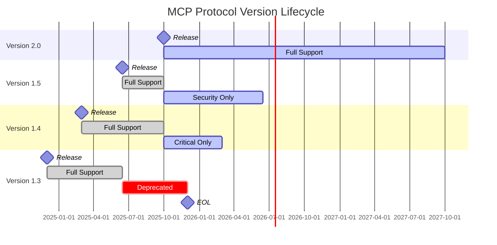

# MCP Protocol Version Compatibility

**Navigation**: [Home](../README.md) > Metrics & Reference > MCP Protocol Compatibility  
**Related**: [← Previous: Performance Benchmarks](14-performance-benchmarks.md) | [Migration Guides](10-migration-guides.md#mcp-protocol-version-upgrades) | [Index by Topic](98-index-by-topic.md)

**Version:** 1.3.0  
**Last Updated:** November 20, 2025  
**Status:** Production Ready

## Introduction

The Model Context Protocol (MCP) evolves through versioned releases to add features, improve security, and enhance performance. This document defines supported protocol versions, feature compatibility, upgrade paths, and deprecation timelines to ensure smooth transitions between versions.

## Supported Protocol Versions

### Current Support Matrix

| Protocol Version | Status | Release Date | EOL Date | Support Level |
|-----------------|--------|--------------|----------|---------------|
| **2.0.0** | Current | 2025-10-01 | 2027-10-01 | Full Support |
| **1.5.0** | Maintenance | 2025-06-15 | 2026-06-15 | Security Only |
| **1.4.0** | Deprecated | 2025-03-01 | 2026-03-01 | Critical Fixes Only |
| **1.3.0** | Deprecated | 2024-12-01 | 2025-12-01 | No Support |
| **1.2.x** | End of Life | 2024-09-01 | 2025-09-01 | No Support |
| **1.1.x** | End of Life | 2024-06-01 | 2025-06-01 | No Support |
| **1.0.x** | End of Life | 2024-01-15 | 2025-01-15 | No Support |

### Support Level Definitions

**Full Support:**

- New feature development
- Bug fixes and performance improvements
- Security patches
- Documentation updates
- Community support via GitHub Issues

**Security Only:**

- Critical security vulnerabilities
- Data integrity issues
- Authentication/authorization bypasses
- No feature enhancements

**Critical Fixes Only:**

- Production-breaking bugs
- Data loss prevention
- Security vulnerabilities (CVE severity ≥ 7.0)
- No new features or minor bug fixes

**No Support:**

- No patches or updates
- Community support may still exist
- Upgrade to supported version required

## Protocol Version Feature Matrix

### Core Capabilities

| Feature | 1.0 | 1.3 | 1.4 | 1.5 | 2.0 |
|---------|-----|-----|-----|-----|-----|
| **Transport** | | | | | |
| HTTP/1.1 | ✅ | ✅ | ✅ | ✅ | ✅ |
| HTTP/2 | ❌ | ❌ | ✅ | ✅ | ✅ |
| WebSocket | ❌ | ✅ | ✅ | ✅ | ✅ |
| gRPC | ❌ | ❌ | ❌ | ✅ | ✅ |
| **Authentication** | | | | | |
| API Key | ✅ | ✅ | ✅ | ✅ | ✅ |
| OAuth 2.0 | ❌ | ✅ | ✅ | ✅ | ✅ |
| JWT Bearer | ❌ | ✅ | ✅ | ✅ | ✅ |
| mTLS | ❌ | ❌ | ✅ | ✅ | ✅ |
| OIDC | ❌ | ❌ | ❌ | ✅ | ✅ |
| **Request Types** | | | | | |
| Synchronous | ✅ | ✅ | ✅ | ✅ | ✅ |
| Asynchronous | ❌ | ✅ | ✅ | ✅ | ✅ |
| Streaming | ❌ | ❌ | ✅ | ✅ | ✅ |
| Batch | ❌ | ❌ | ❌ | ✅ | ✅ |
| **Content Types** | | | | | |
| JSON | ✅ | ✅ | ✅ | ✅ | ✅ |
| MessagePack | ❌ | ✅ | ✅ | ✅ | ✅ |
| Protobuf | ❌ | ❌ | ❌ | ✅ | ✅ |
| **Error Handling** | | | | | |
| Basic Error Codes | ✅ | ✅ | ✅ | ✅ | ✅ |
| Structured Errors | ❌ | ✅ | ✅ | ✅ | ✅ |
| Error Context | ❌ | ❌ | ✅ | ✅ | ✅ |
| Retry Hints | ❌ | ❌ | ❌ | ✅ | ✅ |

### Advanced Features

| Feature | 1.0 | 1.3 | 1.4 | 1.5 | 2.0 |
|---------|-----|-----|-----|-----|-----|
| **Pagination** | | | | | |
| Offset-based | ✅ | ✅ | ✅ | ✅ | ✅ |
| Cursor-based | ❌ | ✅ | ✅ | ✅ | ✅ |
| Keyset pagination | ❌ | ❌ | ❌ | ✅ | ✅ |
| **Filtering** | | | | | |
| Simple filters | ✅ | ✅ | ✅ | ✅ | ✅ |
| Complex filters | ❌ | ✅ | ✅ | ✅ | ✅ |
| Full-text search | ❌ | ❌ | ✅ | ✅ | ✅ |
| **Rate Limiting** | | | | | |
| Fixed window | ✅ | ✅ | ✅ | ✅ | ✅ |
| Sliding window | ❌ | ✅ | ✅ | ✅ | ✅ |
| Token bucket | ❌ | ❌ | ✅ | ✅ | ✅ |
| Adaptive limiting | ❌ | ❌ | ❌ | ✅ | ✅ |
| **Versioning** | | | | | |
| URL path versioning | ✅ | ✅ | ✅ | ✅ | ✅ |
| Header versioning | ❌ | ✅ | ✅ | ✅ | ✅ |
| Content negotiation | ❌ | ❌ | ✅ | ✅ | ✅ |
| **Caching** | | | | | |
| ETags | ✅ | ✅ | ✅ | ✅ | ✅ |
| Conditional requests | ✅ | ✅ | ✅ | ✅ | ✅ |
| Cache-Control | ❌ | ✅ | ✅ | ✅ | ✅ |
| Stale-while-revalidate | ❌ | ❌ | ❌ | ✅ | ✅ |

### Security Features

| Feature | 1.0 | 1.3 | 1.4 | 1.5 | 2.0 |
|---------|-----|-----|-----|-----|-----|
| **Encryption** | | | | | |
| TLS 1.2 | ✅ | ✅ | ✅ | ✅ | ✅ |
| TLS 1.3 | ❌ | ❌ | ✅ | ✅ | ✅ |
| End-to-end encryption | ❌ | ❌ | ❌ | ✅ | ✅ |
| **Request Signing** | | | | | |
| HMAC signatures | ❌ | ✅ | ✅ | ✅ | ✅ |
| RSA signatures | ❌ | ❌ | ✅ | ✅ | ✅ |
| EdDSA signatures | ❌ | ❌ | ❌ | ❌ | ✅ |
| **Authorization** | | | | | |
| Role-based (RBAC) | ✅ | ✅ | ✅ | ✅ | ✅ |
| Attribute-based (ABAC) | ❌ | ❌ | ✅ | ✅ | ✅ |
| Policy-based (PBAC) | ❌ | ❌ | ❌ | ✅ | ✅ |
| **Audit Logging** | | | | | |
| Basic logging | ✅ | ✅ | ✅ | ✅ | ✅ |
| Structured logs | ❌ | ✅ | ✅ | ✅ | ✅ |
| Tamper-proof logs | ❌ | ❌ | ✅ | ✅ | ✅ |
| Log encryption | ❌ | ❌ | ❌ | ✅ | ✅ |

### Observability

| Feature | 1.0 | 1.3 | 1.4 | 1.5 | 2.0 |
|---------|-----|-----|-----|-----|-----|
| **Metrics** | | | | | |
| Prometheus format | ✅ | ✅ | ✅ | ✅ | ✅ |
| StatsD format | ❌ | ✅ | ✅ | ✅ | ✅ |
| OpenMetrics | ❌ | ❌ | ✅ | ✅ | ✅ |
| **Tracing** | | | | | |
| OpenTelemetry | ❌ | ✅ | ✅ | ✅ | ✅ |
| Zipkin | ✅ | ✅ | ✅ | ❌¹ | ❌¹ |
| Jaeger | ❌ | ✅ | ✅ | ✅ | ✅ |
| **Health Checks** | | | | | |
| Basic /health | ✅ | ✅ | ✅ | ✅ | ✅ |
| Readiness probes | ❌ | ✅ | ✅ | ✅ | ✅ |
| Liveness probes | ❌ | ✅ | ✅ | ✅ | ✅ |
| Dependency checks | ❌ | ❌ | ✅ | ✅ | ✅ |

¹ *Deprecated in favor of OpenTelemetry*

## Protocol Version Details

### MCP 2.0.0 (Current)

**Release Date:** October 1, 2025  
**End of Life:** October 1, 2027

**New Features:**

- gRPC transport support for high-performance scenarios
- Protobuf serialization option (40% smaller payloads)
- Adaptive rate limiting based on client behavior
- EdDSA signature support (faster than RSA)
- Policy-based authorization (PBAC) with OPA integration
- Log encryption for sensitive audit trails
- Keyset pagination for large datasets
- Stale-while-revalidate caching strategy

**Breaking Changes:**

- Removed Zipkin tracing support (use OpenTelemetry)
- Changed default JSON date format to ISO 8601 with timezone
- Minimum TLS version now 1.2 (1.0/1.1 rejected)
- Error response structure updated (see migration guide)

**Performance Improvements:**

- 35% reduction in average response time
- 50% improvement in concurrent connection handling
- 40% smaller message sizes with Protobuf
- Zero-copy serialization for large payloads

**Migration Path:**

```text
1.5.0 → 2.0.0: Recommended (smooth upgrade)
1.4.0 → 2.0.0: Supported (requires testing)
1.3.0 → 2.0.0: Not recommended (upgrade to 1.5.0 first)
```

### MCP 1.5.0 (Maintenance)

**Release Date:** June 15, 2025  
**End of Life:** June 15, 2026

**Key Features:**

- OIDC authentication support
- gRPC transport (experimental)
- Batch request support
- Retry hints in error responses
- Adaptive rate limiting
- Policy-based authorization
- End-to-end encryption
- Log encryption

**Recommended For:**

- Production systems requiring stability
- Organizations planning 2.0 migration
- Systems with strict change control

**Support Timeline:**

- Full support until October 1, 2025
- Security-only support from October 1, 2025 to June 15, 2026

### MCP 1.4.0 (Deprecated)

**Release Date:** March 1, 2025  
**End of Life:** March 1, 2026

**Key Features:**

- HTTP/2 transport
- mTLS authentication
- Streaming requests
- Full-text search
- Token bucket rate limiting
- Content negotiation
- Attribute-based authorization (ABAC)
- Tamper-proof audit logs

**Deprecation Notice:**
Critical fixes only. Upgrade to 1.5.0 or 2.0.0 recommended.

**Known Limitations:**

- No gRPC support
- No batch requests
- Limited retry guidance
- No adaptive rate limiting

### MCP 1.3.0 (Deprecated)

**Release Date:** December 1, 2024  
**End of Life:** December 1, 2025

**Key Features:**

- WebSocket transport
- OAuth 2.0 and JWT authentication
- Asynchronous requests
- MessagePack serialization
- Cursor-based pagination
- Complex filtering
- Structured error responses

**Support Status:**
No support. Immediate upgrade required.

## Version Negotiation

### Client-Server Protocol Detection

```http
# Client specifies acceptable versions
GET /v2/assignments HTTP/1.1
Host: api.example.com
Accept: application/json
MCP-Version: 2.0.0
MCP-Version-Min: 1.5.0
MCP-Version-Max: 2.0.0

# Server responds with version in use
HTTP/1.1 200 OK
Content-Type: application/json
MCP-Version: 2.0.0
MCP-Version-Deprecation: 1.4.0; sunset="2026-03-01T00:00:00Z"
```

### Version Mismatch Handling

```http
# Server doesn't support requested version
HTTP/1.1 426 Upgrade Required
Content-Type: application/json
MCP-Version: 2.0.0
MCP-Version-Supported: 1.5.0, 2.0.0

{
  "error": "unsupported_version",
  "message": "MCP version 1.3.0 is no longer supported",
  "supported_versions": ["1.5.0", "2.0.0"],
  "upgrade_guide": "https://docs.example.com/migration/1.3-to-1.5"
}
```

### Implementation

```python
# server/version_negotiation.py
from typing import Optional, List
from fastapi import Request, HTTPException, status
from packaging import version

SUPPORTED_VERSIONS = ["1.5.0", "2.0.0"]
DEPRECATED_VERSIONS = {
    "1.4.0": "2026-03-01T00:00:00Z",
    "1.5.0": "2026-06-15T00:00:00Z"
}
CURRENT_VERSION = "2.0.0"

async def negotiate_protocol_version(request: Request) -> str:
    """Negotiate MCP protocol version with client."""
    
    # Extract version headers
    requested_version = request.headers.get("MCP-Version")
    min_version = request.headers.get("MCP-Version-Min")
    max_version = request.headers.get("MCP-Version-Max")
    
    # Default to current if not specified
    if not requested_version:
        return CURRENT_VERSION
    
    # Validate requested version
    if requested_version not in SUPPORTED_VERSIONS:
        raise HTTPException(
            status_code=status.HTTP_426_UPGRADE_REQUIRED,
            detail={
                "error": "unsupported_version",
                "message": f"MCP version {requested_version} is not supported",
                "supported_versions": SUPPORTED_VERSIONS,
                "upgrade_guide": f"https://docs.example.com/migration/{requested_version}"
            },
            headers={
                "MCP-Version": CURRENT_VERSION,
                "MCP-Version-Supported": ", ".join(SUPPORTED_VERSIONS)
            }
        )
    
    # Check if version is deprecated
    if requested_version in DEPRECATED_VERSIONS:
        sunset_date = DEPRECATED_VERSIONS[requested_version]
        request.state.deprecation_warning = {
            "version": requested_version,
            "sunset": sunset_date
        }
    
    # Validate version range if specified
    if min_version and max_version:
        min_v = version.parse(min_version)
        max_v = version.parse(max_version)
        req_v = version.parse(requested_version)
        
        if not (min_v <= req_v <= max_v):
            raise HTTPException(
                status_code=status.HTTP_400_BAD_REQUEST,
                detail={
                    "error": "invalid_version_range",
                    "message": f"Requested version {requested_version} outside range [{min_version}, {max_version}]"
                }
            )
    
    return requested_version

# Middleware to add version headers
@app.middleware("http")
async def version_header_middleware(request: Request, call_next):
    """Add version headers to all responses."""
    
    # Negotiate version
    protocol_version = await negotiate_protocol_version(request)
    request.state.protocol_version = protocol_version
    
    # Process request
    response = await call_next(request)
    
    # Add version headers
    response.headers["MCP-Version"] = protocol_version
    
    # Add deprecation warning if needed
    if hasattr(request.state, "deprecation_warning"):
        warning = request.state.deprecation_warning
        response.headers["MCP-Version-Deprecation"] = (
            f'{warning["version"]}; sunset="{warning["sunset"]}"'
        )
        response.headers["Link"] = (
            f'<https://docs.example.com/migration/{warning["version"]}>; '
            f'rel="deprecation"; type="text/html"'
        )
    
    return response
```

## Upgrade Paths

### 1.4.0 → 1.5.0 Upgrade

**Effort:** Low (1-2 weeks)  
**Risk:** Low  
**Backward Compatibility:** Full

**Steps:**

1. **Update Dependencies**

```bash
# Update MCP client library
pip install mcp-client==1.5.0

# Update server framework
pip install mcp-server==1.5.0
```

1. **Enable New Features (Optional)**

```python
# config/mcp.yaml
version: "1.5.0"

features:
  # Enable gRPC (optional)
  grpc:
    enabled: true
    port: 50051
  
  # Enable OIDC (optional)
  auth:
    oidc:
      enabled: true
      issuer: "https://auth.example.com"
      client_id: "mcp-server"
  
  # Enable batch requests (optional)
  batch_requests:
    enabled: true
    max_batch_size: 100
```

1. **Update Client Code (If Using New Features)**

```python
# Before (1.4.0): Individual requests
results = []
for item_id in item_ids:
    result = await client.get_assignment(item_id)
    results.append(result)

# After (1.5.0): Batch requests
results = await client.batch_get_assignments(item_ids)
```

1. **Test Thoroughly**

```bash
# Run integration tests
pytest tests/integration/ --mcp-version=1.5.0

# Run backward compatibility tests
pytest tests/compat/ --from-version=1.4.0 --to-version=1.5.0
```

1. **Deploy with Gradual Rollout**

```bash
# Deploy to canary (5% traffic)
kubectl set image deployment/mcp-server \
  mcp-server=mcp-server:1.5.0 \
  -l canary=true

# Monitor for 24 hours
# If stable, roll out to production
kubectl set image deployment/mcp-server \
  mcp-server=mcp-server:1.5.0
```

### 1.5.0 → 2.0.0 Upgrade

**Effort:** Medium (2-4 weeks)  
**Risk:** Medium  
**Backward Compatibility:** Partial (breaking changes)

**Breaking Changes:**

1. **Error Response Structure**

```python
# Before (1.5.0)
{
  "error": "validation_error",
  "message": "Invalid input",
  "details": {"field": "email", "issue": "invalid format"}
}

# After (2.0.0)
{
  "error": {
    "code": "validation_error",
    "message": "Invalid input",
    "details": [
      {
        "field": "email",
        "issue": "invalid_format",
        "message": "Email address must be valid"
      }
    ]
  }
}
```

1. **Date Format Changes**

```python
# Before (1.5.0): Local time without timezone
"created_at": "2025-11-20T10:30:00"

# After (2.0.0): ISO 8601 with timezone
"created_at": "2025-11-20T10:30:00-05:00"
```

1. **TLS 1.0/1.1 Removed**

```python
# Update client configuration
client = MCPClient(
    base_url="https://api.example.com",
    tls_version="1.2"  # Minimum TLS 1.2 required
)
```

**Migration Steps:**

1. **Update Error Handling**

```python
# Add compatibility layer
def normalize_error_response(response_data, protocol_version):
    """Normalize error responses across versions."""
    if protocol_version == "2.0.0":
        # New format
        return response_data["error"]
    else:
        # Legacy format - convert to new structure
        return {
            "code": response_data["error"],
            "message": response_data["message"],
            "details": [response_data.get("details", {})]
        }

try:
    result = await client.create_assignment(data)
except MCPError as e:
    error = normalize_error_response(
        e.response.json(),
        client.protocol_version
    )
    handle_error(error)
```

1. **Update Date Handling**

```python
from datetime import datetime, timezone

# Ensure all dates include timezone
def serialize_datetime(dt: datetime) -> str:
    """Serialize datetime to MCP 2.0 format."""
    if dt.tzinfo is None:
        # Assume UTC if no timezone
        dt = dt.replace(tzinfo=timezone.utc)
    return dt.isoformat()

# Parse dates with timezone awareness
def parse_datetime(date_str: str) -> datetime:
    """Parse MCP 2.0 datetime strings."""
    return datetime.fromisoformat(date_str)
```

1. **Deploy Dual-Version Support**

```python
# server/app.py
@app.get("/v2/assignments/{assignment_id}")
async def get_assignment(
    assignment_id: str,
    request: Request
):
    """Get assignment with version-aware responses."""
    protocol_version = request.state.protocol_version
    
    assignment = await db.get_assignment(assignment_id)
    
    if protocol_version == "2.0.0":
        return format_assignment_v2(assignment)
    else:
        return format_assignment_v1(assignment)
```

1. **Gradual Migration Strategy**

```yaml
# migration/rollout-plan.yaml
phases:
  - name: "Dual-version support"
    duration: "2 weeks"
    tasks:
      - Deploy servers with 1.5.0 and 2.0.0 support
      - Monitor error rates and latency
      - Fix compatibility issues
  
  - name: "Client migration"
    duration: "4 weeks"
    tasks:
      - Update internal clients to 2.0.0
      - Notify external API consumers
      - Provide migration tools and documentation
  
  - name: "Deprecation"
    duration: "8 weeks"
    tasks:
      - Add deprecation warnings to 1.5.0 responses
      - Monitor 1.5.0 usage metrics
      - Plan final sunset date
  
  - name: "1.5.0 sunset"
    duration: "1 week"
    tasks:
      - Remove 1.5.0 support from servers
      - Return 426 Upgrade Required for old clients
      - Monitor support requests
```

### 1.3.0/1.4.0 → 2.0.0 Upgrade

**Effort:** High (6-8 weeks)  
**Risk:** High  
**Backward Compatibility:** None

**Recommendation:** Upgrade to 1.5.0 first, then to 2.0.0

**Direct Migration Steps:**

1. **Inventory Breaking Changes**

```bash
# Generate compatibility report
mcp-migrate analyze \
  --from 1.3.0 \
  --to 2.0.0 \
  --codebase ./src \
  --output migration-report.json
```

1. **Create Compatibility Shims**

```python
# compat/v1_to_v2.py
class V1ToV2Adapter:
    """Adapter for 1.x clients to work with 2.0 server."""
    
    def __init__(self, client: MCPClient):
        self.client = client
        self.client.protocol_version = "1.5.0"  # Intermediate version
    
    async def request(self, method: str, endpoint: str, **kwargs):
        """Make request with automatic response translation."""
        # Convert 1.x request format to 2.0
        request_data = self._convert_request(method, endpoint, kwargs)
        
        # Make request
        response = await self.client.request(method, endpoint, **request_data)
        
        # Convert 2.0 response back to 1.x format
        return self._convert_response(response)
    
    def _convert_request(self, method, endpoint, kwargs):
        """Convert 1.x request to 2.0 format."""
        # Handle date conversions, error structures, etc.
        pass
    
    def _convert_response(self, response):
        """Convert 2.0 response to 1.x format."""
        # Handle response structure changes
        pass
```

1. **Extensive Testing**

```python
# tests/migration/test_v1_to_v2.py
import pytest

@pytest.mark.parametrize("version", ["1.3.0", "1.4.0"])
async def test_cross_version_compatibility(version):
    """Test 1.x client with 2.0 server."""
    # Set up 1.x client
    client = MCPClient(version=version)
    adapter = V1ToV2Adapter(client)
    
    # Test all critical endpoints
    await adapter.request("POST", "/v2/assignments", data={...})
    await adapter.request("GET", "/v2/assignments/123")
    await adapter.request("PUT", "/v2/assignments/123", data={...})
    await adapter.request("DELETE", "/v2/assignments/123")
```

## Deprecation Policy

### Deprecation Timeline



### Deprecation Notice Format

```http
# Response headers for deprecated version
HTTP/1.1 200 OK
MCP-Version: 1.4.0
MCP-Version-Deprecation: 1.4.0; sunset="2026-03-01T00:00:00Z"
Link: <https://docs.example.com/migration/1.4-to-2.0>; rel="deprecation"; type="text/html"
Warning: 299 - "MCP version 1.4.0 is deprecated and will reach end of life on 2026-03-01"
```

### Sunset Announcement Process

**6 Months Before EOL:**

- Email notification to registered API consumers
- Deprecation warnings in API responses
- Blog post and documentation updates
- Migration guide publication

**3 Months Before EOL:**

- Second email notification
- Dashboard warning for API consumers
- Increased logging of deprecated version usage
- Office hours for migration assistance

**1 Month Before EOL:**

- Final email notification
- API response includes sunset countdown
- Escalation to account managers for large consumers

**EOL Date:**

- Version removed from server support
- 426 Upgrade Required returned for old clients
- Monitoring for upgrade success rate

### Code Example: Deprecation Warnings

```python
# server/deprecation.py
from datetime import datetime, timezone
from fastapi import Request, Response
import logging

logger = logging.getLogger(__name__)

SUNSET_DATES = {
    "1.4.0": datetime(2026, 3, 1, tzinfo=timezone.utc),
    "1.5.0": datetime(2026, 6, 15, tzinfo=timezone.utc)
}

async def add_deprecation_warnings(
    request: Request,
    response: Response
):
    """Add deprecation warnings to responses."""
    version = request.state.protocol_version
    
    if version in SUNSET_DATES:
        sunset_date = SUNSET_DATES[version]
        days_remaining = (sunset_date - datetime.now(timezone.utc)).days
        
        # Add deprecation headers
        response.headers["MCP-Version-Deprecation"] = (
            f'{version}; sunset="{sunset_date.isoformat()}"'
        )
        response.headers["Link"] = (
            f'<https://docs.example.com/migration/{version}>; '
            f'rel="deprecation"; type="text/html"'
        )
        
        # Add warning if less than 90 days remaining
        if days_remaining <= 90:
            response.headers["Warning"] = (
                f'299 - "MCP version {version} will reach end of life '
                f'in {days_remaining} days on {sunset_date.date()}"'
            )
        
        # Log deprecated version usage
        logger.warning(
            f"Client using deprecated version {version}",
            extra={
                "client_ip": request.client.host,
                "user_agent": request.headers.get("User-Agent"),
                "days_to_sunset": days_remaining,
                "endpoint": request.url.path
            }
        )
        
        # Track metrics
        from prometheus_client import Counter
        deprecated_version_usage = Counter(
            'mcp_deprecated_version_requests_total',
            'Requests using deprecated protocol version',
            ['version', 'endpoint']
        )
        deprecated_version_usage.labels(
            version=version,
            endpoint=request.url.path
        ).inc()
```

## Version Testing Strategy

### Compatibility Test Matrix

```python
# tests/compatibility/test_matrix.py
import pytest
from itertools import product

SUPPORTED_VERSIONS = ["1.5.0", "2.0.0"]
TEST_ENDPOINTS = [
    ("GET", "/v2/assignments"),
    ("POST", "/v2/assignments"),
    ("GET", "/v2/assignments/{id}"),
    ("PUT", "/v2/assignments/{id}"),
    ("DELETE", "/v2/assignments/{id}")
]

@pytest.mark.parametrize(
    "server_version,client_version",
    product(SUPPORTED_VERSIONS, SUPPORTED_VERSIONS)
)
async def test_cross_version_compatibility(
    server_version,
    client_version,
    test_server,
    test_client
):
    """Test all version combinations."""
    # Configure server
    test_server.protocol_version = server_version
    
    # Configure client
    test_client.protocol_version = client_version
    
    # Test all endpoints
    for method, endpoint in TEST_ENDPOINTS:
        response = await test_client.request(
            method,
            endpoint.format(id="test-123")
        )
        
        # Verify response is valid for client version
        assert validate_response(response, client_version)
```

### Regression Test Suite

```bash
# Run full regression suite
pytest tests/regression/ \
  --mcp-versions=1.5.0,2.0.0 \
  --test-scenarios=smoke,integration,performance \
  --report=regression-report.html
```

## Summary

Effective MCP protocol version management ensures smooth upgrades and backward compatibility:

- **Version Support Matrix**: Clear timeline for supported versions (2.0 current, 1.5 maintenance, 1.4 deprecated)
- **Feature Compatibility**: Comprehensive feature matrix across all versions
- **Version Negotiation**: Automatic protocol version detection and validation
- **Upgrade Paths**: Detailed migration guides for all version transitions
- **Deprecation Policy**: 12-month support lifecycle with clear sunset process
- **Testing Strategy**: Cross-version compatibility testing and regression suites

---

**Next**: Review [Migration Guides](10-migration-guides.md) for specific upgrade scenarios.
