# Architecture Description: MCP Server

**Document Identifier:** MCP-AD-001  
**Version:** 1.0.0  
**Date:** 2026-02-23  
**Standard:** ISO/IEC/IEEE 42010:2022  
**Status:** Approved  
**Author:** Mark Sigler

---

## Document Control

| Version | Date | Author | Changes |
|---------|------|--------|---------|
| 1.0.0 | 2026-02-23 | Mark Sigler | Initial AD derived from MCP-ARCHITECTURE v1.4.0, structured per IEEE 42010:2022 |

---

## Table of Contents

1. [AD Identification](#1-ad-identification)
2. [Stakeholders and Concerns](#2-stakeholders-and-concerns)
3. [Viewpoints](#3-viewpoints)
4. [Views](#4-views)
5. [Architecture Decisions](#5-architecture-decisions)
6. [Correspondence Rules](#6-correspondence-rules)
7. [Known Issues and Gaps](#7-known-issues-and-gaps)

---

## 1. AD Identification

### 1.1 Purpose

This Architecture Description (AD) describes the architecture of a production-ready Model Context Protocol (MCP) server. It is structured per ISO/IEC/IEEE 42010:2022 and realizes the requirements defined in the [Software Requirements Specification (SRS)](../IEEE-29148/SRS.md).

### 1.2 Scope

The AD covers the architecture of a single MCP server instance and its supporting infrastructure:

- Five-layer enterprise architecture (Gateway, Server, Security, Observability, Integration)
- Core MCP primitives: resources, tools, prompts
- Advanced capabilities: sampling, elicitation, tasks
- Security framework: OAuth 2.1 + JWT/JWKS
- Containerized deployment on Docker and Kubernetes
- Observability pipeline: logging, metrics, tracing
- Multi-server orchestration patterns
- AI Service Provider Gateway

### 1.3 System of Interest

**System:** MCP Server  
**Version:** Targets MCP specification 2025-11-25  
**Framework:** FastMCP (Python)  
**Deployment:** Containerized (Docker, Kubernetes)

### 1.4 References

**Normative:**

| Reference | Location |
|-----------|----------|
| SRS (IEEE 29148) | [../IEEE-29148/SRS.md](../IEEE-29148/SRS.md) |
| MCP Specification 2025-11-25 | <https://modelcontextprotocol.io/docs/> |
| MCP Authorization | <https://modelcontextprotocol.io/docs/tutorials/security/authorization> |
| JSON-RPC 2.0 | <https://www.jsonrpc.org/specification> |
| OAuth 2.1 | <https://oauth.net/2.1/> |
| RFC 9728 | <https://datatracker.ietf.org/doc/html/rfc9728> |

**Supporting Architecture Documents:**

| Document | Viewpoints Supported |
|----------|---------------------|
| [01-architecture-overview.md](views/01-architecture-overview.md) | Functional |
| [01b-architecture-decisions.md](views/01b-architecture-decisions.md) | All (ADRs) |
| [02-security-architecture.md](views/02-security-architecture.md) | Security |
| [02a-data-privacy-compliance.md](views/02a-data-privacy-compliance.md) | Security, Information |
| [02b-requirements-engineering.md](../IEEE-29148/methodology/02b-requirements-engineering.md) | Development |
| [03-tool-implementation.md](views/03-tool-implementation.md) | Functional |
| [03a-prompt-implementation.md](views/03a-prompt-implementation.md) | Functional |
| [03b-resource-implementation.md](views/03b-resource-implementation.md) | Functional |
| [03c-sampling-patterns.md](views/03c-sampling-patterns.md) | Functional |
| [03d-decision-trees.md](views/03d-decision-trees.md) | Development |
| [03e-integration-patterns.md](views/03e-integration-patterns.md) | Functional |
| [03f-elicitation-patterns.md](views/03f-elicitation-patterns.md) | Functional |
| [03g-task-patterns.md](views/03g-task-patterns.md) | Functional |
| [03h-multi-server-orchestration.md](views/03h-multi-server-orchestration.md) | Functional, Deployment |
| [03i-ai-service-provider-gateway.md](views/03i-ai-service-provider-gateway.md) | Functional, Deployment |
| [04-testing-strategy.md](views/04-testing-strategy.md) | Development |
| [05-observability.md](views/05-observability.md) | Operational |
| [06-development-lifecycle.md](views/06-development-lifecycle.md) | Development |
| [06a-performance-scalability.md](views/06a-performance-scalability.md) | Operational |
| [07-deployment-patterns.md](views/07-deployment-patterns.md) | Deployment |
| [08-operational-runbooks.md](views/08-operational-runbooks.md) | Operational |
| [09-agentic-best-practices.md](views/09-agentic-best-practices.md) | Functional |
| [10-migration-guides.md](views/10-migration-guides.md) | Development |
| [11-troubleshooting.md](views/11-troubleshooting.md) | Operational |
| [12-cost-optimization.md](views/12-cost-optimization.md) | Operational |
| [13-metrics-kpis.md](views/13-metrics-kpis.md) | Operational |
| [14-performance-benchmarks.md](views/14-performance-benchmarks.md) | Operational |
| [15-mcp-protocol-compatibility.md](views/15-mcp-protocol-compatibility.md) | Development |

---

## 2. Stakeholders and Concerns

### 2.1 Stakeholder Catalogue

Per IEEE 42010 §5.3, the following stakeholders have architecture concerns:

| Stakeholder | Description | Key Concerns |
|-------------|-------------|--------------|
| **Enterprise Architect** | Technology governance authority | Standards compliance, integration patterns, maintainability |
| **Engineering Lead** | Technical decision authority | Feasibility, consistency, team velocity, code quality |
| **Security Lead** | Risk and compliance authority | Threat mitigation, access control, audit, data protection |
| **DevOps Lead** | Operations authority | Deployability, reliability, scalability, monitoring |
| **Product Owner** | Business priority authority | Feature availability, time-to-market, cost |
| **Enterprise Developers** | Build AI-powered applications | Clear APIs, documentation, debugging tools, testing |
| **Platform Engineers** | Manage deployments | Automation, container management, resource efficiency |
| **Data Scientists** | Create AI workflows | Data access, model integration, performance |
| **Security Engineers** | Ensure compliance | Vulnerability management, penetration testing, audit trails |

### 2.2 Concern Catalogue

| ID | Concern | Framing Stakeholders | Addressed by Viewpoints |
|----|---------|---------------------|------------------------|
| CON-01 | How are MCP primitives (tools, resources, prompts) structured? | Developers, Architect | Functional |
| CON-02 | How does data flow through the system? | Developers, Data Scientists | Functional, Information |
| CON-03 | How is data modeled and validated? | Developers, Data Scientists | Information |
| CON-04 | How is the system deployed and distributed? | DevOps, Platform Engineers | Deployment |
| CON-05 | How are authentication and authorization enforced? | Security Lead, Security Engineers | Security |
| CON-06 | How is the system monitored and debugged? | DevOps, Platform Engineers | Operational |
| CON-07 | How is the codebase organized and tested? | Engineering Lead, Developers | Development |
| CON-08 | How does the system scale under load? | DevOps, Architect | Operational, Deployment |
| CON-09 | How are threats mitigated? | Security Lead | Security |
| CON-10 | How is the system maintained and evolved? | Engineering Lead, Product Owner | Development |
| CON-11 | How are AI providers integrated? | Developers, Architect | Functional, Deployment |
| CON-12 | How are multiple MCP servers orchestrated? | Architect, Platform Engineers | Functional, Deployment |

---

## 3. Viewpoints

Per IEEE 42010 §5.4, viewpoints are reusable conventions for constructing architectural views. This AD defines six viewpoints.

### 3.1 Functional Viewpoint

**Purpose:** Describe the runtime behavior and component structure of the MCP server.

**Stakeholders:** Developers, Architects, Data Scientists

**Concerns addressed:** CON-01, CON-02, CON-11, CON-12

**Model kinds:**

- Component diagram (C4 Level 2)
- Sequence diagram (request flow)
- Capability map

**Analysis techniques:**

- Scenario walkthrough
- Protocol compliance verification

### 3.2 Information Viewpoint

**Purpose:** Describe data structures, schemas, and information flow.

**Stakeholders:** Developers, Data Scientists

**Concerns addressed:** CON-03

**Model kinds:**

- Data model diagram
- Schema definitions (JSON Schema 2020-12)

**Analysis techniques:**

- Schema validation
- Data flow analysis

### 3.3 Deployment Viewpoint

**Purpose:** Describe how the system is packaged, distributed, and deployed.

**Stakeholders:** DevOps, Platform Engineers

**Concerns addressed:** CON-04, CON-08, CON-12

**Model kinds:**

- Container topology diagram
- Distribution flow diagram
- Infrastructure diagram

**Analysis techniques:**

- Capacity analysis
- Failure mode analysis

### 3.4 Security Viewpoint

**Purpose:** Describe trust boundaries, authentication, authorization, and threat mitigations.

**Stakeholders:** Security Lead, Security Engineers, Architect

**Concerns addressed:** CON-05, CON-09

**Model kinds:**

- Trust boundary diagram
- Authentication flow sequence
- RBAC model
- STRIDE threat model

**Analysis techniques:**

- Threat modeling (STRIDE)
- Attack surface analysis

### 3.5 Operational Viewpoint

**Purpose:** Describe monitoring, alerting, health checking, and performance management.

**Stakeholders:** DevOps, Platform Engineers

**Concerns addressed:** CON-06, CON-08

**Model kinds:**

- Observability pipeline diagram
- Health check topology
- Alert routing diagram

**Analysis techniques:**

- SLO/SLI analysis
- Capacity planning

### 3.6 Development Viewpoint

**Purpose:** Describe module structure, build pipeline, testing strategy, and development workflow.

**Stakeholders:** Engineering Lead, Developers

**Concerns addressed:** CON-07, CON-10

**Model kinds:**

- Module structure diagram
- CI/CD pipeline diagram
- Testing pyramid

**Analysis techniques:**

- Dependency analysis
- Coverage analysis

---

## 4. Views

### 4.1 Functional View

#### 4.1.1 Five-Layer Architecture

The MCP server operates within a five-layer enterprise architecture. Each layer has distinct responsibilities with clear interfaces.

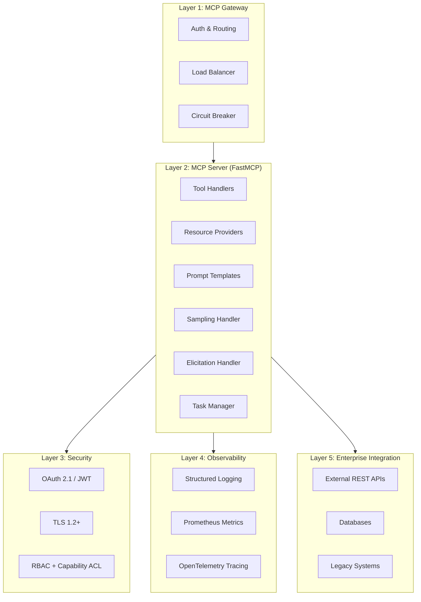

**Layer responsibilities** (see [architecture overview](views/01-architecture-overview.md) for full detail):

| Layer | Responsibility | SRS Requirements |
|-------|---------------|------------------|
| Gateway | TLS termination, auth validation, routing, global rate limits, correlation IDs, circuit breaker coordination | FR-PROTO-005, FR-PROTO-006, NFR-SEC-022, NFR-PERF-017 |
| Server | Tool execution, resource serving, prompt rendering, sampling, elicitation, task management | FR-TOOL-*, FR-RSRC-*, FR-PROMPT-*, FR-SAMP-*, FR-ELIC-*, FR-TASK-* |
| Security | OAuth 2.1 + PKCE, JWT verification, RBAC, capability ACL, input validation, audit logging | NFR-SEC-001–072 |
| Observability | Structured JSON logging, Prometheus metrics, OpenTelemetry tracing, health checks | NFR-OBS-001–013 |
| Integration | External API calls, database access, legacy system adapters | FR-TOOL-011–015 |

#### 4.1.2 MCP Capability Map

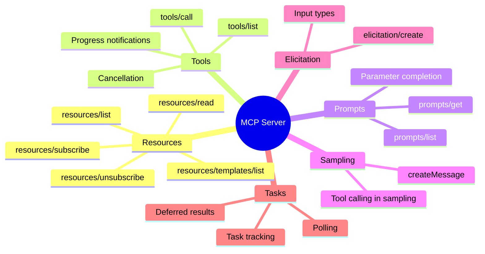

#### 4.1.3 Request Flow

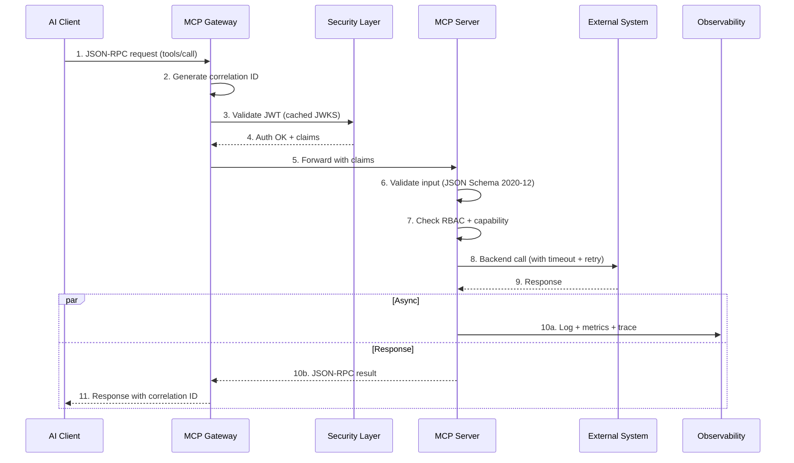

**Timing budget:**

| Step | Budget |
|------|--------|
| Gateway processing | 10–20 ms |
| JWT validation (cached) | 5–15 ms |
| Input validation | 1–5 ms |
| Backend integration | 100–300 ms (variable) |
| Protocol overhead | < 50 ms |
| **Total p95** | **< 500 ms** |

#### 4.1.4 Multi-Server Orchestration

Clients compose multiple MCP servers for cross-domain workflows. Each server declares clear capability boundaries (FR-ORCH-001). Servers never directly access other servers; cross-server coordination is client-orchestrated (FR-ORCH-005).

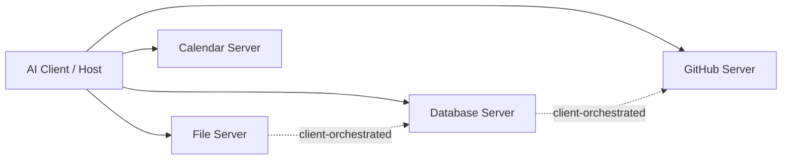

#### 4.1.5 AI Service Provider Gateway

The gateway abstracts AI provider differences, enabling provider-agnostic deployments (CP-03).

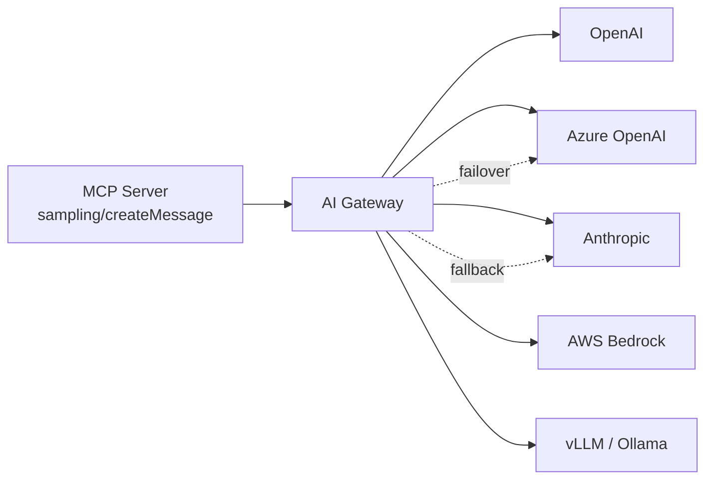

**Gateway capabilities:**

- Configurable `base_url` for any OpenAI-compatible endpoint (FR-GWWY-001)
- Automated `/v1/models` connectivity handshake (FR-GWWY-002)
- Enterprise header injection (`X-Project-ID`, `X-Cost-Center`) (FR-GWWY-003)
- Automatic failover on 429/5xx/timeout (FR-GWWY-004–006)
- Model ID mapping and per-instance rate limits (FR-GWWY-008–009)
- Encrypted credential storage (FR-GWWY-007, NFR-SEC-058–063)

---

### 4.2 Information View

#### 4.2.1 Core Data Model

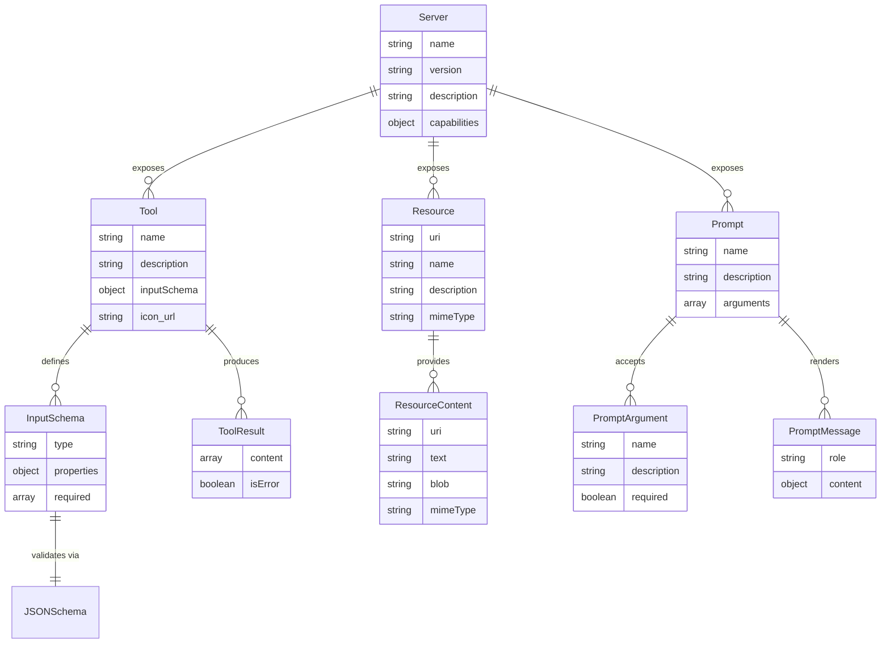

#### 4.2.2 Message Protocol

All communication uses JSON-RPC 2.0 over the selected transport:

| Message Type | Direction | Example |
|-------------|-----------|---------|
| Request | Client → Server | `tools/call`, `resources/read` |
| Response | Server → Client | Result or error |
| Notification | Server → Client | `notifications/resources/updated` |
| Notification | Client → Server | `notifications/cancelled` |
| Sampling request | Server → Client | `sampling/createMessage` |
| Elicitation request | Server → Client | `elicitation/create` |

**JSON Schema 2020-12** is used for all tool input validation (DC-003). Schemas are declared in `tools/list` responses and enforced before tool execution (FR-TOOL-005).

#### 4.2.3 Audit Event Structure

```json
{
  "timestamp": "2025-11-20T10:30:00Z",
  "event_type": "tool_execution",
  "user_id": "user@example.com",
  "user_role": "developer",
  "action": "tools/call:get_forecast",
  "result": "success",
  "ip_address": "10.0.1.42",
  "correlation_id": "550e8400-e29b-41d4-a716-446655440000",
  "duration_ms": 245
}
```

---

### 4.3 Deployment View

#### 4.3.1 Container Topology

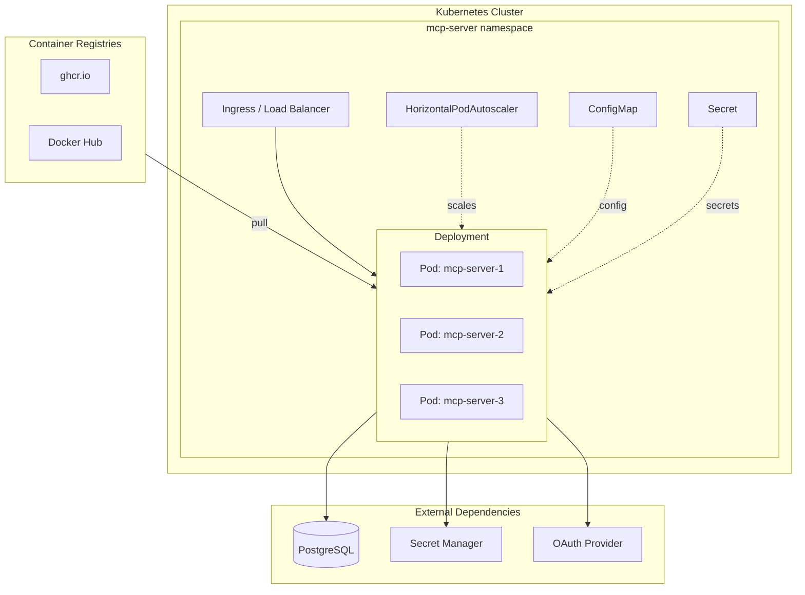

#### 4.3.2 Container Specification

| Property | Value | SRS Requirement |
|----------|-------|-----------------|
| Base image | Alpine / distroless | NFR-CNTR-001 |
| Compressed size | < 100 MB | NFR-CNTR-002 |
| Architectures | AMD64, ARM64 | NFR-CNTR-003 |
| User | Non-root (UID > 1000) | NFR-CNTR-006 |
| Filesystem | Read-only root | NFR-CNTR-007 |
| Capabilities | All dropped, only required added | NFR-CNTR-008 |
| Shell / pkg-mgr | None in final image | NFR-CNTR-009 |
| Secrets in layers | None | NFR-CNTR-010 |
| Vulnerability scan | Zero critical/high | NFR-CNTR-004 |
| CIS Benchmark | Passes | NFR-CNTR-012 |
| Startup time | < 5 seconds | NFR-CNTR-005 |
| Image signing | Cosign or Docker Content Trust | NFR-CNTR-027 |
| SBOM | Included | NFR-CNTR-028 |
| Provenance | Attestation included | NFR-CNTR-029 |

#### 4.3.3 Volume Mount Convention

| Mount Path | Access | Purpose | SRS Requirement |
|------------|--------|---------|-----------------|
| `/config` | Read-only | Configuration files | NFR-CNTR-014, NFR-CNTR-017 |
| `/data` | Read-write | Persistent application data | NFR-CNTR-017 |
| `/secrets` | Read-only | Mounted secrets | NFR-CNTR-015, NFR-CNTR-017 |
| `/logs` | Write | Log output | NFR-CNTR-017 |

#### 4.3.4 Configuration Hierarchy

Per 12-factor app (DC-011):

1. **Environment variables** — primary source (NFR-CNTR-013)
2. **Mounted config files** — override defaults (NFR-CNTR-014)
3. **Secret manager references** — credentials (NFR-CNTR-015)

All configuration validated on startup with clear error messages (NFR-CNTR-016).

#### 4.3.5 Distribution Flow

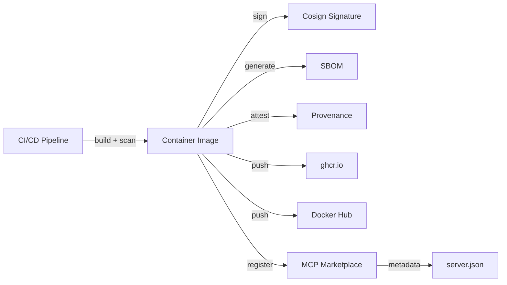

**Publish within 10 minutes of release** (NFR-CNTR-030).

#### 4.3.6 Scaling

| Dimension | Mechanism | SRS Requirement |
|-----------|-----------|-----------------|
| Horizontal | Stateless replicas via HPA | NFR-PERF-010 |
| Concurrency | 100+ connections per instance | NFR-PERF-007 |
| Throughput | > 100 req/s | NFR-PERF-011 |
| Memory | < 500 MB baseline per instance | NFR-PERF-009 |
| Graceful shutdown | SIGTERM within 30 s | NFR-CNTR-020 |

---

### 4.4 Security View

#### 4.4.1 Trust Boundaries

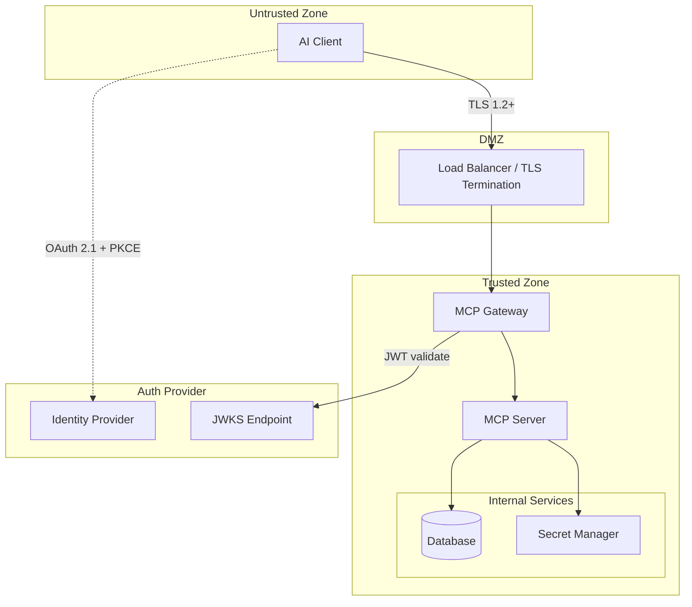

#### 4.4.2 OAuth 2.1 Authorization Flow

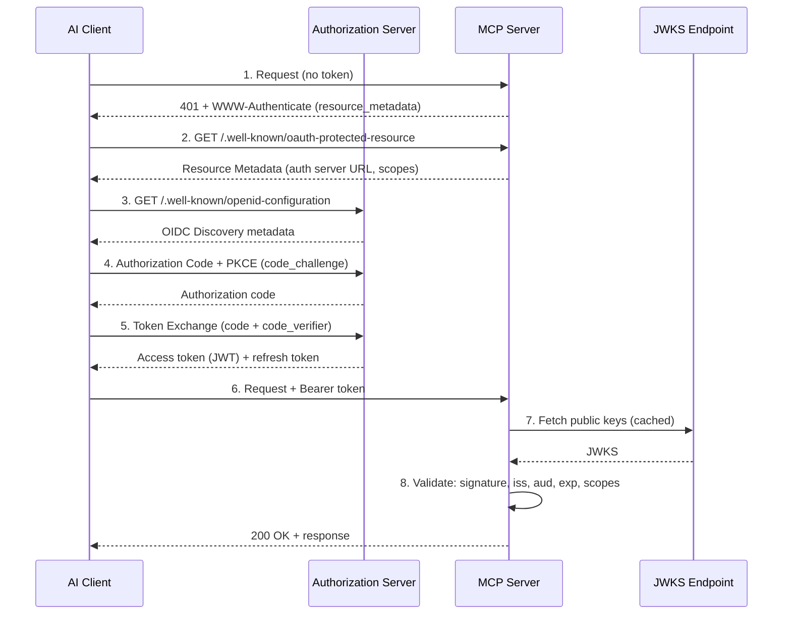

**Key security constraints:**

- PKCE mandatory for all public clients (NFR-SEC-001)
- Implicit flow prohibited (NFR-SEC-002)
- RFC 9728 Protected Resource Metadata at `/.well-known/oauth-protected-resource` (NFR-SEC-004)
- Per-capability scopes: `mcp:tools`, `mcp:resources`, `mcp:prompts` (NFR-SEC-009)

#### 4.4.3 RBAC Model

| Role | Capabilities | SRS Requirement |
|------|-------------|-----------------|
| **admin** | Full access (all capabilities) | NFR-SEC-017 |
| **developer** | `tools:execute`, `resources:read`, `prompts:get` | NFR-SEC-017 |
| **viewer** | `resources:read`, `prompts:get` | NFR-SEC-017 |
| **service** | Limited programmatic access (configured per-service) | NFR-SEC-017 |

**Authorization policy:** deny-by-default (NFR-SEC-019). Every request validated against role + capability (NFR-SEC-021).

#### 4.4.4 Defense in Depth Layers

| Layer | Controls | SRS Requirements |
|-------|----------|------------------|
| Network | TLS 1.2+, Origin validation, CORS allowlist | NFR-SEC-043, FR-PROTO-006, NFR-SEC-057 |
| Authentication | OAuth 2.1 + PKCE, JWT/JWKS, API keys | NFR-SEC-001–016 |
| Authorization | RBAC (4 roles), capability ACL, deny-by-default | NFR-SEC-017–021 |
| Application | Input validation (7 attack classes), rate limiting, security headers | NFR-SEC-030–057 |
| Data | PII masking, encrypted secrets, TLS in transit | NFR-SEC-041–045, NFR-SEC-058–065 |
| Audit | JSON audit events, append-only, 1-year retention | NFR-SEC-046–050 |

#### 4.4.5 Security Headers

Every HTTP response includes (NFR-SEC-051–057):

```
Content-Security-Policy: default-src 'self'
Strict-Transport-Security: max-age=31536000; includeSubDomains
X-Content-Type-Options: nosniff
X-Frame-Options: DENY
X-XSS-Protection: 1; mode=block
Referrer-Policy: no-referrer
```

#### 4.4.6 Input Validation Matrix

| Attack Class | Mitigation | SRS |
|-------------|-----------|-----|
| SQL Injection | Parameterized queries only | NFR-SEC-030 |
| Command Injection | Subprocess with argument lists, no shell | NFR-SEC-031 |
| Path Traversal | Validate against base directory whitelist | NFR-SEC-032 |
| XSS | Sanitize output, HTML-encode | NFR-SEC-033 |
| XXE | Disable external entities | NFR-SEC-034 |
| SSRF | URL whitelist validation | NFR-SEC-035 |
| ReDoS | Regex complexity limits + timeouts | NFR-SEC-036 |

**Request limits:** 1 MB max size (NFR-SEC-037), 5 levels JSON depth (NFR-SEC-038), 10,000 char string max (NFR-SEC-039), 30 s timeout (NFR-SEC-040).

---

### 4.5 Operational View

#### 4.5.1 Observability Pipeline

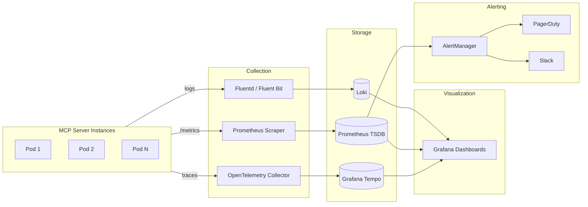

#### 4.5.2 Metrics Exposition

Prometheus-compatible endpoint at `/metrics` (NFR-OBS-005):

| Metric | Type | Labels | SRS |
|--------|------|--------|-----|
| `mcp_requests_total` | Counter | endpoint, method, status | NFR-OBS-006 |
| `mcp_request_duration_seconds` | Histogram | endpoint, quantile | NFR-OBS-006 |
| `mcp_errors_total` | Counter | endpoint, error_type | NFR-OBS-006 |
| `mcp_active_connections` | Gauge | — | NFR-OBS-006 |
| `mcp_rate_limit_hits_total` | Counter | tier | NFR-OBS-006 |

#### 4.5.3 Health Check Topology

| Endpoint | Probe Type | Response Time | Checks | SRS |
|----------|-----------|---------------|--------|-----|
| `/health` | Liveness | < 100 ms | Server running | NFR-OBS-008 |
| `/ready` | Readiness | < 500 ms | Dependencies available | NFR-OBS-009 |
| `/startup` | Startup | < 5 s | Initialization complete | NFR-OBS-010 |

#### 4.5.4 Performance Budget

| Metric | Target | SRS |
|--------|--------|-----|
| p50 response time | < 100 ms | NFR-PERF-012 |
| p95 response time | < 500 ms | NFR-PERF-002 |
| p99 response time | < 1000 ms | NFR-PERF-013 |
| Protocol overhead | < 50 ms | NFR-PERF-004 |
| Auth latency (cached) | < 100 ms | NFR-PERF-005 |
| Gateway overhead | < 30 ms | NFR-PERF-006 |
| Error rate | < 0.1% | NFR-PERF-014 |
| Availability | 99.9% | NFR-PERF-023 |

#### 4.5.5 Resilience Patterns

| Pattern | Configuration | SRS |
|---------|--------------|-----|
| Circuit breaker | Open after 5 failures, half-open after 30 s | NFR-PERF-017 |
| Retry with backoff | 1 s, 2 s, 4 s, 8 s exponential | NFR-PERF-020 |
| Failover (429) | Immediate to secondary | NFR-PERF-019 |
| Failover (5xx) | After backoff, within 500 ms total | NFR-PERF-020 |
| Failover (timeout) | Immediate, within 50 ms | NFR-PERF-021 |
| Failure detection | Within 200 ms | NFR-PERF-022 |
| Graceful degradation | Continue serving available capabilities | NFR-PERF-015 |

#### 4.5.6 Rate Limiting Tiers

| Tier | Limit | SRS |
|------|-------|-----|
| Global | 1000 req/min | NFR-SEC-022 |
| Per-user | 60 req/min | NFR-SEC-023 |
| Per-API-key | 120 req/min | NFR-SEC-024 |
| Per-endpoint | Configurable | NFR-SEC-025 |

Algorithm: token bucket with burst support (NFR-SEC-026). All limits configurable per deployment (NFR-SEC-029).

---

### 4.6 Development View

#### 4.6.1 Module Structure

```
mcp-server/
├── src/
│   ├── server.py            # FastMCP server setup + initialization
│   ├── tools/               # Tool implementations (verb_noun.py)
│   ├── resources/           # Resource providers (uri_scheme.py)
│   ├── prompts/             # Prompt templates
│   ├── auth/                # OAuth 2.1 + JWT middleware
│   ├── middleware/           # Rate limiting, logging, headers
│   ├── models/              # Data models and schemas
│   └── utils/               # Shared utilities
├── tests/
│   ├── unit/                # Unit tests (> 80% coverage)
│   ├── integration/         # Integration tests (> 70%)
│   ├── contract/            # MCP protocol contract tests (100%)
│   ├── security/            # Security-specific tests
│   └── performance/         # Load and latency tests
├── config/                  # Configuration files
├── docs/                    # Architecture & requirements documentation
├── Dockerfile               # Multi-stage production build
├── docker-compose.yml       # Local development compose
├── helm/                    # Kubernetes Helm chart
└── .github/workflows/       # CI/CD pipelines
```

#### 4.6.2 CI/CD Pipeline

```mermaid
flowchart LR
    subgraph PreCommit["Pre-commit"]
        LINT[Lint]
        FMT[Format]
        UT[Unit Tests]
    end

    subgraph PR["Pull Request"]
        INT[Integration Tests]
        CONTRACT[Contract Tests]
        SAST[SAST Scan]
        SEC[Security Tests]
    end

    subgraph Main["Main Branch"]
        FULL[Full Test Suite]
        SCAN[Container Scan]
        BUILD[Build Image]
        SIGN[Sign Image]
    end

    subgraph Release["Release"]
        PERF[Performance Tests]
        E2E[E2E Tests]
        PUB[Publish to Registries]
        REG[Register in Marketplace]
    end

    PreCommit --> PR --> Main --> Release
```

**Quality gates:**

- Pre-commit: lint + format + unit tests pass
- PR: integration + contract + SAST + security tests pass, coverage thresholds met
- Main: full suite + container scan (zero critical/high), image built + signed
- Release: performance + E2E pass, publish to ghcr.io + Docker Hub + MCP Marketplace within 10 min

#### 4.6.3 Testing Pyramid

| Level | Scope | Coverage Target | SRS |
|-------|-------|-----------------|-----|
| Unit | Functions, classes | > 80% (tools: 90%) | §5.3 SRS |
| Integration | API endpoints, data flows | > 70% | §5.3 SRS |
| Contract | MCP protocol compliance | 100% | §5.3 SRS |
| Security | Auth, validation, injection | 100% critical paths | §5.3 SRS |
| Performance | Load, latency | Key endpoints | §5.3 SRS |
| E2E | User workflows | Critical paths | §5.3 SRS |

#### 4.6.4 Framework Choice

**FastMCP** selected per ADR-001:

- Declarative tool registration (60% less boilerplate)
- Built-in OAuth, dependency injection, lifecycle hooks
- Escape hatch to native MCP SDK for edge cases
- Review date: 2026-06-01

---

## 5. Architecture Decisions

Per IEEE 42010 §5.7, architecture decisions and their rationale are captured in Architecture Decision Records.

| ADR | Decision | Rationale | Viewpoints Affected | SRS Requirements |
|-----|----------|-----------|--------------------|--------------------|
| ADR-001 | FastMCP as MCP framework | 60% less boilerplate, built-in enterprise features, active maintenance | Functional, Development | FR-TOOL-*, FR-RSRC-*, FR-PROMPT-* |
| ADR-002 | JWT/JWKS authentication | SSO integration, token lifecycle, proxy-compatible, cloud-native | Security | NFR-SEC-010–016 |
| ADR-003 | Stateless server design | Horizontal scaling, simple deployment, no session affinity | Deployment, Operational | NFR-PERF-010, DC-012 |
| ADR-004 | PostgreSQL + SQLite | ACID for audit, JSONB for schemas, SQLite for dev | Information, Development | FR-RSRC-003, NFR-PERF-008 |
| ADR-005 | HTTP/SSE transport | Proxy-friendly, simpler scaling, standard tooling | Functional, Deployment | FR-PROTO-001, DC-005 |

Full ADR documentation: [01b-architecture-decisions.md](views/01b-architecture-decisions.md)

---

## 6. Correspondence Rules

Per IEEE 42010 §5.6, correspondence rules define constraints between views and between the AD and SRS.

### 6.1 Cross-View Correspondences

| Rule | Description | Views |
|------|-------------|-------|
| CR-01 | Every component in the Functional View that handles user requests must appear in the Security View with explicit trust boundary classification. | Functional ↔ Security |
| CR-02 | Every component in the Functional View must have at least one metric or log point defined in the Operational View. | Functional ↔ Operational |
| CR-03 | Every deployable unit in the Deployment View must map to a module in the Development View. | Deployment ↔ Development |
| CR-04 | Every trust boundary in the Security View must have corresponding TLS configuration in the Deployment View. | Security ↔ Deployment |
| CR-05 | Every health check in the Operational View must be implemented as a Kubernetes probe in the Deployment View. | Operational ↔ Deployment |
| CR-06 | Every data entity in the Information View that contains PII must have masking rules defined in the Security View. | Information ↔ Security |
| CR-07 | Every rate limit tier in the Operational View must correspond to a role in the Security View RBAC model. | Operational ↔ Security |

### 6.2 AD-to-SRS Traceability

Every SRS requirement has at least one realizing element in this AD:

| SRS Domain | AD Section |
|-----------|------------|
| FR-PROTO-* | §4.1 Functional View (request flow, capability map) |
| FR-RSRC-* | §4.1 Functional View, §4.2 Information View (data model) |
| FR-TOOL-* | §4.1 Functional View (capability map, layers) |
| FR-PROMPT-* | §4.1 Functional View (capability map) |
| FR-SAMP-* | §4.1 Functional View (capability map) |
| FR-ELIC-* | §4.1 Functional View (capability map) |
| FR-TASK-* | §4.1 Functional View (capability map) |
| FR-ORCH-* | §4.1.4 Multi-Server Orchestration |
| FR-GWWY-* | §4.1.5 AI Service Provider Gateway |
| NFR-SEC-* | §4.4 Security View (all subsections) |
| NFR-PERF-* | §4.5 Operational View (performance budget, resilience) |
| NFR-OBS-* | §4.5 Operational View (observability pipeline, metrics) |
| NFR-CNTR-* | §4.3 Deployment View (container spec, distribution) |
| DC-* | §4.3 Deployment View, §4.6 Development View |

### 6.3 ADR Traceability

| ADR | Realizing View Sections |
|-----|------------------------|
| ADR-001 (FastMCP) | §4.1 Functional, §4.6.4 Framework Choice |
| ADR-002 (JWT/JWKS) | §4.4.2 OAuth 2.1 Flow |
| ADR-003 (Stateless) | §4.3.6 Scaling, §4.5.4 Performance Budget |
| ADR-004 (Database) | §4.2.1 Data Model |
| ADR-005 (HTTP/SSE) | §4.1.3 Request Flow |

---

## 7. Known Issues and Gaps

| ID | Description | Status | Target |
|----|-------------|--------|--------|
| GAP-01 | Elicitation patterns not yet documented in detail | Planned | docs/03f-elicitation-patterns.md |
| GAP-02 | Task patterns not yet documented in detail | Planned | docs/03g-task-patterns.md |
| GAP-03 | Multi-server orchestration patterns not yet documented | Planned | docs/03h-multi-server-orchestration.md |
| GAP-04 | AI Service Provider Gateway patterns not yet documented | Planned | docs/03i-ai-service-provider-gateway.md |
| GAP-05 | Protocol compatibility section requires rewrite (fabricated content) | Planned | docs/15-mcp-protocol-compatibility.md |
| GAP-06 | OAuth 2.1-specific patterns (PKCE, RFC 9728) need expansion in security docs | Planned | docs/02-security-architecture.md |
| GAP-07 | Container security hardening (CIS, SBOM, signing) needs expansion | Planned | docs/07-deployment-patterns.md |
| GAP-08 | Quantitative performance targets need alignment with SRS | Planned | docs/06a-performance-scalability.md |

---

## Document Approval

| Role | Name | Date |
|------|------|------|
| Author | Mark Sigler | 2026-02-23 |
| Enterprise Architect | | |
| Security Lead | | |
| Engineering Lead | | |
