# Diagram Standards and Guidelines

**Navigation**: [Home](../../../README.md) > Reference > Diagram Standards  
**Related**: [Quick Reference](99-quick-reference.md) | [Contributing](../../../CONTRIBUTING.md)

**Version:** 1.0.0  
**Last Updated:** February 24, 2026  
**Status:** Production Ready

## Introduction

This document establishes consistent standards for creating and maintaining Mermaid diagrams across the MCP Architecture documentation. Following these standards ensures visual consistency, readability, and maintainability.

## Diagram Type Selection

### When to Use Each Type

| Diagram Type | Use Case | Examples | Mermaid Syntax |
|--------------|----------|----------|----------------|
| **Flowchart** | System architecture, decision trees, workflows | Architecture layers, deployment patterns, decision trees | `flowchart TD/TB/LR` |
| **Sequence** | Request flows, API interactions, timing | OAuth flows, request patterns, error handling | `sequenceDiagram` |
| **State** | State machines, lifecycle management | Task states, connection states, circuit breaker | `stateDiagram-v2` |
| **ER Diagram** | Data models, entity relationships | Database schema, domain models | `erDiagram` |
| **Mindmap** | Capability maps, concept hierarchies | Feature trees, category structures | `mindmap` |
| **Graph** | Network topology, dependencies (legacy) | *Prefer flowchart for new diagrams* | `graph TD/TB/LR` |

**Recommendation**: Use `flowchart` over `graph` for all new diagrams (more features, better semantics).

## Color Palette

Use consistent colors across all diagrams for component types:

```mermaid
flowchart LR
    Network["🌐 Network/External<br/>#e3f2fd / #1976d2"]
    Services["🟢 Services/Application<br/>#e8f5e9 / #388e3c"]
    Security["🔴 Security/Critical<br/>#ffebee / #c62828"]
    Monitor["📊 Monitoring/Observability<br/>#fff3e0 / #f57c00"]
    Infra["☁️ Infrastructure/Cloud<br/>#f3e5f5 / #7b1fa2"]
    Data["💾 Data/Storage<br/>#e3f2fd / #1976d2"]
    
    style Network fill:#e3f2fd,stroke:#1976d2,stroke-width:2px
    style Services fill:#e8f5e9,stroke:#388e3c,stroke-width:2px
    style Security fill:#ffebee,stroke:#c62828,stroke-width:2px
    style Monitor fill:#fff3e0,stroke:#f57c00,stroke-width:2px
    style Infra fill:#f3e5f5,stroke:#7b1fa2,stroke-width:2px
    style Data fill:#e3f2fd,stroke:#1976d2,stroke-width:2px
```

### Color Usage Guidelines

| Color | Fill | Stroke | Use For |
|-------|------|--------|---------|
| **Blue** | `#e3f2fd` | `#1976d2` | Network, external systems, data stores |
| **Green** | `#e8f5e9` | `#388e3c` | Application services, components, recommended paths |
| **Red** | `#ffebee` | `#c62828` | Security boundaries, critical paths, errors |
| **Orange** | `#fff3e0` | `#f57c00` | Monitoring, observability, warnings |
| **Purple** | `#f3e5f5` | `#7b1fa2` | Infrastructure, cloud resources, AI/ML |
| **Yellow** | `#fff3cd` | `#856404` | Alternatives, optional paths |
| **Gray** | `#fafafa` | `#999` | Legends, auxiliary information |

## Node Shapes

Use semantic shapes to convey meaning:

**Shape Conventions:**

- **Stadium `([text])`**: Start/end nodes, entry points
- **Rectangle `[text]`**: Processes, services, compute resources
- **Diamond `{text}`**: Decision points, conditional branching
- **Cylinder `[(text)]`**: Databases, data stores, persistent storage
- **Hexagon `{{text}}`**: Firewalls, network policies, security controls
- **Parallelogram `[/text/]`**: User input, manual processes

## Line Styles

Differentiate relationship types with line styling:

**Line Type Guidelines:**

| Line Style | Syntax | Use For |
|------------|--------|---------|
| **Solid** | `-->` | Runtime dependencies, data flow, network calls |
| **Dashed** | `-.->` | Configuration relationships, control flow, mounts |
| **Thick** | `==>` | Critical paths, high-priority flows |
| **Dotted** | `-·-·->` | Optional flows, fallback paths |

## Size and Complexity

### Target Metrics

- **Lines per diagram**: Target <100 lines, max 150 lines
- **Nodes per diagram**: Target <30 nodes, max 50 nodes
- **Nesting depth**: Max 3 levels of subgraphs
- **Label length**: Max 50 characters per line, use ` ` for multi-line

### Splitting Complex Diagrams

When a diagram exceeds complexity limits:

1. **Split by layer**: Collection → Storage → Analysis
2. **Split by phase**: Discovery → Authentication → Request → Response
3. **Split by domain**: Network → Application → Data
4. **Create overview + details**: High-level flow + detailed components

**Example**: The observability stack was split into:

- Collection & Ingestion Pipeline
- Storage & Retention Architecture
- Analysis & Visualization Layer

## Timing Annotations

Add timing information to sequence diagrams for performance context:

**Timing Guidelines:**

- Include per-step timing in notes (e.g., "20-50ms")
- Add operation description (e.g., "Index lookup")
- Provide percentile summary for total latency (P50/P95/P99)
- Use realistic estimates based on benchmarks
- Include units (ms, s, min)

**Timing Ranges:**

| Operation | Typical Range | Example |
|-----------|--------------|---------|
| In-memory lookup | 1-5ms | Cache hit |
| Crypto operation | 8-20ms | JWT signature verify |
| Database query | 20-100ms | Indexed query |
| Network call | 50-200ms | HTTP request |
| External API | 100-500ms | Third-party service |

## Legends

Add legends to diagrams with multiple element types or non-obvious relationships:

```mermaid
flowchart TB
    Main[Main Content]
    
    subgraph Legend["🔑 Legend"]
        L1[Element Type 1]
        L2[Element Type 2]
        L1 -->|Relationship A| L2
        L3[Element] -.->|Relationship B| L4[Element]
    end
    
    style Legend fill:#fafafa,stroke:#999,stroke-width:1px
```

**When to add legends:**

- **Always**: Diagrams with 3+ element types or 3+ relationship types
- **Always**: Security diagrams showing trust zones
- **Always**: Deployment diagrams with multiple services
- **Optional**: Simple flowcharts with 1-2 element types

**Legend content:**

- Explain non-standard colors or shapes
- Define line types (solid vs dashed)
- Clarify trust zones or security boundaries
- Document any diagram-specific conventions

## Subgraphs and Organization

Use subgraphs to group related elements:

**Subgraph Guidelines:**

- Use meaningful labels (not "Group 1", "Group 2")
- Set `direction` explicitly (TB, LR) for consistent layouts
- Apply consistent styling to related subgraphs
- Limit nesting to 3 levels maximum
- Use subgraphs for: security zones, layers, namespaces, phases

## Accessibility

Ensure diagrams are accessible to all users:

### Text Alternatives

- **Alt text**: Provide diagram description in surrounding text
- **Legends**: Always explain symbols, colors, and relationships
- **Labels**: Use descriptive labels, not cryptic abbreviations

### Color Blindness

- **Don't rely on color alone**: Use shapes + colors + labels
- **High contrast**: Ensure stroke colors have sufficient contrast
- **Patterns**: Consider adding icons (🔒, 🌐, 💾) to nodes

### Example - Good Practice

```mermaid
flowchart LR
    Untrusted["🌐 Untrusted Zone<br/>(Internet)"]
    DMZ["🔒 DMZ<br/>(Firewall Protected)"]
    Trusted["✅ Trusted Zone<br/>(Internal Network)"]
    
    Untrusted -->|Port 443 only| DMZ
    DMZ -->|Authenticated| Trusted
    
    style Untrusted fill:#ffebee,stroke:#c62828,stroke-width:2px
    style DMZ fill:#fff3e0,stroke:#f57c00,stroke-width:2px
    style Trusted fill:#e8f5e9,stroke:#388e3c,stroke-width:2px
```

## Testing Diagrams

Verify diagrams render correctly:

### Rendering Checks

- ✅ **GitHub**: Preview in GitHub markdown (native Mermaid support)
- ✅ **VS Code**: Use Mermaid preview extension
- ✅ **mermaid.live**: Paste complex diagrams to test edge cases
- ✅ **CI/CD**: Automated diagram validation (if available)

### Common Issues

| Issue | Cause | Solution |
|-------|-------|----------|
| Diagram doesn't render | Syntax error | Check Mermaid syntax, use linter |
| Layout is broken | Too many nodes | Split diagram or simplify |
| Text overlaps | Long labels | Use ` ` for line breaks |
| Lines cross confusingly | Poor node order | Reorder nodes or add layout hints |

## Examples

### ✅ Good Example: Security Architecture

```mermaid
flowchart TB
    subgraph Internet["🌐 Internet (Untrusted)"]
        Client[Client Application]
    end
    
    subgraph DMZ["🔒 DMZ (Perimeter)"]
        WAF[Web Application Firewall]
        LB[Load Balancer]
        WAF --> LB
    end
    
    subgraph AppZone["✅ Application Zone (Trusted)"]
        API[API Server]
        Auth[Auth Service]
    end
    
    Client -->|HTTPS :443| WAF
    LB -->|Authenticated| API
    API -->|Token validation| Auth
    
    subgraph Legend["🔑 Trust Zones"]
        L1["Untrusted: Public internet"]
        L2["DMZ: Firewall protection"]
        L3["Trusted: Authenticated only"]
    end
    
    style Internet fill:#ffebee,stroke:#c62828,stroke-width:2px
    style DMZ fill:#fff3e0,stroke:#f57c00,stroke-width:2px
    style AppZone fill:#e8f5e9,stroke:#388e3c,stroke-width:2px
    style Legend fill:#fafafa,stroke:#999,stroke-width:1px
```

**Why this is good:**

- ✅ Clear trust zone separation with color coding
- ✅ Descriptive labels with emojis for quick scanning
- ✅ Legend explains trust zones
- ✅ Appropriate complexity (~20 nodes)
- ✅ Security context (HTTPS port, authentication)

### ❌ Bad Example: Overly Complex

**Why this is bad:**

- ❌ Cryptic labels (A, B, C instead of descriptive names)
- ❌ No context or purpose
- ❌ Too many connections without organization
- ❌ No colors or visual hierarchy
- ❌ No legend or explanation

## Checklist

Before submitting a diagram, verify:

- [ ] **Type**: Correct diagram type for the use case
- [ ] **Colors**: Follows standard color palette
- [ ] **Shapes**: Uses semantic shapes appropriately
- [ ] **Labels**: Descriptive, not cryptic abbreviations
- [ ] **Size**: <100 lines, <30 nodes
- [ ] **Legend**: Included if 3+ element types
- [ ] **Timing**: Added to sequence diagrams
- [ ] **Accessibility**: Icons + colors + labels
- [ ] **Renders**: Tested in GitHub and VS Code
- [ ] **Context**: Surrounded by explanatory text

## Reference

### Mermaid Documentation

- [Official Mermaid Docs](https://mermaid.js.org/)
- [Flowchart Syntax](https://mermaid.js.org/syntax/flowchart.html)
- [Sequence Diagram Syntax](https://mermaid.js.org/syntax/sequenceDiagram.html)
- [Live Editor](https://mermaid.live/)

### Related Documentation

- [CONTRIBUTING.md](../../../CONTRIBUTING.md) - general contribution guidelines
- [ROADMAP.md](../../../ROADMAP.md) - planned diagram enhancements
- [04-testing-strategy.md](../views/04-testing-strategy.md) - testing pyramid example
- [05-observability.md](../views/05-observability.md) - split diagram example

## Summary

Consistent diagram standards improve documentation quality, readability, and maintainability. By following these guidelines, diagrams will:

- **Communicate clearly**: Appropriate types and semantic styling
- **Look professional**: Consistent colors and visual hierarchy
- **Scale well**: Complexity limits and splitting strategies
- **Be accessible**: Icons, labels, and high contrast
- **Render reliably**: Tested across multiple platforms

When in doubt, refer to existing diagrams in [01-architecture-overview.md](../views/01-architecture-overview.md), [02-security-architecture.md](../views/02-security-architecture.md), and [05-observability.md](../views/05-observability.md) as exemplars.

---

**Next Steps:**

- Review [Quick Reference](99-quick-reference.md) for diagram syntax cheatsheet
- See [ROADMAP.md](../../../ROADMAP.md) for planned diagram improvements
- Contribute improvements via [CONTRIBUTING.md](../../../CONTRIBUTING.md)
