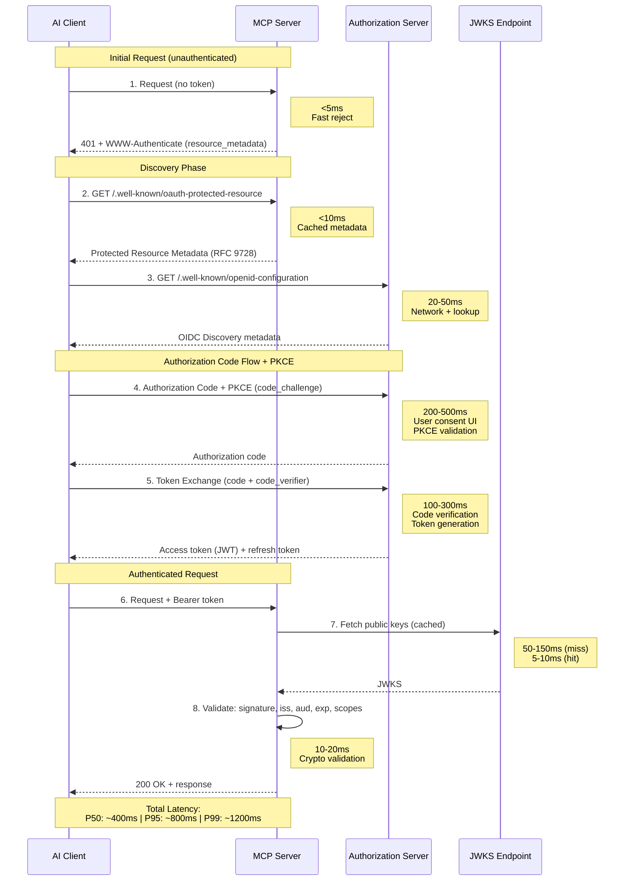
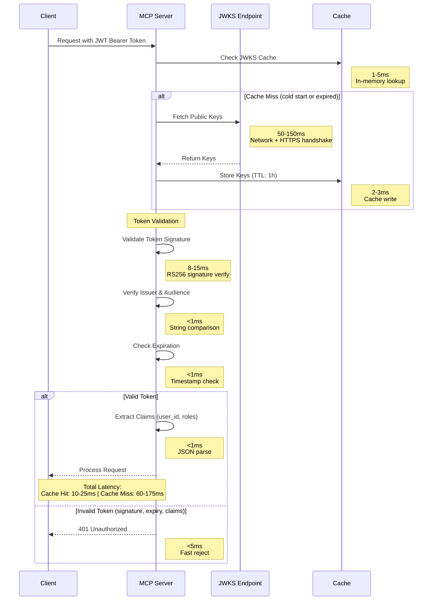
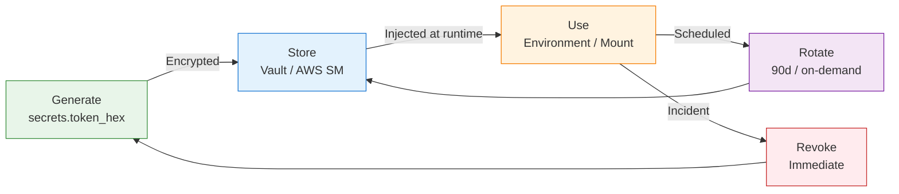

# Security Architecture

**Navigation**: [Home](../README.md) > Implementation Standards > Security Architecture  
**Related**: [← Previous: Architecture Decisions](01b-architecture-decisions.md) | [Next: Data Privacy & Compliance →](02a-data-privacy-compliance.md) | [Testing Security](04-testing-strategy.md#security-testing)

**Version:** 3.0.0  
**Last Updated:** February 24, 2026  
**Status:** Production Ready  
**Framework:** FastMCP v3.x (ADR-002)

## Quick Links

- [Zero Trust Principles](#zero-trust-principles)
- [Authentication Patterns](#authentication-patterns)
- [FastMCP v3 Security Middleware](#fastmcp-v3-security-middleware)
- [JWT Token Validation](#jwt-token-validation)
- [OAuth 2.1 Authorization](#oauth-21-authorization-http-transport)
- [Authorization Frameworks](#authorization-framework)
- [Rate Limiting](#rate-limiting)
- [Input Validation](#input-validation)
- [Cryptographic Standards](#cryptographic-standards)
- [Secret Management](#secret-management)
- [Session Management](#session-management)
- [Audit Logging](#audit-logging)
- [Supply Chain Security](#supply-chain-security)
- [Security Checklist](#security-checklist)

## Introduction

Security is foundational to enterprise MCP servers. This document establishes comprehensive security patterns aligned with **FastMCP v3.x** (ADR-002) covering zero trust architecture, authentication, authorization, middleware-based security pipelines, rate limiting, input validation, cryptographic standards, secret management, session management, audit logging, and supply chain security.

> **SRS References:** NFR-SEC-001 through NFR-SEC-081, NFR-CNTR-001 through NFR-CNTR-029  
> **Architecture Decision References:** ADR-002 (FastMCP v3.x), ADR-003 (JWT/JWKS), ADR-007 (Distroless base images)  
> **Standards:** OWASP ASVS L2, NIST 800-53 Rev 5, CIS Benchmarks, SLSA Level 3

For guidance on transitioning existing REST authentication flows or rotating identity providers during modernization efforts, see the **Migration Guides (12)**.

## Zero Trust Principles

> **SRS References:** NFR-SEC-001–081

Enterprise MCP servers follow zero trust architecture principles per NIST SP 800-207. No network location, service identity, or prior authentication grants implicit trust.

### Core Tenets

| Principle | MCP Implementation | SRS Requirement |
|-----------|-------------------|-----------------|
| **Verify explicitly** | Every request authenticated and authorized via JWT/JWKS + RBAC; no session-only trust | NFR-SEC-001–021 |
| **Least privilege** | Per-capability scopes (`mcp:tools`, `mcp:resources`, `mcp:prompts`); deny-by-default ACL | NFR-SEC-019 |
| **Assume breach** | Defense-in-depth layers; immutable audit logs; anomaly detection; network segmentation | NFR-SEC-046–050, NFR-SEC-073–081 |
| **Micro-segmentation** | K8s NetworkPolicy per pod; firewall between trust zones; mTLS for service-to-service | NFR-SEC-043 |
| **Continuous validation** | Short-lived tokens (15 min); JWKS rotation (1 hr cache); real-time authorization checks | NFR-SEC-010–016 |
| **Context-aware access** | IP geolocation, time-of-day, device posture evaluated in authorization decisions | NFR-SEC-017–021 |

### Trust Decision Flow

```python
from dataclasses import dataclass
from enum import Enum
from typing import Optional

class TrustLevel(Enum):
    """Zero trust decision levels."""
    DENY = "deny"               # Explicit deny
    LOW = "low_trust"           # Read-only, rate-limited
    MEDIUM = "medium_trust"     # Standard operations
    HIGH = "high_trust"         # Administrative operations
    ELEVATED = "elevated_trust" # Break-glass emergency access

@dataclass
class TrustContext:
    """Context for zero trust evaluation."""
    user_id: str
    role: str
    ip_address: str
    geo_location: Optional[str]
    device_fingerprint: Optional[str]
    token_age_seconds: int
    failed_attempts_last_hour: int
    is_service_account: bool

async def evaluate_trust(ctx: TrustContext) -> TrustLevel:
    """Evaluate trust level based on multiple signals.
    
    Implements continuous trust evaluation per NIST 800-207.
    No single factor determines access; all signals are weighted.
    """
    # Deny: Too many failed attempts (brute force)
    if ctx.failed_attempts_last_hour > 10:
        return TrustLevel.DENY
    
    # Deny: Token too old for sensitive operations
    if ctx.token_age_seconds > 900:  # 15 minutes
        return TrustLevel.DENY
    
    # Low trust: Unknown location or device
    if not ctx.geo_location or not ctx.device_fingerprint:
        return TrustLevel.LOW
    
    # Medium trust: Standard authenticated user
    if ctx.role in ("viewer", "developer"):
        return TrustLevel.MEDIUM
    
    # High trust: Admin with valid context
    if ctx.role == "admin" and ctx.failed_attempts_last_hour == 0:
        return TrustLevel.HIGH
    
    return TrustLevel.LOW
```

## Defense in Depth

Enterprise MCP servers implement multiple layers of security controls with network segmentation and trust zones:

```mermaid
flowchart TB
    subgraph Internet["🌐 Internet (Untrusted Zone)"]
        Client[Client Applications<br/>Web/Mobile/CLI]
    end
    
    subgraph DMZ["🔒 DMZ (Perimeter Zone)"]
        direction TB
        WAF[Web Application Firewall<br/>ModSecurity/Cloudflare<br/>OWASP Top 10 protection]
        LB[Load Balancer<br/>TLS termination<br/>DDoS mitigation]
        
        WAF --> LB
    end
    
    subgraph AppZone["🏢 Application Zone (Restricted)"]
        direction TB
        
        subgraph AuthLayer["Authentication Layer"]
            direction LR
            JWT[JWT Verifier<br/>JWKS validation]
            OAuth[OAuth 2.0 Provider<br/>Token exchange]
            APIKey[API Key Manager<br/>SHA-256 hash check]
        end
        
        subgraph MCPServers["MCP Server Cluster"]
            direction LR
            MCP1[MCP Server 1<br/>Pod: mcp-server-a]
            MCP2[MCP Server 2<br/>Pod: mcp-server-b]
            MCP3[MCP Server 3<br/>Pod: mcp-server-c]
        end
        
        subgraph Authorization["Authorization Layer"]
            RBAC[RBAC Engine<br/>Role → Permissions]
            ACL[Capability ACL<br/>Per-tool policies]
        end
        
        AuthLayer --> MCPServers
        MCPServers --> Authorization
    end
    
    subgraph DataZone["💾 Data Zone (Highly Restricted)"]
        direction LR
        DB[(PostgreSQL<br/>Encrypted at rest)]
        Cache[(Redis<br/>TLS required)]
        Secrets[Vault<br/>Secret management]
    end
    
    subgraph MonitorZone["📊 Monitoring Zone (Isolated)"]
        direction LR
        Prometheus[Prometheus<br/>:9090]
        Grafana[Grafana<br/>:3000]
        Loki[Loki<br/>Log aggregation]
    end
    
    %% Network Flow
    Client -->|HTTPS :443<br/>TLS 1.3| WAF
    WAF -->|Allow: Valid requests<br/>Block: Attack patterns| LB
    LB -->|HTTP :8080<br/>mTLS optional| AuthLayer
    
    %% Firewall Rules
    FW1{{Firewall 1<br/>Internet → DMZ}}
    FW2{{Firewall 2<br/>DMZ → App Zone}}
    FW3{{Firewall 3<br/>App → Data Zone}}
    
    Internet -.->|Port 443 only| FW1
    FW1 -.-> DMZ
    DMZ -.->|Authenticated only| FW2
    FW2 -.-> AppZone
    AppZone -.->|DB: 5432, Redis: 6379<br/>Vault: 8200| FW3
    FW3 -.-> DataZone
    
    %% Network Policies (K8s)
    MCPServers -->|NetworkPolicy:<br/>Allow egress to DB| DB
    MCPServers -->|NetworkPolicy:<br/>Allow egress to Cache| Cache
    MCPServers -->|NetworkPolicy:<br/>Deny all other egress| X[❌]
    
    %% Monitoring Access
    MCPServers -.->|Metrics :9090<br/>Read-only| Prometheus
    Prometheus -.->|Scrape| Grafana
    MCPServers -.->|Logs stdout<br/>Structured JSON| Loki
    
    %% Legend
    subgraph Legend["🔑 Security Controls Legend"]
        L1[Trust Zone Boundary]
        L2{{Firewall / Network Policy}}
        L3[TLS/mTLS Encryption]
        L4[Authentication Required]
    end
    
    style Internet fill:#ffebee,stroke:#c62828,stroke-width:2px
    style DMZ fill:#fff3e0,stroke:#f57c00,stroke-width:2px
    style AppZone fill:#e8f5e9,stroke:#388e3c,stroke-width:2px
    style DataZone fill:#e3f2fd,stroke:#1976d2,stroke-width:3px
    style MonitorZone fill:#f3e5f5,stroke:#7b1fa2,stroke-width:2px
    style FW1 fill:#ffcdd2,stroke:#d32f2f,stroke-width:2px
    style FW2 fill:#ffcdd2,stroke:#d32f2f,stroke-width:2px
    style FW3 fill:#ffcdd2,stroke:#d32f2f,stroke-width:2px
    style WAF fill:#fff9c4,stroke:#f57f17,stroke-width:2px
    style Legend fill:#fafafa,stroke:#999,stroke-width:1px
```



### Security Zones & Trust Boundaries

| Zone | Trust Level | Access | Firewall Rules | Network Policy |
|------|-------------|--------|----------------|----------------|
| **Internet** | Untrusted | Public | Allow :443 HTTPS only | N/A (external) |
| **DMZ** | Low | WAF + LB | Allow :443 in, :8080 out to App Zone | Deny all except App Zone |
| **Application Zone** | Medium | Authenticated users | Allow from DMZ, to Data Zone only | Deny all except DB/Cache/Vault |
| **Data Zone** | High | Application services | Allow :5432 (PG), :6379 (Redis), :8200 (Vault) | Deny all inbound except App Zone |
| **Monitoring Zone** | Isolated | Read-only metrics | Allow :9090, :3000 from App Zone | Deny all write access |

**Firewall Rules (iptables/nftables):**

```bash
# Firewall 1: Internet → DMZ
iptables -A FORWARD -i eth0 -o dmz0 -p tcp --dport 443 -m state --state NEW,ESTABLISHED -j ACCEPT
iptables -A FORWARD -i dmz0 -o eth0 -m state --state ESTABLISHED -j ACCEPT
iptables -P FORWARD DROP

# Firewall 2: DMZ → Application Zone
iptables -A FORWARD -i dmz0 -o app0 -p tcp --dport 8080 -m state --state NEW,ESTABLISHED -j ACCEPT
iptables -A FORWARD -s 10.1.0.0/24 -d 10.2.0.0/24 -j ACCEPT  # DMZ → App subnet
iptables -P FORWARD DROP

# Firewall 3: Application → Data Zone
iptables -A FORWARD -i app0 -o data0 -p tcp -m multiport --dports 5432,6379,8200 -j ACCEPT
iptables -A FORWARD -s 10.2.0.0/24 -d 10.3.0.0/24 -j DROP  # Deny all other traffic
```

**Kubernetes NetworkPolicies:**

```yaml
# Restrict MCP Server egress to only database and cache
apiVersion: networking.k8s.io/v1
kind: NetworkPolicy
metadata:
  name: mcp-server-egress
  namespace: mcp-production
spec:
  podSelector:
    matchLabels:
      app: mcp-server
  policyTypes:
    - Egress
  egress:
    # Allow DNS
    - to:
        - namespaceSelector:
            matchLabels:
              name: kube-system
      ports:
        - protocol: UDP
          port: 53
    # Allow PostgreSQL
    - to:
        - podSelector:
            matchLabels:
              app: postgresql
      ports:
        - protocol: TCP
          port: 5432
    # Allow Redis
    - to:
        - podSelector:
            matchLabels:
              app: redis
      ports:
        - protocol: TCP
          port: 6379
    # Allow Vault
    - to:
        - podSelector:
            matchLabels:
              app: vault
      ports:
        - protocol: TCP
          port: 8200
```

### Defense in Depth Layers

```mermaid
flowchart TB
    subgraph Layer1["🌐 Layer 1: Network Security"]
        N1[TLS 1.3 Encryption<br/>ECDHE cipher suites]
        N2[Network Policies<br/>K8s NetworkPolicy]
        N3[Firewall Rules<br/>iptables/nftables]
        N4[WAF Protection<br/>OWASP Top 10]
    end
    
    subgraph Layer2["🔐 Layer 2: Authentication"]
        A1[JWT Verification<br/>RS256 + JWKS]
        A2[OAuth 2.0 + PKCE<br/>Authorization Code Flow]
        A3[API Keys<br/>SHA-256 hashed]
        A4[mTLS<br/>Service-to-service]
    end
    
    subgraph Layer3["🛡️ Layer 3: Authorization"]
        Z1[RBAC<br/>Role → Permissions]
        Z2[Capability ACL<br/>Per-tool policies]
        Z3[Resource Policies<br/>Ownership checks]
        Z4[Rate Limiting<br/>Token bucket per user]
    end
    
    subgraph Layer4["⚙️ Layer 4: Application Security"]
        S1[Input Validation<br/>Pydantic schemas]
        S2[Output Encoding<br/>XSS prevention]
        S3[Security Headers<br/>CSP, HSTS, X-Frame-Options]
        S4[CSRF Protection<br/>Token validation]
    end
    
    subgraph Layer5["📊 Layer 5: Audit & Monitoring"]
        M1[Audit Logging<br/>Structured JSON + trace_id]
        M2[Anomaly Detection<br/>Failed auth spikes]
        M3[Alert System<br/>PagerDuty on critical]
        M4[Security Metrics<br/>Prometheus + Grafana]
    end
    
    Layer1 --> Layer2
    Layer2 --> Layer3
    Layer3 --> Layer4
    Layer4 --> Layer5
    
    style Layer1 fill:#ffebee,stroke:#c62828,stroke-width:2px
    style Layer2 fill:#e3f2fd,stroke:#1976d2,stroke-width:2px
    style Layer3 fill:#e8f5e9,stroke:#388e3c,stroke-width:2px
    style Layer4 fill:#fff3e0,stroke:#f57c00,stroke-width:2px
    style Layer5 fill:#f3e5f5,stroke:#7b1fa2,stroke-width:2px
```



## Threat Modeling

### STRIDE Analysis

Threat modeling using the STRIDE framework identifies security risks across MCP server components. Each threat category requires specific mitigations.

#### Spoofing Identity

**Threats:**

- Attackers impersonating legitimate users or services
- Token theft and replay attacks
- Session hijacking

**Mitigations:**

- Strong authentication (JWT with signature verification)
- Multi-factor authentication (MFA) for administrative access
- Short-lived tokens with refresh rotation
- Token binding to client identity (certificate fingerprints)
- Anti-CSRF tokens for state-changing operations

**Implementation:**

```python
# JWT with short expiration and refresh tokens
jwt_config = {
    "access_token_ttl": 900,  # 15 minutes
    "refresh_token_ttl": 86400,  # 24 hours
    "require_token_binding": True
}

# Validate token freshness
def validate_token_freshness(token: dict) -> bool:
    issued_at = token.get("iat")
    if not issued_at:
        return False
    
    age_seconds = time.time() - issued_at
    return age_seconds < MAX_TOKEN_AGE
```

#### Tampering with Data

**Threats:**

- Message interception and modification
- Parameter tampering in tool calls
- Database manipulation through injection attacks

**Mitigations:**

- TLS/mTLS for transport encryption
- Message signing (HMAC or digital signatures)
- Input validation and sanitization
- Parameterized queries (no string concatenation)
- Integrity checks on critical data

**Implementation:**

```python
# Message integrity verification
import hmac
import hashlib

def verify_message_integrity(message: str, signature: str, secret: str) -> bool:
    """Verify HMAC signature on message."""
    expected = hmac.new(
        secret.encode(),
        message.encode(),
        hashlib.sha256
    ).hexdigest()
    return hmac.compare_digest(expected, signature)

# SQL injection prevention
async def safe_query(db, user_id: str):
    """Use parameterized queries."""
    # SECURE: Parameters are escaped
    result = await db.fetch(
        "SELECT * FROM users WHERE id = $1",
        user_id
    )
    # NEVER do: f"SELECT * FROM users WHERE id = '{user_id}'"
```

#### Repudiation

**Threats:**

- Users denying actions they performed
- Lack of audit trail for security events
- Insufficient logging for forensic analysis

**Mitigations:**

- Comprehensive audit logging with immutable records
- Cryptographic signatures on audit events
- Centralized log aggregation with tamper detection
- Non-repudiation through digital signatures on critical actions

**Implementation:**

```python
# Immutable audit log entry with signature
import json
from datetime import datetime

async def create_audit_entry(
    action: str,
    user_id: str,
    details: dict,
    signing_key: str
) -> dict:
    """Create signed audit log entry."""
    entry = {
        "timestamp": datetime.utcnow().isoformat(),
        "action": action,
        "user_id": user_id,
        "details": details,
        "nonce": secrets.token_hex(16)
    }
    
    # Sign entry for non-repudiation
    entry_json = json.dumps(entry, sort_keys=True)
    signature = hmac.new(
        signing_key.encode(),
        entry_json.encode(),
        hashlib.sha256
    ).hexdigest()
    
    entry["signature"] = signature
    await audit_log.write(entry)
    return entry
```

#### Information Disclosure

**Threats:**

- Sensitive data leakage in logs or error messages
- Exposure of system internals in stack traces
- PII disclosure without proper authorization
- API enumeration through verbose responses

**Mitigations:**

- Redact sensitive data in logs (see Audit Logging section)
- Generic error messages to clients (detailed logs server-side only)
- Field-level access control for sensitive attributes
- Rate limiting to prevent enumeration attacks
- Least privilege principle for data access

**Implementation:**

```python
# Safe error responses
class SafeErrorResponse:
    """Return generic errors to clients, log details internally."""
    
    @staticmethod
    async def handle_error(error: Exception, request_id: str):
        # Log full details server-side
        logger.error(
            "Request failed",
            request_id=request_id,
            error_type=type(error).__name__,
            error_details=str(error),
            stack_trace=traceback.format_exc()
        )
        
        # Return generic message to client
        return {
            "error": "An error occurred processing your request",
            "request_id": request_id,
            "timestamp": datetime.utcnow().isoformat()
        }
```

#### Denial of Service (DoS)

**Threats:**

- Resource exhaustion through excessive requests
- Slowloris-style attacks with slow connections
- Algorithmic complexity attacks (ReDoS, billion laughs)
- Memory exhaustion through large payloads

**Mitigations:**

- Multi-tier rate limiting (global, per-user, per-endpoint)
- Request size limits and timeouts
- Circuit breakers for downstream dependencies
- Horizontal scaling with load balancing
- Input complexity validation (regex timeout, recursion depth)

**Implementation:**

```python
# Request size and complexity limits
MAX_REQUEST_SIZE = 1_048_576  # 1 MB
MAX_ARRAY_DEPTH = 5
MAX_STRING_LENGTH = 10_000
REQUEST_TIMEOUT = 30  # seconds

async def validate_request_complexity(data: dict, depth: int = 0):
    """Prevent DoS through complex nested structures."""
    if depth > MAX_ARRAY_DEPTH:
        raise ValueError(f"Maximum nesting depth exceeded: {MAX_ARRAY_DEPTH}")
    
    for key, value in data.items():
        if isinstance(value, str) and len(value) > MAX_STRING_LENGTH:
            raise ValueError(f"String length exceeds limit: {MAX_STRING_LENGTH}")
        elif isinstance(value, dict):
            await validate_request_complexity(value, depth + 1)
        elif isinstance(value, list):
            for item in value[:100]:  # Limit iteration
                if isinstance(item, dict):
                    await validate_request_complexity(item, depth + 1)
```

#### Elevation of Privilege

**Threats:**

- Vertical privilege escalation (user → admin)
- Horizontal privilege escalation (user A → user B)
- Capability bypass through parameter manipulation
- Confused deputy attacks

**Mitigations:**

- Principle of least privilege enforcement
- Explicit authorization checks before every privileged operation
- Role hierarchy with inheritance controls
- Capability tokens that cannot be forged
- Resource ownership verification

**Implementation:**

```python
# Explicit privilege checks
async def delete_user(requester_id: str, target_user_id: str, db):
    """Delete user with authorization checks."""
    
    # Check requester has admin role
    requester = await db.fetch_one(
        "SELECT role FROM users WHERE id = $1",
        requester_id
    )
    if requester["role"] not in ["admin", "super_admin"]:
        raise PermissionError("Insufficient privileges")
    
    # Prevent super_admin deletion by regular admin
    target = await db.fetch_one(
        "SELECT role FROM users WHERE id = $1",
        target_user_id
    )
    if target["role"] == "super_admin" and requester["role"] != "super_admin":
        raise PermissionError("Cannot delete super admin")
    
    # Audit before action
    await audit_log.write({
        "action": "user_delete",
        "requester": requester_id,
        "target": target_user_id
    })
    
    # Execute deletion
    await db.execute("DELETE FROM users WHERE id = $1", target_user_id)
```

### Threat Model Summary

| STRIDE Category | Key Risks | Primary Mitigations |
|----------------|-----------|---------------------|
| **Spoofing** | Token theft, impersonation | Strong auth, MFA, short-lived tokens |
| **Tampering** | Message modification, injection | TLS, input validation, parameterized queries |
| **Repudiation** | Action denial, missing audit trail | Immutable logs, digital signatures |
| **Information Disclosure** | Data leaks, verbose errors | Redaction, generic errors, least privilege |
| **Denial of Service** | Resource exhaustion, complexity attacks | Rate limiting, timeouts, input validation |
| **Elevation of Privilege** | Unauthorized access escalation | Explicit auth checks, least privilege, auditing |

## Authentication Patterns

### OAuth 2.1 Authorization (HTTP Transport)

For HTTP transport, MCP servers **must** implement OAuth 2.1 authorization with mandatory PKCE per the [MCP Authorization specification](https://modelcontextprotocol.io/docs/tutorials/security/authorization). The OAuth implicit flow is prohibited.

> **SRS References:** NFR-SEC-001 through NFR-SEC-009

**Key Requirements:**

- **PKCE mandatory** for all public clients (Authorization Code + PKCE flow)
- **OIDC Discovery** support via `/.well-known/openid-configuration`
- **Protected Resource Metadata** exposed at `/.well-known/oauth-protected-resource` per [RFC 9728](https://datatracker.ietf.org/doc/html/rfc9728)
- **Client registration** via Client ID Metadata Documents or Dynamic Client Registration (DCR)
- **Incremental scope consent** via `WWW-Authenticate` header
- **Per-capability scopes:** `mcp:tools`, `mcp:resources`, `mcp:prompts`

**OAuth 2.1 Authorization Flow:**



**Protected Resource Metadata Example:**

```json
{
  "resource": "https://mcp-server.example.com",
  "authorization_servers": ["https://auth.example.com"],
  "scopes_supported": ["mcp:tools", "mcp:resources", "mcp:prompts"],
  "bearer_methods_supported": ["header"]
}
```

**Implementation:**

```python
from fastmcp import FastMCP
from fastmcp.server.auth import OAuthProvider

# Configure OAuth 2.1 with PKCE
oauth_provider = OAuthProvider(
    issuer=os.getenv("AUTH_ISSUER"),
    jwks_uri=os.getenv("AUTH_JWKS_URI"),
    audience=os.getenv("AUTH_AUDIENCE"),
    scopes_supported=["mcp:tools", "mcp:resources", "mcp:prompts"],
    require_pkce=True,  # Mandatory for OAuth 2.1
)

mcp = FastMCP("Enterprise MCP Server", auth_provider=oauth_provider)

@mcp.route("/.well-known/oauth-protected-resource")
async def protected_resource_metadata():
    """RFC 9728 Protected Resource Metadata endpoint."""
    return {
        "resource": os.getenv("MCP_SERVER_URL"),
        "authorization_servers": [os.getenv("AUTH_ISSUER")],
        "scopes_supported": ["mcp:tools", "mcp:resources", "mcp:prompts"],
        "bearer_methods_supported": ["header"],
    }
```

### Multi-Provider Support

MCP servers support multiple authentication mechanisms based on deployment context.

#### JWT/JWKS Authentication (Recommended)

JSON Web Tokens with JWKS (JSON Web Key Set) provide standard enterprise SSO integration.

**Implementation:**

```python
from fastmcp.server.auth.providers.jwt import JWTVerifier

# Configure JWT authentication
auth_provider = JWTVerifier(
    jwks_uri="https://auth.example.com/.well-known/jwks.json",
    issuer="https://auth.example.com",
    audience="mcp-server-production"
)

# Use in FastMCP server
mcp = FastMCP("Enterprise MCP Server", auth_provider=auth_provider)
```

**Token Validation Flow:**



**Token Validation Checklist:**

- ✅ Verify signature using JWKS public keys
- ✅ Validate `iss` (issuer) claim matches expected issuer
- ✅ Validate `aud` (audience) claim matches server identifier
- ✅ Check `exp` (expiration) timestamp
- ✅ Optionally check `nbf` (not before) timestamp
- ✅ Extract user claims (`sub`, custom claims)

**Configuration:**

```python
JWT_CONFIG = {
    "jwks_uri": os.getenv("AUTH_JWKS_URI"),
    "issuer": os.getenv("AUTH_ISSUER"),
    "audience": os.getenv("AUTH_AUDIENCE"),
    "jwks_cache_ttl": 3600,  # 1 hour
    "clock_skew": 60,  # Allow 60s time drift
}
```

#### OAuth 2.0 Providers

Support for popular OAuth 2.0 providers:

**GitHub Authentication:**

```python
from fastmcp.server.auth.providers.github import GitHubProvider

auth_provider = GitHubProvider(
    client_id=os.getenv("GITHUB_CLIENT_ID"),
    client_secret=os.getenv("GITHUB_CLIENT_SECRET"),
    allowed_orgs=["your-organization"]
)
```

**Google Workspace:**

```python
from fastmcp.server.auth.providers.google import GoogleProvider

auth_provider = GoogleProvider(
    client_id=os.getenv("GOOGLE_CLIENT_ID"),
    client_secret=os.getenv("GOOGLE_CLIENT_SECRET"),
    allowed_domains=["example.com"]
)
```

#### WorkOS Enterprise SSO

For enterprise SAML/OIDC integration:

```python
from fastmcp.server.auth.providers.workos import WorkOSProvider

auth_provider = WorkOSProvider(
    api_key=os.getenv("WORKOS_API_KEY"),
    client_id=os.getenv("WORKOS_CLIENT_ID"),
    organization_id=os.getenv("WORKOS_ORG_ID")
)
```

### API Key Authentication

For service-to-service communication:

```python
import hashlib
import hmac
import secrets
from datetime import datetime, timedelta

class SecureAPIKeyManager:
    """Enterprise API key management with hashing, rotation, and audit.
    
    API keys are never stored in plaintext. Only the SHA-256 hash is persisted.
    Keys support expiration, rotation, and revocation.
    """
    
    KEY_PREFIX = "mcp_"
    KEY_LENGTH = 32  # 256-bit entropy
    
    @staticmethod
    def generate_key() -> tuple[str, str]:
        """Generate a new API key and its hash.
        
        Returns:
            (plaintext_key, key_hash) - plaintext shown once to user,
            hash stored in database.
        """
        raw = secrets.token_hex(SecureAPIKeyManager.KEY_LENGTH)
        plaintext = f"{SecureAPIKeyManager.KEY_PREFIX}{raw}"
        key_hash = hashlib.sha256(plaintext.encode()).hexdigest()
        return plaintext, key_hash
    
    @staticmethod
    def verify_key(plaintext_key: str, stored_hash: str) -> bool:
        """Verify API key against stored hash (constant-time comparison)."""
        candidate_hash = hashlib.sha256(plaintext_key.encode()).hexdigest()
        return hmac.compare_digest(candidate_hash, stored_hash)
    
    @staticmethod
    async def rotate_key(db, key_id: str) -> tuple[str, str]:
        """Rotate an API key. Old key remains valid for grace period.
        
        Returns:
            (new_plaintext_key, new_key_hash)
        """
        new_plaintext, new_hash = SecureAPIKeyManager.generate_key()
        
        # Mark old key with grace period (24 hours)
        await db.execute(
            """UPDATE api_keys 
               SET expires_at = $1, rotated_at = NOW()
               WHERE id = $2""",
            datetime.utcnow() + timedelta(hours=24),
            key_id
        )
        
        # Insert new key
        await db.execute(
            """INSERT INTO api_keys (id, key_hash, created_at, expires_at)
               VALUES ($1, $2, NOW(), $3)""",
            f"{key_id}_v2",
            new_hash,
            datetime.utcnow() + timedelta(days=90)  # 90-day rotation
        )
        
        return new_plaintext, new_hash
```

**API Key Best Practices:**

- Generate with `secrets.token_hex(32)` (256-bit entropy)
- Store only SHA-256 hash in database (never plaintext)
- Enforce 90-day rotation policy with 24-hour grace period
- Implement key revocation with immediate effect
- Prefix keys with `mcp_` for identification (`mcp_a1b2c3...`)
- Audit all API key creation, usage, rotation, and revocation
- Rate limit per API key independently

## FastMCP v3 Security Middleware

> **ADR Reference:** ADR-002 (FastMCP v3.x)

FastMCP v3.x provides a middleware pipeline that processes all MCP requests bidirectionally. Security controls are implemented as middleware components that execute in a defined order per the defense-in-depth model.

### Security Middleware Stack

The following middleware ordering implements defense-in-depth. Error handling is outermost (catches all exceptions), authentication/authorization next, then operational controls innermost:

```python
from fastmcp import FastMCP
from fastmcp.server.middleware import Middleware, MiddlewareContext
from fastmcp.server.middleware.error_handling import ErrorHandlingMiddleware
from fastmcp.server.middleware.rate_limiting import RateLimitingMiddleware
from fastmcp.server.middleware.logging import StructuredLoggingMiddleware
from fastmcp.server.middleware.timing import TimingMiddleware
from fastmcp.server.middleware.response_limiting import ResponseLimitingMiddleware
from fastmcp.server.auth.providers.jwt import JWTVerifier

# ── Authentication Provider ──────────────────────────────────
auth = JWTVerifier(
    jwks_uri=os.getenv("AUTH_JWKS_URI"),
    issuer=os.getenv("AUTH_ISSUER"),
    audience=os.getenv("AUTH_AUDIENCE"),
)

mcp = FastMCP(
    "Enterprise MCP Server",
    auth=auth,  # FastMCP v3 built-in auth
)

# ── Middleware Stack (order matters: first added = outermost) ─
# Layer 1: Error handling (catches all exceptions from inner layers)
mcp.add_middleware(ErrorHandlingMiddleware(
    include_traceback=False,    # Never expose stack traces to clients
    transform_errors=True,      # Convert to safe MCP error responses
    error_callback=send_to_siem  # Forward to SIEM for alerting
))

# Layer 2: Rate limiting (reject before expensive operations)
mcp.add_middleware(RateLimitingMiddleware(
    max_requests_per_second=50.0,
    burst_capacity=100
))

# Layer 3: Authorization (per-tool RBAC + capability checks)
mcp.add_middleware(RBACMiddleware(
    role_capabilities=ROLE_CAPABILITIES,
    deny_by_default=True
))

# Layer 4: Audit logging (record all requests/responses)
mcp.add_middleware(AuditMiddleware(
    log_requests=True,
    log_responses=True,
    redact_sensitive_fields=["password", "token", "api_key", "secret"]
))

# Layer 5: Input sanitization
mcp.add_middleware(InputSanitizationMiddleware(
    max_string_length=10_000,
    max_nesting_depth=5,
    max_request_size=1_048_576  # 1 MB
))

# Layer 6: Response limiting (prevent context window overflow)
mcp.add_middleware(ResponseLimitingMiddleware(max_size=500_000))

# Layer 7: Timing (performance monitoring, innermost)
mcp.add_middleware(TimingMiddleware())

# Layer 8: Structured logging (JSON for aggregation)
mcp.add_middleware(StructuredLoggingMiddleware())
```

### Custom RBAC Middleware

Implements deny-by-default authorization per NFR-SEC-019 using FastMCP v3 middleware hooks:

```python
from fastmcp.server.middleware import Middleware, MiddlewareContext
from fastmcp.server.dependencies import get_http_headers
from fastmcp.exceptions import ToolError
import jwt

class RBACMiddleware(Middleware):
    """Role-based access control middleware.
    
    Enforces deny-by-default policy: all tool calls, resource reads,
    and prompt accesses require explicit role + capability grants.
    Extracts role from JWT claims and validates against capability matrix.
    """
    
    def __init__(self, role_capabilities: dict, deny_by_default: bool = True):
        self.role_capabilities = role_capabilities
        self.deny_by_default = deny_by_default
    
    def _get_user_role(self, context: MiddlewareContext) -> str:
        """Extract user role from JWT claims via FastMCP context."""
        if context.fastmcp_context and context.fastmcp_context.request_context:
            # Access token claims from FastMCP auth provider
            token_data = getattr(
                context.fastmcp_context.request_context, 
                'token_data', None
            )
            if token_data:
                return token_data.get("role", "viewer")
        return "viewer"  # Default to least privilege
    
    async def on_call_tool(self, context: MiddlewareContext, call_next):
        """Authorize tool execution against RBAC matrix."""
        role = self._get_user_role(context)
        tool_name = context.message.name
        
        # Check capability
        capabilities = self.role_capabilities.get(role, [])
        required = f"tools:execute:{tool_name}"
        
        if self.deny_by_default and required not in capabilities:
            # Check wildcard permission
            if "tools:execute:*" not in capabilities:
                raise ToolError(
                    f"Access denied: role '{role}' lacks capability "
                    f"'{required}'"
                )
        
        # Store role in context for downstream use
        if context.fastmcp_context:
            context.fastmcp_context.set_state("user_role", role)
        
        return await call_next(context)
    
    async def on_read_resource(self, context: MiddlewareContext, call_next):
        """Authorize resource reads."""
        role = self._get_user_role(context)
        capabilities = self.role_capabilities.get(role, [])
        
        if "resources:read" not in capabilities:
            from fastmcp.exceptions import ResourceError
            raise ResourceError("Access denied: insufficient permissions")
        
        return await call_next(context)
    
    async def on_get_prompt(self, context: MiddlewareContext, call_next):
        """Authorize prompt access."""
        role = self._get_user_role(context)
        capabilities = self.role_capabilities.get(role, [])
        
        if "prompts:get" not in capabilities:
            from fastmcp.exceptions import PromptError
            raise PromptError("Access denied: insufficient permissions")
        
        return await call_next(context)
```

### Custom Audit Middleware

Implements immutable audit logging with sensitive data redaction:

```python
from fastmcp.server.middleware import Middleware, MiddlewareContext
from fastmcp.server.dependencies import get_http_headers
from datetime import datetime
import json
import hashlib
import structlog

logger = structlog.get_logger("audit")

class AuditMiddleware(Middleware):
    """Audit logging middleware with redaction and non-repudiation.
    
    Logs all security-relevant events with:
    - Correlation IDs for request tracing
    - Sensitive field redaction
    - HMAC signatures for non-repudiation
    - Structured JSON for SIEM ingestion
    """
    
    SENSITIVE_FIELDS = {"password", "token", "api_key", "secret", "credential"}
    
    def __init__(
        self,
        log_requests: bool = True,
        log_responses: bool = True,
        redact_sensitive_fields: list[str] | None = None,
        signing_key: str | None = None,
    ):
        self.log_requests = log_requests
        self.log_responses = log_responses
        if redact_sensitive_fields:
            self.SENSITIVE_FIELDS.update(redact_sensitive_fields)
        self.signing_key = signing_key
    
    def _redact(self, data: dict) -> dict:
        """Recursively redact sensitive fields."""
        redacted = {}
        for key, value in data.items():
            if key.lower() in self.SENSITIVE_FIELDS:
                redacted[key] = "***REDACTED***"
            elif isinstance(value, dict):
                redacted[key] = self._redact(value)
            else:
                redacted[key] = value
        return redacted
    
    async def on_call_tool(self, context: MiddlewareContext, call_next):
        """Audit tool executions (highest security relevance)."""
        start = datetime.utcnow()
        user_id = "anonymous"
        
        if context.fastmcp_context:
            user_id = context.fastmcp_context.get_state("user_id") or "anonymous"
        
        headers = get_http_headers() or {}
        
        try:
            result = await call_next(context)
            
            await logger.ainfo(
                "tool_execution",
                event_type="audit",
                tool_name=context.message.name,
                arguments=self._redact(context.message.arguments or {}),
                user_id=user_id,
                ip_address=headers.get("x-forwarded-for", "unknown"),
                correlation_id=headers.get("x-correlation-id"),
                result="success",
                duration_ms=(datetime.utcnow() - start).total_seconds() * 1000,
                timestamp=start.isoformat(),
            )
            return result
            
        except Exception as e:
            await logger.aerror(
                "tool_execution_failed",
                event_type="audit",
                tool_name=context.message.name,
                user_id=user_id,
                ip_address=headers.get("x-forwarded-for", "unknown"),
                result="failure",
                error_type=type(e).__name__,
                duration_ms=(datetime.utcnow() - start).total_seconds() * 1000,
                timestamp=start.isoformat(),
            )
            raise

### Input Sanitization Middleware

Validates all incoming MCP requests against size and complexity limits per NFR-SEC-037–040:

```python
from fastmcp.server.middleware import Middleware, MiddlewareContext
from fastmcp.exceptions import ToolError
import re

class InputSanitizationMiddleware(Middleware):
    """Validate and sanitize all tool inputs.
    
    Prevents:
    - Oversized payloads (DoS)
    - Deeply nested structures (algorithmic complexity)
    - Excessively long strings (buffer overflow, ReDoS)
    - Dangerous patterns (injection attempts)
    """
    
    def __init__(
        self,
        max_string_length: int = 10_000,
        max_nesting_depth: int = 5,
        max_request_size: int = 1_048_576,
        max_array_items: int = 1_000,
    ):
        self.max_string_length = max_string_length
        self.max_nesting_depth = max_nesting_depth
        self.max_request_size = max_request_size
        self.max_array_items = max_array_items
    
    def _validate_depth(self, data, depth: int = 0):
        """Recursively validate nesting depth and string lengths."""
        if depth > self.max_nesting_depth:
            raise ToolError(
                f"Input nesting exceeds maximum depth ({self.max_nesting_depth})"
            )
        
        if isinstance(data, dict):
            for key, value in data.items():
                self._validate_depth(value, depth + 1)
        elif isinstance(data, list):
            if len(data) > self.max_array_items:
                raise ToolError(
                    f"Array exceeds maximum items ({self.max_array_items})"
                )
            for item in data:
                self._validate_depth(item, depth + 1)
        elif isinstance(data, str):
            if len(data) > self.max_string_length:
                raise ToolError(
                    f"String exceeds maximum length ({self.max_string_length})"
                )
    
    async def on_call_tool(self, context: MiddlewareContext, call_next):
        """Validate tool arguments before execution."""
        args = context.message.arguments or {}
        self._validate_depth(args)
        return await call_next(context)
```

### Middleware Composition with Mounted Servers

FastMCP v3 server composition enables modular security zones. Parent middleware applies to all mounted servers, while mounted servers can add additional controls:

```python
from fastmcp import FastMCP

# Public server: minimal auth, read-only
public_server = FastMCP("Public API")
public_server.add_middleware(RateLimitingMiddleware(
    max_requests_per_second=100.0
))

# Admin server: strict auth, full access
admin_server = FastMCP("Admin API")
admin_server.add_middleware(RBACMiddleware(
    role_capabilities={"admin": ["tools:execute:*"]},
    deny_by_default=True
))

# Parent server: global security controls
app = FastMCP("Enterprise MCP", auth=auth)
app.add_middleware(ErrorHandlingMiddleware())
app.add_middleware(AuditMiddleware())

# Mount with namespace isolation
app.mount(public_server, namespace="public")
app.mount(admin_server, namespace="admin")

# Request flow:
# public/tool → ErrorHandling → Audit → RateLimit → tool handler
# admin/tool → ErrorHandling → Audit → RBAC → tool handler
```

## Authorization Framework

### Role-Based Access Control (RBAC)

> **SRS References:** NFR-SEC-017 through NFR-SEC-021

MCP servers implement a **deny-by-default** authorization policy: all access is denied unless explicitly granted (NFR-SEC-019). Authorization is validated on every protected endpoint request (NFR-SEC-021).

Define the four standard roles for MCP server access:

| Role | MCP Capabilities | Description | Use Case |
|------|-----------------|-------------|----------|
| `admin` | `tools:execute`, `resources:read`, `prompts:get` + all management ops | Full access to all capabilities | System administrators |
| `developer` | `tools:execute`, `resources:read`, `prompts:get` | Read/write development access | Engineering teams |
| `viewer` | `resources:read`, `prompts:get` | Read-only access | Auditors, stakeholders |
| `service` | Configurable per-service subset | Limited programmatic access | CI/CD systems, automation |

**Implementation:**

```python
from typing import List
from fastapi import HTTPException

# Define role hierarchy
ROLE_HIERARCHY = {
    "admin": ["admin", "developer", "analyst", "viewer"],
    "developer": ["developer", "viewer"],
    "analyst": ["analyst", "viewer"],
    "viewer": ["viewer"],
}

def check_role(user_context: dict, required_roles: List[str]) -> bool:
    """Check if user has required role."""
    user_role = user_context.get("role")
    allowed_roles = ROLE_HIERARCHY.get(user_role, [])
    
    return any(role in allowed_roles for role in required_roles)

@mcp.tool()
async def delete_resource(
    resource_id: str,
    user_context: dict
) -> dict:
    """Delete a resource - requires admin role."""
    if not check_role(user_context, ["admin"]):
        raise HTTPException(
            status_code=403,
            detail="Admin role required for deletion"
        )
    
    # Proceed with deletion
    await perform_deletion(resource_id)
    return {"status": "deleted", "resource_id": resource_id}
```

### Capability-Based Access Control

Fine-grained permissions for specific operations:

```python
# Define capabilities
CAPABILITIES = {
    "assignments:create": "Create new assignments",
    "assignments:read": "Read assignment details",
    "assignments:update": "Modify existing assignments",
    "assignments:delete": "Delete assignments",
    "releases:deploy": "Deploy releases to production",
    "pipelines:trigger": "Trigger pipeline execution",
}

# Assign capabilities to roles
ROLE_CAPABILITIES = {
    "admin": list(CAPABILITIES.keys()),  # All capabilities
    "developer": [
        "assignments:create",
        "assignments:read",
        "assignments:update",
        "pipelines:trigger",
    ],
    "viewer": [
        "assignments:read",
    ],
}

def has_capability(user_context: dict, capability: str) -> bool:
    """Check if user has specific capability."""
    user_role = user_context.get("role")
    capabilities = ROLE_CAPABILITIES.get(user_role, [])
    return capability in capabilities

@mcp.tool()
async def deploy_release(
    release_id: str,
    user_context: dict
) -> dict:
    """Deploy a release - requires releases:deploy capability."""
    if not has_capability(user_context, "releases:deploy"):
        raise HTTPException(
            status_code=403,
            detail="Missing required capability: releases:deploy"
        )
    
    # Proceed with deployment
    result = await perform_deployment(release_id)
    return result
```

## Rate Limiting

### Token Bucket Algorithm

Implement multi-tier rate limiting to prevent abuse and ensure fair resource allocation.

**Implementation:**

```python
from datetime import datetime
from typing import Dict

class RateLimiter:
    """Token bucket rate limiter with burst support."""
    
    def __init__(
        self,
        requests_per_minute: int = 60,
        burst_size: int = 10
    ):
        """
        Initialize rate limiter.
        
        Args:
            requests_per_minute: Sustained rate limit
            burst_size: Maximum burst capacity
        """
        self.requests_per_minute = requests_per_minute
        self.burst_size = burst_size
        self.tokens = float(burst_size)
        self.last_refill = datetime.now()
        
        # Statistics
        self.total_requests = 0
        self.rejected_requests = 0
    
    async def acquire(self) -> bool:
        """
        Attempt to acquire a token.
        
        Returns:
            True if token acquired, False if rate limited
        """
        self.total_requests += 1
        self._refill_tokens()
        
        if self.tokens >= 1:
            self.tokens -= 1
            return True
        else:
            self.rejected_requests += 1
            return False
    
    def _refill_tokens(self):
        """Refill tokens based on elapsed time."""
        now = datetime.now()
        elapsed = (now - self.last_refill).total_seconds()
        
        if elapsed > 0:
            # Calculate tokens to add
            tokens_to_add = (self.requests_per_minute / 60.0) * elapsed
            self.tokens = min(self.burst_size, self.tokens + tokens_to_add)
            self.last_refill = now
    
    def get_stats(self) -> Dict:
        """Get rate limiter statistics."""
        return {
            "requests_per_minute": self.requests_per_minute,
            "burst_size": self.burst_size,
            "current_tokens": round(self.tokens, 2),
            "total_requests": self.total_requests,
            "rejected_requests": self.rejected_requests,
            "success_rate": round(
                ((self.total_requests - self.rejected_requests) / 
                 max(1, self.total_requests)) * 100, 2
            )
        }
```

### Multi-Tier Rate Limiting

```python
class AdvancedRateLimiter:
    """Multi-tier rate limiting."""
    
    def __init__(self, config: dict):
        # Global rate limit
        self.global_limiter = RateLimiter(
            requests_per_minute=config["global_rpm"],
            burst_size=config["global_burst"]
        )
        
        # Per-user limits
        self.user_limiters: Dict[str, RateLimiter] = {}
        self.user_rpm = config["per_user_rpm"]
        
        # Per-API-key limits
        self.api_key_limiters: Dict[str, RateLimiter] = {}
        self.api_key_rpm = config["per_api_key_rpm"]
    
    async def check_rate_limit(
        self,
        user_id: str,
        api_key: Optional[str] = None
    ) -> tuple[bool, str]:
        """
        Check all rate limit tiers.
        
        Returns:
            (allowed, reason) tuple
        """
        # Check global limit
        if not await self.global_limiter.acquire():
            return False, "Global rate limit exceeded"
        
        # Check per-user limit
        if user_id not in self.user_limiters:
            self.user_limiters[user_id] = RateLimiter(
                requests_per_minute=self.user_rpm,
                burst_size=5
            )
        
        if not await self.user_limiters[user_id].acquire():
            return False, f"Rate limit exceeded for user: {user_id}"
        
        # Check API key limit if provided
        if api_key:
            if api_key not in self.api_key_limiters:
                self.api_key_limiters[api_key] = RateLimiter(
                    requests_per_minute=self.api_key_rpm,
                    burst_size=20
                )
            
            if not await self.api_key_limiters[api_key].acquire():
                return False, "API key rate limit exceeded"
        
        return True, "OK"
```

### Rate Limit Headers

Include rate limit information in responses:

```python
@app.middleware("http")
async def add_rate_limit_headers(request: Request, call_next):
    """Add rate limit headers to response."""
    response = await call_next(request)
    
    # Add rate limit headers
    response.headers["X-RateLimit-Limit"] = "60"
    response.headers["X-RateLimit-Remaining"] = str(limiter.tokens)
    response.headers["X-RateLimit-Reset"] = str(
        int(limiter.last_refill.timestamp()) + 60
    )
    
    return response
```

## Input Validation

### Pydantic Models

Use Pydantic for automatic validation:

```python
from pydantic import BaseModel, Field, validator
from typing import List
import re
import html

class CreateResourceInput(BaseModel):
    """Validated input for resource creation."""
    
    name: str = Field(
        ...,
        min_length=3,
        max_length=100,
        description="Resource name"
    )
    description: str = Field(
        ...,
        max_length=1000,
        description="Resource description"
    )
    tags: List[str] = Field(
        default=[],
        max_items=10,
        description="Resource tags"
    )
    priority: int = Field(
        default=3,
        ge=1,
        le=5,
        description="Priority level (1-5)"
    )
    
    @validator('name')
    def validate_name(cls, v):
        """Ensure name contains only safe characters."""
        if not re.match(r'^[a-zA-Z0-9_-]+$', v):
            raise ValueError(
                "Name must contain only alphanumeric, dash, underscore"
            )
        return v
    
    @validator('description')
    def sanitize_description(cls, v):
        """Remove potentially dangerous content."""
        # Remove HTML tags
        v = re.sub(r'<[^>]+>', '', v)
        # Escape special characters
        return html.escape(v)
    
    @validator('tags', each_item=True)
    def validate_tag(cls, v):
        """Validate each tag."""
        if not re.match(r'^[a-zA-Z0-9_-]+$', v):
            raise ValueError("Invalid tag format")
        return v.lower()

@mcp.tool()
async def create_resource(input: CreateResourceInput) -> dict:
    """Create resource with validated input."""
    # Input is automatically validated by Pydantic
    result = await backend.create_resource(
        name=input.name,
        description=input.description,
        tags=input.tags,
        priority=input.priority
    )
    return result
```

### SQL Injection Prevention

Always use parameterized queries:

```python
# ❌ NEVER do this
query = f"SELECT * FROM users WHERE username = '{username}'"

# ✅ Always use parameterized queries
query = "SELECT * FROM users WHERE username = %s"
result = await db.execute(query, (username,))
```

### Path Traversal Prevention

Validate and sanitize file paths:

```python
from pathlib import Path
import os

def validate_file_path(file_path: str, base_dir: str) -> Path:
    """Validate file path to prevent traversal attacks."""
    # Resolve to absolute path
    abs_path = Path(base_dir) / file_path
    abs_path = abs_path.resolve()
    
    # Ensure path is within base directory
    if not str(abs_path).startswith(str(Path(base_dir).resolve())):
        raise ValueError("Invalid file path: directory traversal detected")
    
    return abs_path

@mcp.tool()
async def read_file(file_path: str) -> str:
    """Read file with path validation."""
    safe_path = validate_file_path(file_path, "/var/data/allowed")
    
    with open(safe_path, 'r') as f:
        return f.read()
```

### Command Injection Prevention

Never execute shell commands with user input:

```python
# ❌ NEVER do this
os.system(f"ping {user_input}")

# ✅ Use subprocess with argument list
import subprocess

subprocess.run(["ping", "-c", "1", user_input], check=True)
```

## Security Headers

### Standard Headers

Apply security headers to all HTTP responses:

```python
SECURITY_HEADERS = {
    "Content-Security-Policy": "default-src 'self'",
    "Strict-Transport-Security": "max-age=31536000; includeSubDomains",
    "X-Content-Type-Options": "nosniff",
    "X-Frame-Options": "DENY",
    "X-XSS-Protection": "1; mode=block",
    "Referrer-Policy": "no-referrer",
    "Permissions-Policy": "geolocation=(), microphone=(), camera=()"
}

@app.middleware("http")
async def add_security_headers(request: Request, call_next):
    """Add security headers to all responses."""
    response = await call_next(request)
    
    for header, value in SECURITY_HEADERS.items():
        response.headers[header] = value
    
    return response
```

### CORS Configuration

Configure CORS restrictively:

```python
from fastapi.middleware.cors import CORSMiddleware

app.add_middleware(
    CORSMiddleware,
    allow_origins=["https://app.example.com"],  # Specific origins
    allow_credentials=True,
    allow_methods=["GET", "POST"],  # Only needed methods
    allow_headers=["Authorization", "Content-Type"],
    max_age=3600,  # Cache preflight for 1 hour
)
```

## Audit Logging

### Audit Event Structure

```python
from dataclasses import dataclass
from datetime import datetime
from typing import Optional, Dict, Any

@dataclass
class AuditEvent:
    """Standard audit event structure."""
    
    timestamp: datetime
    event_type: str
    user_id: str
    user_role: str
    tool_name: Optional[str]
    resource_id: Optional[str]
    action: str
    result: str  # success, failure, error
    ip_address: str
    user_agent: str
    correlation_id: str
    metadata: Dict[str, Any]
    
    def to_json(self) -> dict:
        """Convert to JSON-serializable dict."""
        return {
            "timestamp": self.timestamp.isoformat(),
            "event_type": self.event_type,
            "user_id": self.user_id,
            "user_role": self.user_role,
            "tool_name": self.tool_name,
            "resource_id": self.resource_id,
            "action": self.action,
            "result": self.result,
            "ip_address": self.ip_address,
            "user_agent": self.user_agent,
            "correlation_id": self.correlation_id,
            "metadata": self.metadata
        }
```

### Events to Audit

**Critical Events (Always Log):**

- Authentication attempts (success/failure)
- Authorization decisions (allow/deny)
- Destructive operations (delete, modify)
- Configuration changes
- Rate limit violations
- Security policy violations
- Privilege escalation attempts

**Example:**

```python
async def audit_log(
    event_type: str,
    user_context: dict,
    action: str,
    result: str,
    **metadata
):
    """Log audit event."""
    event = AuditEvent(
        timestamp=datetime.utcnow(),
        event_type=event_type,
        user_id=user_context.get("user_id"),
        user_role=user_context.get("role"),
        tool_name=metadata.get("tool_name"),
        resource_id=metadata.get("resource_id"),
        action=action,
        result=result,
        ip_address=metadata.get("ip_address"),
        user_agent=metadata.get("user_agent"),
        correlation_id=metadata.get("correlation_id"),
        metadata=metadata
    )
    
    # Write to audit log
    logger.info("AUDIT", extra=event.to_json())

@mcp.tool()
async def delete_resource(
    resource_id: str,
    user_context: dict,
    request_context: dict
) -> dict:
    """Delete resource with audit logging."""
    try:
        # Perform deletion
        await backend.delete(resource_id)
        
        # Log success
        await audit_log(
            event_type="resource_deletion",
            user_context=user_context,
            action="delete",
            result="success",
            resource_id=resource_id,
            **request_context
        )
        
        return {"status": "deleted"}
        
    except Exception as e:
        # Log failure
        await audit_log(
            event_type="resource_deletion",
            user_context=user_context,
            action="delete",
            result="failure",
            resource_id=resource_id,
            error=str(e),
            **request_context
        )
        raise
```

### Sensitive Data Handling

**Never log:**

- Passwords or password hashes
- API keys or tokens
- Credit card numbers
- Social security numbers
- Private encryption keys

**Redact or mask:**

- Email addresses: `u***r@example.com`
- Phone numbers: `***-***-1234`
- API keys: `sk_***abc123`

```python
def redact_sensitive_data(data: dict) -> dict:
    """Redact sensitive information from audit logs."""
    sensitive_fields = ['password', 'token', 'api_key', 'secret']
    
    redacted = data.copy()
    for field in sensitive_fields:
        if field in redacted:
            redacted[field] = '***REDACTED***'
    
    # Mask email
    if 'email' in redacted:
        email = redacted['email']
        parts = email.split('@')
        if len(parts) == 2:
            redacted['email'] = f"{parts[0][0]}***@{parts[1]}"
    
    return redacted
```

## Security Testing Tools

### Static Analysis

#### Bandit (Python Security Linter)

Bandit scans Python code for common security issues.

**Installation & Configuration:**

```bash
pip install bandit
```

**Configuration File (`bandit.yaml`):**

```yaml
# .bandit.yaml
tests:
  - B201  # Flask debug mode
  - B301  # Pickle usage
  - B302  # marshal usage
  - B303  # MD5 or SHA1
  - B304  # Insecure ciphers
  - B305  # Insecure cipher modes
  - B306  # Insecure TempFile
  - B307  # eval usage
  - B308  # mark_safe usage
  - B309  # HTTPSConnection
  - B310  # urllib.urlopen
  - B311  # Random for crypto
  - B312  # Telnet usage
  - B313  # XML vulnerabilities
  - B314  - B320  # XML processing
  - B321  # FTP usage
  - B323  # Unverified SSL
  - B324  # Insecure hashes
  - B325  # Tempfile
  - B401  - B404  # Imports
  - B501  - B509  # Crypto
  - B601  - B612  # Injection

exclude_dirs:
  - /tests/
  - /venv/
  - /.venv/

# Ignore test fixtures
skips:
  - B101  # Allow assert in tests
```

**Usage:**

```bash
# Scan entire project
bandit -r src/ -f json -o bandit-report.json

# CI/CD integration
bandit -r src/ -ll -i  # Low severity, ignore info

# Exclude specific files
bandit -r src/ --exclude src/tests/
```

**Example Issues Detected:**

```python
# BAD: Hardcoded password
password = "admin123"  # B105: hardcoded_password_string

# BAD: Use of eval
eval(user_input)  # B307: eval usage

# BAD: Weak random for tokens
token = random.randint(1000, 9999)  # B311: use secrets module

# GOOD: Secure alternatives
password = os.environ["DB_PASSWORD"]
# Don't use eval, parse safely instead
token = secrets.token_hex(16)
```

#### Safety (Dependency Vulnerability Scanner)

Safety checks dependencies for known security vulnerabilities.

**Installation:**

```bash
pip install safety
```

**Usage:**

```bash
# Check installed packages
safety check

# Check requirements file
safety check -r requirements.txt

# Generate JSON report
safety check --json --output safety-report.json

# CI/CD with exit codes
safety check --exit-code  # Fails build on vulnerabilities
```

**Configuration (`safety-policy.yml`):**

```yaml
# .safety-policy.yml
security:
  ignore-vulnerabilities:
    # Temporarily ignore specific CVEs (with justification)
    - id: 12345
      reason: "False positive - not using affected feature"
      expires: "2025-12-31"
  
  ignore-packages:
    # Ignore dev dependencies
    - pytest
    - black

  continue-on-vulnerability-error: false
```

#### Semgrep (Multi-language Static Analysis)

Semgrep finds bugs and enforces code standards with custom rules.

**Installation:**

```bash
pip install semgrep
```

**Configuration (`.semgrep.yml`):**

```yaml
rules:
  # SQL Injection Prevention
  - id: sql-injection-risk
    patterns:
      - pattern: $DB.execute(f"... {$VAR} ...")
      - pattern: $DB.execute("..." + $VAR + "...")
    message: "Potential SQL injection. Use parameterized queries."
    severity: ERROR
    languages:
      - python
  
  # Hardcoded Secrets
  - id: hardcoded-secret
    patterns:
      - pattern: $VAR = "..."
      - metavariable-regex:
          metavariable: $VAR
          regex: (password|secret|api_key|token)
    message: "Possible hardcoded secret. Use environment variables."
    severity: WARNING
    languages:
      - python
  
  # Missing Authentication Check
  - id: missing-auth-check
    patterns:
      - pattern: |
          @app.route(...)
          def $FUNC(...):
            ...
      - pattern-not: |
          @app.route(...)
          @require_auth
          def $FUNC(...):
            ...
    message: "Endpoint missing authentication decorator"
    severity: ERROR
    languages:
      - python
  
  # Dangerous Function Usage
  - id: dangerous-exec
    patterns:
      - pattern-either:
          - pattern: exec(...)
          - pattern: eval(...)
          - pattern: __import__(...)
    message: "Dangerous function usage: code execution risk"
    severity: ERROR
    languages:
      - python
  
  # Insecure Random
  - id: insecure-random
    patterns:
      - pattern: random.$METHOD(...)
      - metavariable-regex:
          metavariable: $METHOD
          regex: (randint|random|choice)
    message: "Use secrets module for security-sensitive randomness"
    severity: WARNING
    languages:
      - python
```

**Usage:**

```bash
# Run all rules
semgrep --config .semgrep.yml src/

# Use community rules
semgrep --config "p/security-audit" src/

# CI/CD mode
semgrep ci --config auto

# Generate SARIF output for GitHub
semgrep --config auto --sarif -o semgrep.sarif src/
```

### Dynamic Testing

#### Penetration Testing Guidelines

**Scope Definition:**

1. **Pre-engagement:**
   - Define testing scope (URLs, API endpoints, IP ranges)
   - Establish rules of engagement (times, methods, data handling)
   - Obtain written authorization
   - Define communication channels for critical findings

2. **Testing Phases:**

##### Phase 1: Information Gathering

```bash
# Enumerate endpoints
curl https://api.example.com/.well-known/openapi.json

# DNS reconnaissance
dig example.com ANY
nslookup -type=ANY example.com

# Certificate inspection
openssl s_client -connect api.example.com:443 -showcerts
```

##### Phase 2: Authentication Testing

```bash
# Test JWT validation
# - Expired tokens
# - Invalid signatures (modify payload)
# - Algorithm confusion (none, HS256 vs RS256)
# - Missing required claims

# Brute force prevention
for i in {1..1000}; do
  curl -X POST https://api.example.com/auth \
    -d '{"username":"admin","password":"pass'$i'"}' &
done

# Token enumeration
# Try sequential token IDs, predictable patterns
```

##### Phase 3: Authorization Testing

```bash
# Horizontal privilege escalation
# User A tries to access User B's resources
curl -H "Authorization: Bearer $USER_A_TOKEN" \
  https://api.example.com/users/$USER_B_ID

# Vertical privilege escalation
# Regular user tries admin endpoints
curl -H "Authorization: Bearer $USER_TOKEN" \
  https://api.example.com/admin/users

# IDOR (Insecure Direct Object Reference)
# Test sequential IDs, GUIDs
for id in {1..100}; do
  curl https://api.example.com/documents/$id
done
```

##### Phase 4: Input Validation Testing

```bash
# SQL Injection
curl -X POST https://api.example.com/search \
  -d '{"query": "admin'\'' OR 1=1--"}'

# Command Injection
curl -X POST https://api.example.com/tools/ping \
  -d '{"host": "127.0.0.1; cat /etc/passwd"}'

# Path Traversal
curl https://api.example.com/files?path=../../../../etc/passwd

# XXE (XML External Entity)
curl -X POST https://api.example.com/upload \
  -H "Content-Type: application/xml" \
  -d '<?xml version="1.0"?><!DOCTYPE foo [<!ENTITY xxe SYSTEM "file:///etc/passwd">]><data>&xxe;</data>'

# SSRF (Server-Side Request Forgery)
curl -X POST https://api.example.com/fetch \
  -d '{"url": "http://169.254.169.254/latest/meta-data/"}'
```

##### Phase 5: Business Logic Testing

- Race conditions (concurrent requests)
- Price/quantity manipulation
- Workflow bypass (skip steps)
- Rate limit bypass (distributed requests, header manipulation)

**Automated Tools:**

```bash
# OWASP ZAP (Web scanner)
docker run -t owasp/zap2docker-stable zap-baseline.py \
  -t https://api.example.com

# Burp Suite (Manual + automated)
# Configure proxy, spider, active scan

# Nuclei (Vulnerability scanner)
nuclei -u https://api.example.com -t cves/ -t vulnerabilities/
```

**Reporting:**

- **Critical**: Immediate notification (< 4 hours)
- **High**: Detailed report within 24 hours
- **Medium/Low**: Included in final report

### Security Incident Response Procedures

#### Incident Response Plan

##### 1. Preparation

- Maintain updated contact list (security team, legal, PR)
- Document escalation paths
- Pre-provision isolated forensic environment
- Establish secure communication channels

##### 2. Detection & Analysis

```python
# Anomaly detection example
async def detect_anomaly(user_id: str, action: str, context: dict):
    """Flag suspicious patterns."""
    
    # Unusual time
    hour = datetime.now().hour
    if hour < 6 or hour > 22:
        await alert("Off-hours access", user_id, action)
    
    # Unusual location (IP geolocation change)
    recent_ips = await get_recent_ips(user_id, hours=1)
    if len(set(geolocate(ip) for ip in recent_ips)) > 2:
        await alert("Multiple geolocations", user_id, action)
    
    # Excessive failed attempts
    failed_count = await get_failed_attempts(user_id, minutes=10)
    if failed_count > 5:
        await alert("Brute force attempt", user_id, action)
    
    # Privilege escalation attempt
    if action.startswith("admin_") and not await is_admin(user_id):
        await alert("Privilege escalation attempt", user_id, action)
```

##### 3. Containment

**Immediate Actions (< 15 minutes):**

```bash
# Revoke compromised credentials
curl -X POST https://api.example.com/admin/revoke-token \
  -H "Authorization: Bearer $ADMIN_TOKEN" \
  -d '{"user_id": "compromised-user-id"}'

# Block IP address
kubectl exec -it gateway-pod -- \
  iptables -A INPUT -s $SUSPICIOUS_IP -j DROP

# Isolate affected service
kubectl scale deployment compromised-service --replicas=0
```

**Short-term Containment (< 1 hour):**

- Rotate all API keys for affected service
- Force password reset for impacted users
- Enable additional logging/monitoring
- Snapshot systems for forensics

##### 4. Eradication

- Identify root cause (vulnerability, misconfiguration, compromised credentials)
- Apply patches or configuration fixes
- Remove malware/backdoors
- Verify integrity of systems

##### 5. Recovery

- Restore from clean backups (verify integrity first)
- Gradual service restoration with enhanced monitoring
- Verify fixes prevent recurrence

##### 6. Post-Incident Activity

```markdown
## Incident Report Template

**Incident ID:** INC-2025-001
**Severity:** Critical / High / Medium / Low
**Date Detected:** YYYY-MM-DD HH:MM UTC
**Date Resolved:** YYYY-MM-DD HH:MM UTC

### Summary
Brief description of the incident.

### Timeline
- HH:MM: Detection
- HH:MM: Containment initiated
- HH:MM: Root cause identified
- HH:MM: Fix applied
- HH:MM: Service restored

### Root Cause
Technical details of vulnerability or misconfiguration.

### Impact
- Users affected: X
- Data exposed: Yes/No (details)
- Service downtime: X hours

### Response Actions
1. Immediate containment steps taken
2. Eradication measures applied
3. Recovery procedures executed

### Lessons Learned
- What worked well
- What could be improved
- Process gaps identified

### Remediation
- [ ] Patch applied and tested
- [ ] Configuration hardened
- [ ] Monitoring enhanced
- [ ] Documentation updated
- [ ] Training conducted

### Follow-up
- Schedule: Post-mortem meeting (DATE)
- Assignees: Update runbooks, implement preventive controls
```

### Vulnerability Disclosure Policy

**Purpose:** Provide a safe channel for security researchers to report vulnerabilities.

**Policy Template:**

```markdown
# Vulnerability Disclosure Policy

## Scope

This policy applies to the following systems:

- Production API: https://api.example.com
- Web application: https://app.example.com
- Mobile applications (iOS, Android)

**Out of Scope:**
- Third-party dependencies (report to respective maintainers)
- Social engineering or phishing tests
- Physical security tests
- Denial of service testing

## How to Report

**Preferred Channel:** security@example.com (PGP key available)

**Alternative Channels:**
- HackerOne: https://hackerone.com/example
- Bug bounty platform: [link]

## Information to Include

- Description of vulnerability
- Steps to reproduce
- Proof of concept (if applicable)
- Impact assessment
- Suggested remediation (optional)

## Safe Harbor

We will not pursue legal action against researchers who:
- Act in good faith
- Avoid privacy violations
- Avoid data destruction
- Follow responsible disclosure timeline
- Do not publicly disclose until resolved

## Response Timeline

- **Acknowledgment:** Within 48 hours
- **Initial Assessment:** Within 5 business days
- **Status Updates:** Every 10 business days
- **Resolution Target:** 90 days for critical, 180 days for others

## Recognition

With your permission, we will:
- Acknowledge your contribution in our security advisories
- Add you to our Hall of Fame
- Offer bug bounty rewards (if enrolled in program)

## Severity Classification

| Severity | Examples | Response Time |
|----------|----------|---------------|
| **Critical** | RCE, authentication bypass, data breach | < 24 hours |
| **High** | Privilege escalation, SQL injection | < 72 hours |
| **Medium** | XSS, CSRF, info disclosure | < 7 days |
| **Low** | Minor configuration issues | < 14 days |

## Contact

Security Team: security@example.com
PGP Fingerprint: XXXX XXXX XXXX XXXX XXXX

Last Updated: November 20, 2025
```

## Cryptographic Standards

> **SRS References:** NFR-SEC-043, NFR-SEC-058–065

All cryptographic operations must use approved algorithms with sufficient key sizes. This section defines the minimum standards for the MCP server implementation.

### Approved Algorithms

| Purpose | Algorithm | Key Size | Standard | Notes |
|---------|-----------|----------|----------|-------|
| **JWT Signing** | RS256 (RSA-SHA256) | 2048-bit minimum, 4096-bit recommended | RFC 7518 | Asymmetric; JWKS key rotation every 90 days |
| **JWT Signing (alt)** | ES256 (ECDSA P-256) | 256-bit | RFC 7518 | Preferred for performance; smaller keys |
| **Password Hashing** | Argon2id | memory: 64MB, iterations: 3 | RFC 9106 | Preferred over bcrypt for new implementations |
| **Password Hashing (alt)** | bcrypt | cost factor: 12 | OpenBSD | Acceptable for existing systems |
| **API Key Hashing** | SHA-256 | 256-bit | FIPS 180-4 | One-way hash; constant-time comparison required |
| **TLS** | TLS 1.2+ (prefer 1.3) | — | RFC 8446 | ECDHE cipher suites only; no CBC mode |
| **Symmetric Encryption** | AES-256-GCM | 256-bit | NIST SP 800-38D | Authenticated encryption for data at rest |
| **Message Signing** | HMAC-SHA256 | 256-bit | RFC 2104 | Audit log non-repudiation |
| **Random Generation** | `secrets` module | — | Python docs | Never use `random` for security-sensitive values |

### Prohibited Algorithms

| Algorithm | Reason | Replacement |
|-----------|--------|-------------|
| MD5 | Collision attacks | SHA-256+ |
| SHA-1 | Collision attacks | SHA-256+ |
| DES / 3DES | Insufficient key size | AES-256-GCM |
| RC4 | Stream cipher weaknesses | AES-256-GCM |
| RSA < 2048-bit | Factorization risk | RSA-4096 or ECDSA P-256 |
| TLS 1.0 / 1.1 | Protocol vulnerabilities | TLS 1.2+ |
| `random` module | Predictable PRNG | `secrets` module |
| HS256 for JWT | Shared secret risk | RS256 or ES256 |

### TLS Configuration

```python
# Production TLS configuration
TLS_CONFIG = {
    "min_version": "TLSv1.2",
    "prefer_version": "TLSv1.3",
    "cipher_suites": [
        # TLS 1.3 suites (auto-negotiated)
        "TLS_AES_256_GCM_SHA384",
        "TLS_CHACHA20_POLY1305_SHA256",
        "TLS_AES_128_GCM_SHA256",
        # TLS 1.2 suites (ECDHE only, no CBC)
        "ECDHE-ECDSA-AES256-GCM-SHA384",
        "ECDHE-RSA-AES256-GCM-SHA384",
        "ECDHE-ECDSA-CHACHA20-POLY1305",
        "ECDHE-RSA-CHACHA20-POLY1305",
    ],
    "certificate_rotation_days": 90,
    "hsts_max_age": 31_536_000,  # 1 year
    "hsts_include_subdomains": True,
    "hsts_preload": True,
}
```

## Secret Management

> **SRS References:** NFR-SEC-058–065, NFR-CNTR-015

Secrets (credentials, API keys, certificates, encryption keys) must never appear in source code, container layers, logs, or environment variable dumps.

### Secret Lifecycle



### Implementation Patterns

```python
import os
from typing import Optional

class SecretManager:
    """Enterprise secret management with Vault integration.
    
    Supports:
    - HashiCorp Vault (production)
    - AWS Secrets Manager (cloud)
    - Kubernetes secrets (container)
    - Environment variables (development fallback)
    """
    
    def __init__(self, backend: str = "env"):
        self.backend = backend
        self._cache: dict[str, str] = {}
        self._cache_ttl = 300  # 5 minutes
    
    async def get_secret(self, key: str) -> str:
        """Retrieve secret with caching and audit.
        
        Raises:
            SecretNotFoundError: Secret does not exist.
            SecretAccessDeniedError: Caller lacks permission.
        """
        # Check cache first
        if key in self._cache:
            return self._cache[key]
        
        if self.backend == "vault":
            value = await self._get_from_vault(key)
        elif self.backend == "aws":
            value = await self._get_from_aws(key)
        elif self.backend == "k8s":
            value = self._get_from_k8s_mount(key)
        else:
            value = os.environ.get(key)
        
        if value is None:
            raise SecretNotFoundError(f"Secret '{key}' not found")
        
        self._cache[key] = value
        return value
    
    async def _get_from_vault(self, key: str) -> Optional[str]:
        """Retrieve from HashiCorp Vault via API."""
        import hvac
        client = hvac.Client(url=os.environ["VAULT_ADDR"])
        client.token = os.environ["VAULT_TOKEN"]
        
        response = client.secrets.kv.v2.read_secret_version(path=key)
        return response["data"]["data"].get("value")
    
    def _get_from_k8s_mount(self, key: str) -> Optional[str]:
        """Read from Kubernetes secret volume mount."""
        secret_path = f"/secrets/{key}"
        try:
            with open(secret_path, "r") as f:
                return f.read().strip()
        except FileNotFoundError:
            return None


# Usage in FastMCP server
secrets = SecretManager(backend=os.getenv("SECRET_BACKEND", "env"))

@mcp.tool()
async def connect_database(ctx: Context) -> str:
    """Tool that needs database credentials."""
    db_password = await secrets.get_secret("DB_PASSWORD")
    # Use password, never log it
    return "Connected successfully"
```

### Secret Rotation Policy

| Secret Type | Rotation Period | Grace Period | Automation |
|-------------|----------------|--------------|------------|
| JWT signing keys | 90 days | 24 hours (old key valid) | JWKS endpoint auto-updates |
| API keys | 90 days | 24 hours | Key manager API |
| Database passwords | 90 days | 1 hour | Vault dynamic secrets |
| TLS certificates | 90 days | 7 days | cert-manager / Let's Encrypt |
| OAuth client secrets | 180 days | 48 hours | IdP admin API |
| Encryption keys | 365 days | 30 days | KMS automatic rotation |

## Session Management

> **SRS References:** NFR-SEC-073–081, FR-PROTO-025–031

MCP sessions over Streamable HTTP transport require secure session lifecycle management that binds sessions to authenticated users and prevents session hijacking.

### Session Security Controls

```python
import secrets
import hashlib
from datetime import datetime, timedelta
from dataclasses import dataclass, field
from typing import Optional

@dataclass
class MCPSession:
    """Secure MCP session with authentication binding.
    
    Sessions are bound to:
    - Authenticated user identity (from JWT claims)
    - Client IP address (for anomaly detection)
    - User agent (for fingerprinting)
    - Creation timestamp (for TTL enforcement)
    """
    session_id: str
    user_id: str
    role: str
    client_ip: str
    user_agent: str
    created_at: datetime
    last_active: datetime
    expires_at: datetime
    is_revoked: bool = False
    
    @staticmethod
    def create(
        user_id: str,
        role: str,
        client_ip: str,
        user_agent: str,
        ttl_minutes: int = 60
    ) -> "MCPSession":
        """Create a new session with cryptographic session ID."""
        now = datetime.utcnow()
        return MCPSession(
            session_id=secrets.token_urlsafe(32),
            user_id=user_id,
            role=role,
            client_ip=client_ip,
            user_agent=user_agent,
            created_at=now,
            last_active=now,
            expires_at=now + timedelta(minutes=ttl_minutes),
        )
    
    def is_valid(self, client_ip: str) -> bool:
        """Validate session is active and not hijacked."""
        if self.is_revoked:
            return False
        if datetime.utcnow() > self.expires_at:
            return False
        # Detect session hijacking: IP change
        if self.client_ip != client_ip:
            return False
        return True


class SessionStore:
    """In-memory session store with TTL and cleanup.
    
    Production deployments should use Redis with TLS:
      redis://session-store:6379/0?ssl=true
    """
    
    def __init__(self):
        self._sessions: dict[str, MCPSession] = {}
    
    async def create(self, **kwargs) -> MCPSession:
        session = MCPSession.create(**kwargs)
        self._sessions[session.session_id] = session
        return session
    
    async def get(self, session_id: str) -> Optional[MCPSession]:
        return self._sessions.get(session_id)
    
    async def revoke(self, session_id: str) -> None:
        """Immediately revoke a session (incident response)."""
        if session_id in self._sessions:
            self._sessions[session_id].is_revoked = True
    
    async def revoke_all_for_user(self, user_id: str) -> int:
        """Revoke all sessions for a user (credential compromise)."""
        count = 0
        for session in self._sessions.values():
            if session.user_id == user_id and not session.is_revoked:
                session.is_revoked = True
                count += 1
        return count
    
    async def cleanup_expired(self) -> int:
        """Remove expired sessions. Run periodically."""
        now = datetime.utcnow()
        expired = [
            sid for sid, s in self._sessions.items()
            if now > s.expires_at
        ]
        for sid in expired:
            del self._sessions[sid]
        return len(expired)
```

### Session Security Requirements

| Control | Implementation | SRS |
|---------|---------------|-----|
| Session ID entropy | `secrets.token_urlsafe(32)` (256-bit) | NFR-SEC-073 |
| Session binding | Bound to user ID, IP, user-agent | NFR-SEC-074 |
| Session timeout | Absolute: 60 min; Idle: 15 min | NFR-SEC-075 |
| Session revocation | Immediate via `revoke()` API | NFR-SEC-076 |
| Session hijack detection | IP change triggers re-authentication | NFR-SEC-077 |
| Concurrent sessions | Max 5 per user; oldest revoked | NFR-SEC-078 |
| Session storage | Redis with TLS; encrypted at rest | NFR-SEC-079 |
| Cookie attributes | `Secure; HttpOnly; SameSite=Strict; Path=/` | NFR-SEC-080 |

## Supply Chain Security

> **ADR Reference:** ADR-007 (Distroless base images)  
> **SRS References:** NFR-CNTR-027–029, NFR-SEC-058–065

### SLSA Framework Compliance

Target **SLSA Level 3** for build integrity:

| SLSA Requirement | Implementation | Level |
|------------------|---------------|-------|
| **Source** | Version-controlled (Git), branch protection, signed commits | L3 |
| **Build** | GitHub Actions (hosted runners), build-as-code (Makefile) | L3 |
| **Provenance** | Automated provenance generation via `slsa-github-generator` | L3 |
| **Dependencies** | Pinned with hashes (`pip-compile --generate-hashes`), Dependabot | L3 |

### Container Security (ADR-007)

```dockerfile
# ── Build Stage (Alpine) ─────────────────────────────────────
FROM python:3.11-alpine AS builder

# Install build dependencies
RUN apk add --no-cache gcc musl-dev libffi-dev

# Create non-root user for build
RUN addgroup -S build && adduser -S build -G build
USER build
WORKDIR /home/build

# Install Python dependencies
COPY --chown=build:build requirements.txt .
RUN pip install --user --no-cache-dir -r requirements.txt

# ── Runtime Stage (Distroless) ───────────────────────────────
FROM gcr.io/distroless/python3-debian12

# Copy only runtime artifacts (no shell, no package manager)
COPY --from=builder /home/build/.local /root/.local
COPY --from=builder /home/build/app /app

WORKDIR /app
ENV PATH=/root/.local/bin:$PATH

# Read-only filesystem, non-root, minimal capabilities
USER nonroot:nonroot

ENTRYPOINT ["python", "-m", "fastmcp", "run", "server:mcp"]
```

### Dependency Scanning Pipeline

```yaml
# .github/workflows/security-scan.yml
name: Security Scan
on: [push, pull_request]

jobs:
  dependency-scan:
    runs-on: ubuntu-latest
    steps:
      - uses: actions/checkout@v4
      
      # Pin dependencies with hashes
      - name: Verify dependency integrity
        run: pip-compile --generate-hashes -o requirements.lock requirements.in
      
      # Scan for known vulnerabilities
      - name: Safety check
        run: safety check -r requirements.lock --exit-code
      
      # SBOM generation (CycloneDX format)
      - name: Generate SBOM
        run: cyclonedx-py requirements -o sbom.json --format json
      
      # Container image scan
      - name: Trivy scan
        uses: aquasecurity/trivy-action@master
        with:
          image-ref: ${{ env.IMAGE }}
          severity: CRITICAL,HIGH
          exit-code: 1
      
      # Sign container image
      - name: Cosign sign
        run: cosign sign --yes ${{ env.IMAGE }}
      
      # Attach SBOM to image
      - name: Cosign attach SBOM
        run: cosign attach sbom --sbom sbom.json ${{ env.IMAGE }}
      
      # Generate SLSA provenance
      - uses: slsa-framework/slsa-github-generator/.github/workflows/generator_container_slsa3.yml@v2.0.0
```

### Artifact Verification

```bash
# Verify container signature before deployment
cosign verify \
  --certificate-identity=ci@example.com \
  --certificate-oidc-issuer=https://token.actions.githubusercontent.com \
  ghcr.io/org/mcp-server:latest

# Verify SBOM
cosign verify-attestation \
  --type cyclonedx \
  ghcr.io/org/mcp-server:latest

# Verify SLSA provenance
slsa-verifier verify-image \
  --source-uri=github.com/org/mcp-server \
  --builder-id=https://github.com/slsa-framework/slsa-github-generator \
  ghcr.io/org/mcp-server:latest
```

## Security Checklist

Before deploying an MCP server to production:

### Zero Trust & Architecture

- [ ] Zero trust principles documented and enforced
- [ ] Trust zones defined with firewall rules between each
- [ ] Kubernetes NetworkPolicies applied per pod
- [ ] Defense-in-depth layers verified (network → auth → authz → app → audit)

### Authentication (ADR-003)

- [ ] OAuth 2.1 + PKCE configured (implicit flow prohibited)
- [ ] JWT signature validation via JWKS (RS256 or ES256)
- [ ] JWKS cache TTL set (≤ 1 hour)
- [ ] Token audience binding (RFC 8707) enforced
- [ ] Protected Resource Metadata at `/.well-known/oauth-protected-resource`
- [ ] API keys stored as SHA-256 hashes (never plaintext)
- [ ] API key rotation policy enforced (90 days)

### FastMCP v3 Security Middleware (ADR-002)

- [ ] Error handling middleware outermost (catches all exceptions)
- [ ] Rate limiting middleware configured (per-user, per-API-key)
- [ ] RBAC middleware enforcing deny-by-default
- [ ] Audit middleware logging all tool executions
- [ ] Input sanitization middleware validating depth/size/length
- [ ] Response limiting middleware preventing context overflow
- [ ] Middleware ordering verified (error → rate limit → auth → audit → sanitize → response → timing → logging)

### Authorization

- [ ] RBAC roles defined (admin, developer, viewer, service)
- [ ] Capability-based ACL per tool/resource/prompt
- [ ] Deny-by-default policy enforced (NFR-SEC-019)
- [ ] Authorization checked on every request (NFR-SEC-021)

### Input Validation

- [ ] Pydantic models on all tool inputs
- [ ] SQL injection prevention (parameterized queries only)
- [ ] Path traversal prevention (base directory whitelist)
- [ ] Command injection prevention (subprocess with arg lists)
- [ ] Request size limit enforced (1 MB max, NFR-SEC-037)
- [ ] JSON nesting depth limited (5 levels, NFR-SEC-038)
- [ ] String length limited (10,000 chars, NFR-SEC-039)
- [ ] Request timeout enforced (30 s, NFR-SEC-040)

### Cryptographic Standards

- [ ] TLS 1.2+ enforced (TLS 1.3 preferred)
- [ ] Only approved cipher suites (ECDHE, no CBC)
- [ ] No prohibited algorithms (MD5, SHA-1, DES, RC4)
- [ ] `secrets` module for all security-sensitive randomness
- [ ] Argon2id or bcrypt for password hashing

### Secret Management

- [ ] No secrets in source code or container layers
- [ ] Secrets injected at runtime (Vault / AWS SM / K8s mounts)
- [ ] Secret rotation automated (90-day policy)
- [ ] Secret revocation tested and documented

### Session Management

- [ ] Session IDs generated with `secrets.token_urlsafe(32)`
- [ ] Sessions bound to user identity + IP + user-agent
- [ ] Session timeout enforced (absolute: 60 min, idle: 15 min)
- [ ] Session revocation API available for incident response
- [ ] Cookie attributes set: `Secure; HttpOnly; SameSite=Strict`

### Audit & Monitoring

- [ ] Audit logging for all critical security events
- [ ] Sensitive data redacted in logs (passwords, tokens, PII)
- [ ] Structured JSON logs for SIEM ingestion
- [ ] Anomaly detection for failed auth spikes
- [ ] Correlation IDs propagated through request chain

### Transport Security

- [ ] Origin header validation on all HTTP requests
- [ ] Security headers configured (CSP, HSTS, X-Frame-Options)
- [ ] CORS restricted to specific origins
- [ ] SSRF mitigation (block private IPs, DNS rebinding protection)
- [ ] Token passthrough prohibited (NFR-SEC-081)

### Supply Chain Security (ADR-007)

- [ ] Distroless base image for production containers
- [ ] Multi-stage build (Alpine build → distroless runtime)
- [ ] Dependencies pinned with hashes (`pip-compile --generate-hashes`)
- [ ] Container image signed (Cosign)
- [ ] SBOM generated and attached to image (CycloneDX)
- [ ] SLSA Level 3 provenance attestation
- [ ] Trivy scan: zero critical/high vulnerabilities
- [ ] Error messages don't leak sensitive info

## MCP Transport Security (2025-11-25)

The MCP specification defines transport-level security requirements that go beyond general application security.

### Origin Header Validation

Servers running on Streamable HTTP **MUST** validate the `Origin` header on all incoming requests:

```python
ALLOWED_ORIGINS = {"https://app.example.com", "https://client.example.com"}

async def validate_origin(request):
    origin = request.headers.get("Origin")
    if origin and origin not in ALLOWED_ORIGINS:
        return Response(status_code=403, body="Forbidden: invalid origin")
```

- If the origin is not on the allow-list, the server MUST return **403 Forbidden**
- When running locally, the server MUST bind to `localhost` (not `0.0.0.0`) to limit network exposure

### Token Audience Binding (RFC 8707)

MCP clients MUST include the `resource` parameter in authorization and token requests to bind tokens to a specific MCP server:

```python
# Client includes resource indicator in token request
token_request = {
    "grant_type": "authorization_code",
    "code": auth_code,
    "code_verifier": pkce_verifier,
    "resource": "https://mcp-server.example.com"  # RFC 8707
}
```

- Servers MUST validate that the token's audience matches their own resource URI
- **Token passthrough is forbidden**: MCP servers MUST NOT forward client-issued tokens to downstream APIs

### Scope Minimization

MCP implements incremental scope consent. Servers use `WWW-Authenticate` with `scope` hints to request specific permissions:

```http
HTTP/1.1 403 Forbidden
WWW-Authenticate: Bearer resource_metadata="https://mcp.example.com/.well-known/oauth-protected-resource", scope="mcp:tools mcp:resources"
```

- Clients should request the **minimum scopes** needed for the current operation
- Servers should challenge for additional scopes only when the current operation requires them

### SSRF Mitigation for MCP Tools

MCP tools that accept URLs or make outbound HTTP requests are vulnerable to Server-Side Request Forgery (SSRF). Mitigate by:

1. **Validating URL schemes** — Allow only `https://`; block `file://`, `ftp://`, `gopher://`
2. **Blocking internal networks** — Deny requests to `127.0.0.0/8`, `10.0.0.0/8`, `172.16.0.0/12`, `192.168.0.0/16`, `169.254.0.0/16`, `::1`
3. **DNS rebinding protection** — Resolve DNS before connecting and re-check the IP
4. **Using allowlists** — Prefer allowlisted domains over denylisted IPs

```python
import ipaddress
from urllib.parse import urlparse

BLOCKED_NETWORKS = [
    ipaddress.ip_network("127.0.0.0/8"),
    ipaddress.ip_network("10.0.0.0/8"),
    ipaddress.ip_network("172.16.0.0/12"),
    ipaddress.ip_network("192.168.0.0/16"),
    ipaddress.ip_network("169.254.0.0/16"),
]

def validate_url(url: str) -> bool:
    parsed = urlparse(url)
    if parsed.scheme not in ("https",):
        return False
    # Resolve and check IP
    ip = ipaddress.ip_address(socket.gethostbyname(parsed.hostname))
    return not any(ip in net for net in BLOCKED_NETWORKS)
```

### Session Hijacking and Prompt Injection

MCP sessions can be targeted by prompt injection attacks where an attacker manipulates AI model output to impersonate a different user or bypass access controls:

- **Session-context binding**: Bind session IDs to authenticated user context; do not rely on session alone for identity
- **Input sanitization**: Treat all tool inputs as untrusted, especially those generated by AI models
- **Output filtering**: Validate tool outputs before returning to the client to prevent data exfiltration
- **Confused deputy defense**: Always verify human consent before executing privileged operations; do not trust AI-generated authorization claims

### Local MCP Server Security

Local MCP servers (running on `stdio` transport) have a unique threat profile:

- **Process isolation**: Run each MCP server in a separate process with minimal permissions
- **File system access**: Restrict file access to declared root directories only
- **No network exposure**: Local servers should not open network ports
- **Environment isolation**: Do not inherit sensitive environment variables; use explicit configuration

## Summary

Enterprise MCP servers built with FastMCP v3.x require comprehensive security controls aligned with zero trust principles and defense-in-depth:

- **Zero Trust Architecture**: Verify explicitly, least privilege, assume breach (NIST 800-207)
- **FastMCP v3 Middleware Pipeline**: Security controls as ordered middleware (error handling → rate limiting → RBAC → audit → sanitization → response limiting → timing → logging)
- **Authentication**: OAuth 2.1 + PKCE, JWT/JWKS (RS256/ES256), multi-provider support (GitHub, Google, WorkOS), API key management with SHA-256 hashing
- **Authorization**: Deny-by-default RBAC with per-tool capability ACL via FastMCP middleware hooks (`on_call_tool`, `on_read_resource`, `on_get_prompt`)
- **Cryptographic Standards**: Approved algorithms only (AES-256-GCM, Argon2id, TLS 1.3); prohibited list enforced (MD5, SHA-1, DES)
- **Secret Management**: Vault/AWS SM/K8s mount integration; 90-day rotation policy; never in code or logs
- **Session Management**: Cryptographic session IDs, user/IP/UA binding, TTL enforcement, immediate revocation
- **Input Validation**: Pydantic models, depth/size/length limits, 7 attack class mitigations (SQLi, XSS, SSRF, XXE, path traversal, command injection, ReDoS)
- **Supply Chain Security**: Distroless containers (ADR-007), SLSA Level 3 provenance, Cosign signing, SBOM generation, Trivy scanning
- **Audit & Monitoring**: Structured JSON logging, SIEM integration, anomaly detection, non-repudiation via HMAC signatures

---

**Next**: Review [Tool Implementation Standards](03-tool-implementation.md) for building consistent MCP tools.
