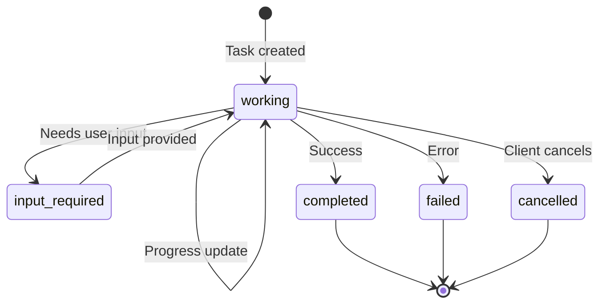

# Task Patterns

**Navigation**: [Home](../README.md) > Implementation Standards > Task Patterns  
**Related**: [← Previous: Elicitation Patterns](03f-elicitation-patterns.md) | [Next: Multi-Server Orchestration →](03h-multi-server-orchestration.md) | [Tool Implementation](03-tool-implementation.md)

**Version:** 2.0.0  
**Last Updated:** July 19, 2025  
**Status:** Production Ready

> **SRS References:** FR-TASK-001 through FR-TASK-003

## Introduction

Tasks enable MCP servers and clients to handle **durable, long-running requests** with unique identifiers, polling-based status checks, and deferred result retrieval. Unlike standard requests that return immediately, tasks persist across connection boundaries and support asynchronous completion with mid-flight interaction through elicitation and sampling.

Tasks are a **top-level capability** in MCP 2025-11-25 (not experimental). Both clients and servers can be task receivers.

## When to Use Tasks

| Scenario | Use Tasks? | Alternative |
|----------|-----------|-------------|
| Tool call takes > 30 seconds | ✅ Yes | Progress notifications for 5–30 s |
| Result needs to survive reconnection | ✅ Yes | Stateless retry |
| Batch processing (many items) | ✅ Yes | Streaming results |
| Mid-task user input needed | ✅ Yes | Elicitation within task |
| Quick data lookup (< 2 s) | ❌ No | Standard tool call |
| Real-time streaming needed | ❌ No | SSE / progress notifications |

## Capability Declaration

Tasks are declared as a **top-level** capability during initialization, with sub-capabilities specifying which request types support tasks and whether list/cancel are available.

### Server Task Capabilities

The server declares task support for tool calls:

```json
{
  "capabilities": {
    "tasks": {
      "list": {},
      "cancel": {},
      "requests": {
        "tools": {
          "call": {}
        }
      }
    }
  }
}
```

### Client Task Capabilities

The client declares task support for sampling and elicitation:

```json
{
  "capabilities": {
    "tasks": {
      "list": {},
      "cancel": {},
      "requests": {
        "sampling": {
          "createMessage": {}
        },
        "elicitation": {
          "create": {}
        }
      }
    }
  }
}
```

### Tool-Level Task Negotiation

Individual tools can declare task support via `execution.taskSupport`:

| Value | Meaning |
|-------|---------|
| `"required"` | Caller MUST send the request as a task |
| `"optional"` | Caller MAY send the request as a task |
| `"forbidden"` | Caller MUST NOT send the request as a task (default for tools without `execution`) |

```json
{
  "name": "run_pipeline",
  "description": "Run a CI/CD pipeline (long-running)",
  "inputSchema": { ... },
  "execution": {
    "taskSupport": "required"
  }
}
```

## Task Lifecycle



### Task States

| State | Description |
|-------|-------------|
| `working` | Task is actively processing |
| `input_required` | Task paused, awaiting user input (elicitation) |
| `completed` | Task finished successfully; result available |
| `failed` | Task encountered an error |
| `cancelled` | Task was cancelled by the caller |

## Protocol Methods

### Creating a Task

To create a task, the caller includes `_meta.taskId` in the request params. The receiver responds with `202 Accepted` and a task object instead of a direct result.

**Request (client → server):**

```json
{
  "jsonrpc": "2.0",
  "id": 1,
  "method": "tools/call",
  "params": {
    "name": "run_pipeline",
    "arguments": { "repo": "my-app", "branch": "main" },
    "_meta": {
      "taskId": "task-001"
    }
  }
}
```

**Response (task accepted):**

```json
{
  "jsonrpc": "2.0",
  "id": 1,
  "result": {
    "_meta": {
      "task": {
        "id": "task-001",
        "status": "working",
        "createdAt": "2025-07-19T10:00:00Z",
        "lastUpdatedAt": "2025-07-19T10:00:00Z",
        "pollInterval": 5000,
        "ttl": 86400
      }
    }
  }
}
```

### Polling Task Status: `tasks/get`

```json
{
  "jsonrpc": "2.0",
  "id": 2,
  "method": "tasks/get",
  "params": {
    "id": "task-001"
  }
}
```

**Response:**

```json
{
  "jsonrpc": "2.0",
  "id": 2,
  "result": {
    "id": "task-001",
    "status": "working",
    "createdAt": "2025-07-19T10:00:00Z",
    "lastUpdatedAt": "2025-07-19T10:00:05Z",
    "pollInterval": 5000
  }
}
```

### Retrieving Task Result: `tasks/result`

Once the task reaches `completed` or `failed` status:

```json
{
  "jsonrpc": "2.0",
  "id": 3,
  "method": "tasks/result",
  "params": {
    "id": "task-001"
  }
}
```

**Response (completed):**

```json
{
  "jsonrpc": "2.0",
  "id": 3,
  "result": {
    "id": "task-001",
    "status": "completed",
    "result": {
      "content": [
        { "type": "text", "text": "Pipeline completed: 42 tests passed, 0 failed." }
      ]
    }
  }
}
```

### Listing Tasks: `tasks/list`

```json
{
  "jsonrpc": "2.0",
  "id": 4,
  "method": "tasks/list"
}
```

### Cancelling a Task: `tasks/cancel`

```json
{
  "jsonrpc": "2.0",
  "id": 5,
  "method": "tasks/cancel",
  "params": {
    "id": "task-001"
  }
}
```

## Task Fields Reference

| Field | Type | Description |
|-------|------|-------------|
| `id` | `string` | Unique task identifier (provided by caller in `_meta.taskId`) |
| `status` | `string` | One of: `working`, `input_required`, `completed`, `failed`, `cancelled` |
| `createdAt` | `string` | ISO 8601 timestamp of task creation |
| `lastUpdatedAt` | `string` | ISO 8601 timestamp of last status change |
| `pollInterval` | `number` | Suggested polling interval in milliseconds |
| `ttl` | `number` | Time-to-live in seconds for task data retention |
| `result` | `object` | The original method's result payload (available when `completed`) |
| `error` | `object` | Error details (available when `failed`) |

## Implementation Patterns

### Basic Task-Enabled Tool

```python
import asyncio
import uuid
from datetime import datetime, timezone

# In-memory task store (use Redis/DB in production)
tasks: dict[str, dict] = {}

@mcp.tool(
    execution={"taskSupport": "required"}
)
async def run_pipeline(repo: str, branch: str = "main") -> dict:
    """Run a CI/CD pipeline (long-running, requires task)."""
    task_id = mcp.current_task_id  # Set by framework from _meta.taskId
    
    tasks[task_id] = {
        "id": task_id,
        "status": "working",
        "createdAt": datetime.now(timezone.utc).isoformat(),
        "lastUpdatedAt": datetime.now(timezone.utc).isoformat(),
        "pollInterval": 5000,
        "ttl": 86400,
        "result": None,
        "error": None,
    }
    
    # Start background processing
    asyncio.create_task(_execute_pipeline(task_id, repo, branch))
    
    # Return task metadata (framework wraps in _meta.task)
    return tasks[task_id]


async def _execute_pipeline(task_id: str, repo: str, branch: str):
    """Background pipeline execution."""
    task = tasks[task_id]
    
    try:
        # Simulate pipeline stages
        stages = ["checkout", "build", "test", "deploy"]
        for stage in stages:
            await asyncio.sleep(10)  # Simulate work
            task["lastUpdatedAt"] = datetime.now(timezone.utc).isoformat()
            
            # Send progress notification
            await mcp.send_progress(
                task_id=task_id,
                progress=stages.index(stage) + 1,
                total=len(stages),
                message=f"Stage: {stage}"
            )
        
        task["status"] = "completed"
        task["result"] = {
            "content": [{"type": "text", "text": f"Pipeline passed for {repo}@{branch}"}]
        }
    except Exception as e:
        task["status"] = "failed"
        task["error"] = {"message": str(e)}
    finally:
        task["lastUpdatedAt"] = datetime.now(timezone.utc).isoformat()
```

### Task with Mid-Flight Elicitation (input_required)

```python
async def _deploy_with_approval(task_id: str, service: str, env: str):
    """Task that pauses for user approval before deploying to production."""
    task = tasks[task_id]
    
    # Build and test
    task["lastUpdatedAt"] = datetime.now(timezone.utc).isoformat()
    await run_build(service)
    await run_tests(service)
    
    if env == "production":
        # Pause task — request user input
        task["status"] = "input_required"
        task["lastUpdatedAt"] = datetime.now(timezone.utc).isoformat()
        
        result = await mcp.elicit(
            message=f"Tests passed. Approve deployment of {service} to production?",
            schema={
                "type": "object",
                "properties": {
                    "approve": {
                        "type": "boolean",
                        "default": False
                    }
                },
                "required": ["approve"]
            }
        )
        
        # Resume task
        task["status"] = "working"
        task["lastUpdatedAt"] = datetime.now(timezone.utc).isoformat()
        
        if not result.content.get("approve"):
            task["status"] = "cancelled"
            return
    
    # Deploy
    await perform_deploy(service, env)
    task["status"] = "completed"
    task["result"] = {
        "content": [{"type": "text", "text": f"Deployed {service} to {env}."}]
    }
    task["lastUpdatedAt"] = datetime.now(timezone.utc).isoformat()
```

## Two-Way Task Support

Tasks work in **both directions**:

| Direction | Task Receiver | Task Capabilities (`requests`) |
|-----------|--------------|-------------------------------|
| Client → Server | Server | `tools.call`, `tools.list`, `tools.cancel` |
| Server → Client | Client | `sampling.createMessage`, `elicitation.create` |

A server can issue a `sampling/createMessage` request to the client as a task (with `_meta.taskId`), and the client returns the task object. The server then polls `tasks/get` on the client to retrieve the sampling result.

## Production Considerations

| Concern | Recommendation |
|---------|---------------|
| Task persistence | Use Redis or PostgreSQL, not in-memory dicts |
| Task expiration | Honor `ttl` and clean up expired tasks |
| `pollInterval` | Set realistically (e.g., 5000 ms); clients SHOULD NOT poll faster |
| Idempotency | Use `_meta.taskId` as the idempotency key |
| Audit logging | Log task creation, status changes, and completion |
| Resource limits | Limit concurrent tasks per user/role |
| Task isolation | Bind tasks to sessions; do not allow cross-session access |

## Security Considerations

- **Session binding:** Tasks MUST be accessible only within the session that created them
- **Access control:** Task operations (`tasks/get`, `tasks/result`, `tasks/cancel`) MUST verify caller identity
- **Resource management:** Servers MUST enforce task count limits and TTL to prevent resource exhaustion
- **Context integrity:** Task results MUST NOT be influenced by other users' tasks (no cross-contamination)

## Testing

```python
async def test_task_lifecycle():
    """Test complete task lifecycle: create → poll → complete."""
    # Create task
    result = await call_tool_as_task("run_pipeline", {"repo": "my-app"}, task_id="test-001")
    assert result["_meta"]["task"]["status"] == "working"
    
    # Poll until complete
    for _ in range(10):
        await asyncio.sleep(1)
        status = await tasks_get("test-001")
        if status["status"] in ("completed", "failed"):
            break
    
    assert status["status"] == "completed"
    
    # Retrieve result
    result = await tasks_result("test-001")
    assert "Pipeline passed" in result["result"]["content"][0]["text"]

async def test_task_cancellation():
    """Test task cancellation."""
    await call_tool_as_task("run_pipeline", {"repo": "my-app"}, task_id="test-002")
    await tasks_cancel("test-002")
    
    status = await tasks_get("test-002")
    assert status["status"] == "cancelled"

async def test_task_not_found():
    """Test polling a non-existent task."""
    with pytest.raises(McpError):
        await tasks_get("non-existent-id")

async def test_input_required_flow():
    """Test task that pauses for user input."""
    await call_tool_as_task("deploy_service", {"service": "api", "env": "production"}, task_id="test-003")
    
    # Wait for input_required state
    for _ in range(10):
        await asyncio.sleep(1)
        status = await tasks_get("test-003")
        if status["status"] == "input_required":
            break
    
    assert status["status"] == "input_required"
```

## Summary

- Tasks are a **top-level capability** in MCP 2025-11-25 for durable, long-running requests
- Lifecycle states: `working` → `input_required` → `completed` / `failed` / `cancelled`
- Use `_meta.taskId` to create a task; poll with `tasks/get`; retrieve with `tasks/result`
- Tool-level control via `execution.taskSupport`: `required`, `optional`, or `forbidden`
- Tasks work **both ways** — clients and servers can be task receivers
- Always implement cancellation, TTL, and session-bound access control

---

**Next**: Review [Multi-Server Orchestration](03h-multi-server-orchestration.md) for cross-server patterns.
