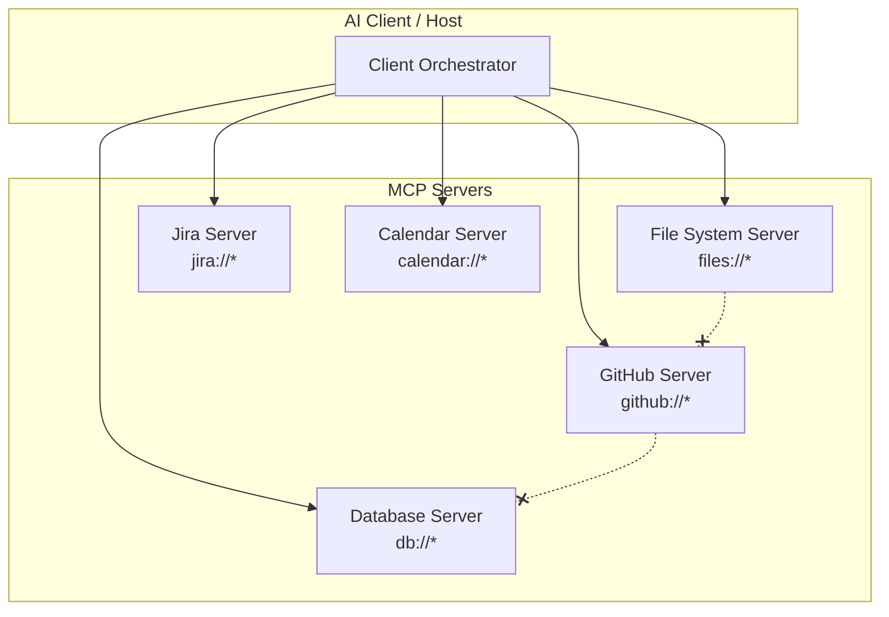
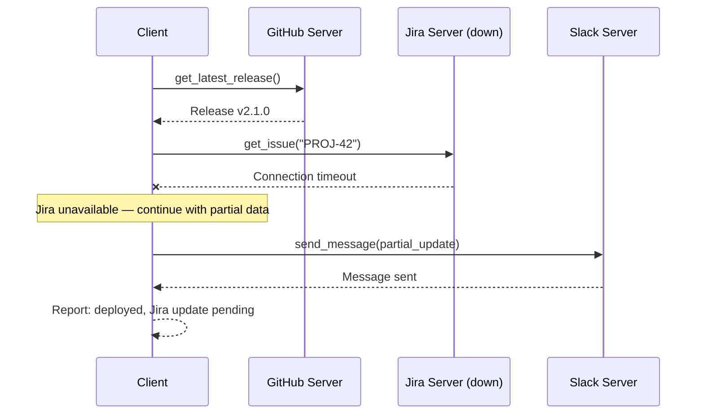

# Multi-Server Orchestration

**Navigation**: [Home](../README.md) > Implementation Standards > Multi-Server Orchestration  
**Related**: [← Previous: Task Patterns](03g-task-patterns.md) | [Next: AI Service Provider Gateway →](03i-ai-service-provider-gateway.md) | [Architecture Overview](01-architecture-overview.md)

**Version:** 1.0.0  
**Last Updated:** February 23, 2026  
**Status:** Production Ready

> **SRS References:** FR-ORCH-001 through FR-ORCH-005

## Introduction

MCP is designed for composition: a single AI client (host) connects to **multiple MCP servers** simultaneously, each serving a distinct integration domain. Cross-domain workflows are achieved by the client orchestrating calls across servers — servers never communicate directly with each other.

This pattern enforces the **Separation of Concerns** core principle (CP-04): each server focuses on a single domain with cohesive capabilities.

## Architecture



**Key constraints:**

- Servers **never** access other servers' data directly (FR-ORCH-005)
- Cross-server data flow is **client-orchestrated**
- Each server declares **clear capability boundaries** (FR-ORCH-001)
- Resources from different servers are **combinable** by the client (FR-ORCH-002)
- Tools from different servers are **usable together** via client composition (FR-ORCH-003)

## Capability Boundary Declaration

Each server must declare its domain scope clearly so clients can route requests appropriately:

```python
from fastmcp import FastMCP

# Clear domain boundaries
github_server = FastMCP(
    name="github-mcp-server",
    version="1.0.0",
    description="GitHub integration: repositories, issues, pull requests, and code search.",
    capabilities={
        "tools": {},
        "resources": {},
        "prompts": {},
    }
)

# Separate domain — separate server
jira_server = FastMCP(
    name="jira-mcp-server",
    version="1.0.0",
    description="Jira integration: issues, sprints, boards, and project management.",
    capabilities={
        "tools": {},
        "resources": {},
    }
)
```

## Cross-Server Workflow Patterns

### Pattern 1: Sequential Composition

The client calls servers in sequence, passing outputs as inputs:

```
User: "Create a GitHub issue from JIRA-1234 and link them"

Client orchestration:
  1. jira-server → tools/call: get_issue(key="JIRA-1234")
  2. github-server → tools/call: create_issue(title=jira_result.summary, body=jira_result.description)
  3. jira-server → tools/call: add_link(key="JIRA-1234", url=github_result.html_url)
```

### Pattern 2: Parallel Resource Aggregation

The client reads resources from multiple servers concurrently:

```
User: "Show me the project status"

Client orchestration (parallel):
  1a. github-server → resources/read: github://org/repo/pull-requests
  1b. jira-server → resources/read: jira://project/PROJ/sprint/current
  1c. calendar-server → resources/read: calendar://team/deadlines
  
Client merges all resources into context for LLM.
```

### Pattern 3: Cross-Domain Tool Chains

Tools from different servers are composed into multi-step workflows:

```
User: "Deploy the latest code and update the ticket"

Client orchestration:
  1. github-server → tools/call: get_latest_release(repo="org/app")
  2. deploy-server → tools/call: deploy(version=release.tag, env="staging")
  3. jira-server → tools/call: transition_issue(key="PROJ-42", status="deployed")
  4. slack-server → tools/call: send_message(channel="#releases", text="...")
```

## Failure Isolation

When one server in a composition fails, other servers must continue operating (FR-ORCH-004):



**Client-side resilience tips:**

- Set per-server timeouts independently
- Degrade gracefully when a server is unavailable
- Retry transient failures with backoff (per-server circuit breaker)
- Report partial results rather than failing entirely

## Design Guidelines

### DO

- **One domain per server**: GitHub = one server, Jira = another, Slack = another
- **Declare clear boundaries**: Name, description, and capability set should make scope obvious
- **Use standard URI schemes**: `github://`, `jira://`, `db://` for resources
- **Design for independent operation**: Each server works alone or in composition

### DON'T

- **Don't reach across servers**: No server-to-server RPC or shared state
- **Don't create "god" servers**: A server doing GitHub + Jira + Slack violates CP-04
- **Don't assume composition order**: Clients may call servers in any order
- **Don't share authentication tokens**: Each server manages its own credentials

## Testing Multi-Server Compositions

```python
async def test_cross_server_workflow():
    """Test that servers work independently in a composition."""
    # Each server operates independently
    github_result = await github_server.call_tool("get_latest_release", {"repo": "org/app"})
    jira_result = await jira_server.call_tool("get_issue", {"key": "PROJ-42"})
    
    # Both succeed independently
    assert github_result is not None
    assert jira_result is not None

async def test_failure_isolation():
    """Test that one server's failure doesn't affect others."""
    # Simulate Jira down
    with mock_server_down("jira-server"):
        # GitHub should still work
        github_result = await github_server.call_tool("create_issue", {...})
        assert github_result is not None
```

## Summary

- MCP servers compose via **client orchestration**, not server-to-server communication
- Each server owns a **single domain** with clear capability boundaries
- Failure in one server must not cascade to others
- Clients combine resources and tools from multiple servers for cross-domain workflows

---

**Next**: Review [AI Service Provider Gateway](03i-ai-service-provider-gateway.md) for provider-agnostic deployment.
