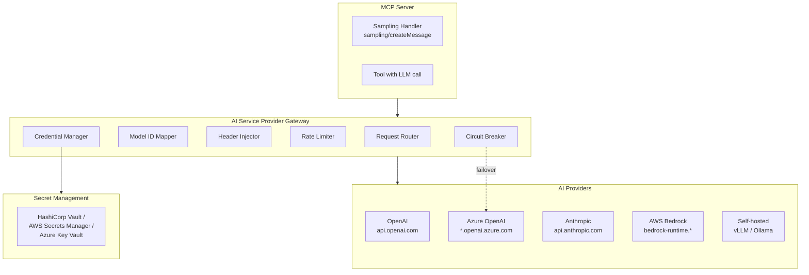

# AI Service Provider Gateway

**Navigation**: [Home](../README.md) > Implementation Standards > AI Service Provider Gateway  
**Related**: [← Previous: Multi-Server Orchestration](03h-multi-server-orchestration.md) | [Testing Strategy →](04-testing-strategy.md) | [Sampling Patterns](03c-sampling-patterns.md)

**Version:** 1.0.0  
**Last Updated:** February 23, 2026  
**Status:** Production Ready

> **SRS References:** FR-GWWY-001 through FR-GWWY-012, NFR-SEC-058 through NFR-SEC-065, CP-03

## Introduction

The AI Service Provider Gateway enables **provider-agnostic** MCP server deployments. It abstracts differences between AI providers (OpenAI, Azure OpenAI, Anthropic, AWS Bedrock, Google Vertex AI, vLLM, Ollama) behind a unified interface, allowing servers to switch providers or implement failover without code changes.

This gateway enforces the **AI Service Provider Agnostic** core principle (CP-03): no hardcoded provider dependencies; provider selection via configuration; authentication via environment variables or secret managers.

## Architecture



## Configuration

### Endpoint Configuration

> **SRS Reference:** FR-GWWY-001

```yaml
# config/gateway.yaml
ai_gateway:
  primary:
    provider: "openai"
    base_url: "https://api.openai.com/v1"       # Configurable endpoint
    credential_ref: "KV_OPENAI_API_KEY"          # Secret reference, not value
    
  secondary:
    provider: "azure_openai"
    base_url: "https://myorg.openai.azure.com/v1"
    credential_ref: "KV_AZURE_OPENAI_KEY"
    
  fallback:
    provider: "anthropic"
    base_url: "https://api.anthropic.com/v1"
    credential_ref: "KV_ANTHROPIC_KEY"

  # Model ID mapping (FR-GWWY-008)
  model_mapping:
    "gpt-4o": "gpt-4o-2024-08-06"                # OpenAI
    "gpt-4o-azure": "gpt-4o"                      # Azure deployment name
    "claude-sonnet": "claude-sonnet-4-20250514"   # Anthropic
```

### Rate Limiting

> **SRS Reference:** FR-GWWY-009

```yaml
  rate_limits:
    tokens_per_minute: 100000
    requests_per_minute: 500
    
  # Cost tracking (FR-GWWY-010)
  cost_tracking:
    enabled: true
    dimensions:
      - "cost_center"
      - "project"
      - "environment"
```

### Enterprise Headers

> **SRS Reference:** FR-GWWY-003, NFR-SEC-064, NFR-SEC-065

```yaml
  enterprise_headers:
    required: true
    headers:
      X-Project-ID: "${PROJECT_ID}"
      X-Cost-Center: "${COST_CENTER}"
      X-Environment: "${ENVIRONMENT}"
      X-Request-ID: "${auto:uuid}"                # Auto-generated per request
    reject_missing: true                           # 401 if required headers missing
```

## Implementation

### Gateway Client

```python
import httpx
import os
from dataclasses import dataclass

@dataclass
class GatewayConfig:
    base_url: str
    credential_ref: str
    model_mapping: dict[str, str]
    enterprise_headers: dict[str, str]
    timeout: float = 30.0
    max_retries: int = 3

class AIGateway:
    """AI Service Provider Gateway."""
    
    def __init__(self, config: GatewayConfig):
        self.config = config
        self._client = httpx.AsyncClient(
            base_url=config.base_url,
            timeout=config.timeout,
        )
    
    async def _get_credential(self) -> str:
        """Retrieve credential from secret manager (never plain-text config)."""
        # NFR-SEC-058: Encrypted secret management
        return await secret_manager.get(self.config.credential_ref)
    
    def _resolve_model(self, model_id: str) -> str:
        """Map application model ID to provider model ID."""
        return self.config.model_mapping.get(model_id, model_id)
    
    def _inject_headers(self, headers: dict) -> dict:
        """Inject mandatory enterprise headers."""
        for key, value in self.config.enterprise_headers.items():
            if value.startswith("${auto:"):
                headers[key] = str(uuid.uuid4())
            else:
                headers[key] = os.getenv(value.strip("${}"), "")
        return headers
    
    async def create_completion(
        self,
        model: str,
        messages: list[dict],
        **kwargs,
    ) -> dict:
        """Route completion request through the gateway."""
        credential = await self._get_credential()
        
        headers = {
            "Authorization": f"Bearer {credential}",
            "Content-Type": "application/json",
        }
        headers = self._inject_headers(headers)
        
        payload = {
            "model": self._resolve_model(model),
            "messages": messages,
            **kwargs,
        }
        
        response = await self._client.post(
            "/chat/completions",
            json=payload,
            headers=headers,
        )
        response.raise_for_status()
        return response.json()
```

### Connectivity Verification

> **SRS Reference:** FR-GWWY-002

```python
async def verify_connectivity(gateway: AIGateway) -> bool:
    """Automated /v1/models handshake to verify provider connectivity."""
    try:
        credential = await gateway._get_credential()
        response = await gateway._client.get(
            "/models",
            headers={"Authorization": f"Bearer {credential}"},
            timeout=10.0,
        )
        return response.status_code == 200
    except Exception:
        return False
```

### Failover Logic

> **SRS References:** FR-GWWY-004 through FR-GWWY-006, NFR-PERF-019 through NFR-PERF-021

```python
class ResilientGateway:
    """Gateway with automatic failover between providers."""
    
    def __init__(
        self,
        primary: AIGateway,
        secondary: AIGateway,
        fallback: AIGateway | None = None,
    ):
        self.primary = primary
        self.secondary = secondary
        self.fallback = fallback
        self._breaker = CircuitBreaker(
            failure_threshold=5,
            recovery_timeout=30,
        )
    
    async def create_completion(self, model: str, messages: list, **kwargs) -> dict:
        """Route with automatic failover."""
        try:
            return await self._breaker.execute(
                self.primary.create_completion, model, messages, **kwargs
            )
        except RateLimitError:
            # FR-GWWY-004: Immediate failover on 429
            return await self.secondary.create_completion(model, messages, **kwargs)
        except ServerError as e:
            # FR-GWWY-005: Exponential backoff then failover on 5xx
            for delay in [1, 2, 4, 8]:
                try:
                    await asyncio.sleep(delay)
                    return await self.primary.create_completion(model, messages, **kwargs)
                except ServerError:
                    continue
            return await self.secondary.create_completion(model, messages, **kwargs)
        except TimeoutError:
            # FR-GWWY-006: Immediate failover on timeout
            return await self.secondary.create_completion(model, messages, **kwargs)
```

### Credential Rotation

> **SRS Reference:** FR-GWWY-011, NFR-SEC-061

```python
class CredentialRotator:
    """Automatic credential rotation without service restart."""
    
    def __init__(self, secret_ref: str, refresh_interval: int = 3600):
        self._secret_ref = secret_ref
        self._refresh_interval = refresh_interval
        self._cached_credential: str | None = None
        self._last_refresh: float = 0
    
    async def get_credential(self) -> str:
        """Get current credential, refreshing if stale."""
        now = time.time()
        if now - self._last_refresh > self._refresh_interval or not self._cached_credential:
            self._cached_credential = await secret_manager.get(self._secret_ref)
            self._last_refresh = now
        return self._cached_credential
```

## MCP Sampling Integration

> **SRS Reference:** FR-GWWY-012

When the MCP server implements sampling, LLM requests are routed through the gateway:

```python
@mcp.tool()
async def analyze_data(data: str) -> dict:
    """Analyze data using LLM via the gateway."""
    # Route through AI gateway — provider-agnostic
    result = await gateway.create_completion(
        model="gpt-4o",                          # Application model ID
        messages=[
            {"role": "system", "content": "You are a data analyst."},
            {"role": "user", "content": f"Analyze: {data}"},
        ],
        temperature=0.2,
        max_tokens=1000,
    )
    
    return {
        "content": [{
            "type": "text",
            "text": result["choices"][0]["message"]["content"]
        }]
    }
```

## Gateway Testing

> **SRS Reference:** §5.4 (UAT-GW groups)

| Group | Focus | Test Examples |
|-------|-------|--------------|
| **UAT-GW-1** | Connectivity & Discovery | `/v1/models` handshake succeeds; invalid URL returns clear error |
| **UAT-GW-2** | Security & Governance | Enterprise headers injected; missing headers → 401; credentials from vault only |
| **UAT-GW-3** | Model Parity & Routing | Model ID mapping correct; same prompt → equivalent results across providers |
| **UAT-GW-4** | Fallback & Resiliency | 429 → immediate failover; 5xx → backoff then failover; timeout → immediate failover |
| **UAT-GW-5** | Performance & Latency | Gateway overhead < 30 ms (p95); rate limits enforced |
| **UAT-GW-6** | MCP Sampling Integration | sampling/createMessage routes through gateway; provider selection configurable |

```python
async def test_failover_on_429():
    """UAT-GW-4.1: Rate limit triggers immediate failover."""
    primary = MockProvider(responses=[RateLimitError()])
    secondary = MockProvider(responses=[SuccessResponse()])
    
    gateway = ResilientGateway(primary=primary, secondary=secondary)
    result = await gateway.create_completion("gpt-4o", [{"role": "user", "content": "test"}])
    
    assert result is not None
    assert secondary.call_count == 1

async def test_gateway_overhead():
    """UAT-GW-5.1: Gateway adds < 30ms overhead."""
    start = time.monotonic()
    await gateway.create_completion("gpt-4o", [{"role": "user", "content": "ping"}])
    elapsed = (time.monotonic() - start) * 1000
    
    assert elapsed < 30 + backend_latency  # Gateway overhead only
```

## Summary

- The AI Gateway enables **provider-agnostic** deployments (CP-03)
- All credentials stored in **encrypted secret managers**, never in plain-text (NFR-SEC-058–059)
- Automatic **failover** on 429, 5xx, and timeout (FR-GWWY-004–006)
- **Model ID mapping** decouples application models from provider-specific IDs
- **Enterprise headers** injected on every request; missing headers rejected
- Gateway overhead must stay **< 30 ms** (NFR-PERF-006)

---

**Next**: Review [Testing Strategy](04-testing-strategy.md) for the complete testing approach.
