# Observability

**Navigation**: [Home](../README.md) > Quality & Operations > Observability  
**Related**: [← Previous: Testing Strategy](04-testing-strategy.md) | [Next: Development Lifecycle →](06-development-lifecycle.md) | [Metrics & KPIs](13-metrics-kpis.md)

**Version:** 1.4.0  
**Last Updated:** November 20, 2025  
**Status:** Production Ready

## Quick Links

- [Structured Logging](#structured-logging)
- [Metrics Collection](#metrics-collection)
- [Distributed Tracing](#distributed-tracing-patterns)
- [Health Checks](#health-check-implementations)
- [Alerting Strategies](#alerting-strategies)
- [Summary](#summary)

## Introduction

Comprehensive observability enables effective monitoring, debugging, and performance optimization of MCP servers. This document covers structured logging, metrics collection, distributed tracing, health checks, and alerting strategies.

## Three Pillars of Observability

The observability system integrates logs, metrics, and traces for comprehensive system visibility:

```mermaid
graph TB
    subgraph Sources["📡 Data Sources"]
        direction LR
        MCP1[MCP Server 1]
        MCP2[MCP Server 2]
        MCP3[MCP Server 3]
        Gateway[MCP Gateway]
        K8s[Kubernetes<br/>Control Plane]
    end
    
    subgraph Collection["🔄 Collection Layer"]
        direction TB
        
        subgraph LogPipeline["Log Pipeline"]
            Fluent[Fluentd/Fluent Bit<br/>Log Forwarder]
            LogBuffer[(Buffer<br/>Kafka/Redis)]
        end
        
        subgraph MetricPipeline["Metrics Pipeline"]
            Prometheus[Prometheus<br/>Scraper]
            StatsdExp[StatsD Exporter<br/>Push Gateway]
        end
        
        subgraph TracePipeline["Trace Pipeline"]
            OTel[OpenTelemetry<br/>Collector]
            TraceBuffer[(Sampling<br/>Buffer)]
        end
    end
    
    subgraph Storage["💾 Storage Layer"]
        direction TB
        
        subgraph LogStorage["Log Storage"]
            Loki[(Loki<br/>LogQL)]
            ES[(Elasticsearch<br/>Full-text Search)]
            S3Log[(S3/GCS<br/>Long-term Archive)]
        end
        
        subgraph MetricStorage["Metrics Storage"]
            PromStorage[(Prometheus TSDB<br/>15d retention)]
            Thanos[(Thanos<br/>Long-term Storage)]
            M3[(M3DB<br/>High Cardinality)]
        end
        
        subgraph TraceStorage["Trace Storage"]
            Jaeger[(Jaeger<br/>Cassandra/ES)]
            Tempo[(Grafana Tempo<br/>S3/GCS)]
        end
    end
    
    subgraph Analysis["🔍 Analysis & Visualization"]
        direction LR
        Grafana[Grafana<br/>Unified Dashboards]
        Kibana[Kibana<br/>Log Analysis]
        Jaeger_UI[Jaeger UI<br/>Trace Explorer]
    end
    
    subgraph Alerting["🚨 Alerting & Response"]
        direction TB
        AlertMgr[Alert Manager<br/>Routing & Dedup]
        PagerDuty[PagerDuty<br/>On-call]
        Slack[Slack<br/>Notifications]
        Email[Email<br/>Reports]
    end
    
    subgraph Intelligence["🤖 AIOps (Optional)"]
        Anomaly[Anomaly Detection<br/>ML Models]
        Forecast[Capacity Forecasting<br/>Prophet/ARIMA]
        RCA[Root Cause Analysis<br/>Graph Analysis]
    end
    
    %% Log Flow
    MCP1 -->|stdout/stderr| Fluent
    MCP2 -->|stdout/stderr| Fluent
    MCP3 -->|stdout/stderr| Fluent
    Gateway -->|JSON logs| Fluent
    K8s -->|Events| Fluent
    
    Fluent -->|Parse & Enrich| LogBuffer
    LogBuffer -->|Indexed| Loki
    LogBuffer -->|Full-text| ES
    Loki -->|Cold Storage| S3Log
    
    %% Metrics Flow
    MCP1 -->|/metrics| Prometheus
    MCP2 -->|/metrics| Prometheus
    MCP3 -->|/metrics| Prometheus
    Gateway -->|StatsD| StatsdExp
    K8s -->|kube-state-metrics| Prometheus
    
    StatsdExp -->|Expose| Prometheus
    Prometheus -->|Federate| PromStorage
    PromStorage -->|Downsample| Thanos
    Prometheus -->|High Card| M3
    
    %% Trace Flow
    MCP1 -->|OTLP| OTel
    MCP2 -->|OTLP| OTel
    MCP3 -->|OTLP| OTel
    Gateway -->|Zipkin| OTel
    
    OTel -->|Sample & Batch| TraceBuffer
    TraceBuffer -->|Spans| Jaeger
    TraceBuffer -->|Spans| Tempo
    
    %% Visualization
    Loki -->|LogQL| Grafana
    ES -->|Query| Kibana
    PromStorage -->|PromQL| Grafana
    Thanos -->|PromQL| Grafana
    Jaeger -->|Query| Jaeger_UI
    Tempo -->|TraceQL| Grafana
    
    %% Correlation
    Grafana -.->|trace_id| Jaeger_UI
    Grafana -.->|correlation_id| Kibana
    Jaeger_UI -.->|log correlation| Loki
    
    %% Alerting
    Prometheus -->|Alert Rules| AlertMgr
    Loki -->|Alert Rules| AlertMgr
    AlertMgr -->|On-call| PagerDuty
    AlertMgr -->|Notify| Slack
    AlertMgr -->|Digest| Email
    
    %% AIOps
    PromStorage -.->|Time Series| Anomaly
    Loki -.->|Error Patterns| RCA
    PromStorage -.->|Historical| Forecast
    
    Anomaly -->|Anomaly Alerts| AlertMgr
    RCA -.->|Context| Grafana
    Forecast -.->|Predictions| Grafana
    
    %% Styling
    classDef sources fill:#e3f2fd,stroke:#1976d2,stroke-width:2px
    classDef collection fill:#f3e5f5,stroke:#7b1fa2,stroke-width:2px
    classDef storage fill:#e8f5e9,stroke:#388e3c,stroke-width:2px
    classDef analysis fill:#fff3e0,stroke:#f57c00,stroke-width:2px
    classDef alerting fill:#ffebee,stroke:#c62828,stroke-width:2px
    classDef aiops fill:#fce4ec,stroke:#c2185b,stroke-width:2px
    
    class MCP1,MCP2,MCP3,Gateway,K8s sources
    class Fluent,LogBuffer,Prometheus,StatsdExp,OTel,TraceBuffer collection
    class Loki,ES,S3Log,PromStorage,Thanos,M3,Jaeger,Tempo storage
    class Grafana,Kibana,Jaeger_UI analysis
    class AlertMgr,PagerDuty,Slack,Email alerting
    class Anomaly,Forecast,RCA aiops
```



### Observability Stack Components

**Data Sources:**

- MCP servers emit logs, metrics, and traces
- Gateway provides centralized telemetry
- Kubernetes control plane metrics and events

**Collection Layer:**

- **Logs**: Fluentd/Fluent Bit for log forwarding with parsing
- **Metrics**: Prometheus pull-based scraping, StatsD push
- **Traces**: OpenTelemetry Collector with sampling and batching

**Storage Layer:**

- **Logs**: Loki (efficient), Elasticsearch (full-text), S3 (archive)
- **Metrics**: Prometheus (15d), Thanos (long-term), M3DB (high cardinality)
- **Traces**: Jaeger (Cassandra/ES), Tempo (object storage)

**Analysis & Visualization:**

- Grafana for unified dashboards (logs, metrics, traces)
- Kibana for advanced log analysis
- Jaeger UI for trace exploration

**Alerting:**

- Alert Manager for routing and deduplication
- PagerDuty for on-call escalation
- Slack and email for notifications

**AIOps (Optional):**

- Anomaly detection with ML models
- Capacity forecasting (Prophet/ARIMA)
- Root cause analysis via graph analysis

**Key Features:**

- **Correlation**: Link traces to logs via correlation_id
- **Cardinality Management**: M3DB for high-cardinality metrics
- **Long-term Retention**: Thanos and S3 for cost-effective storage
- **Sampling**: Intelligent trace sampling to reduce volume
- **Federation**: Multi-cluster Prometheus aggregation

## Structured Logging

### Logging Configuration

```python
import logging
import structlog
from pythonjsonlogger import jsonlogger

def configure_logging():
    """Configure structured logging."""
    
    # Configure standard logging
    logging.basicConfig(
        format="%(message)s",
        level=logging.INFO
    )
    
    # Configure structlog
    structlog.configure(
        processors=[
            structlog.contextvars.merge_contextvars,
            structlog.stdlib.filter_by_level,
            structlog.stdlib.add_logger_name,
            structlog.stdlib.add_log_level,
            structlog.stdlib.PositionalArgumentsFormatter(),
            structlog.processors.TimeStamper(fmt="iso"),
            structlog.processors.StackInfoRenderer(),
            structlog.processors.format_exc_info,
            structlog.processors.UnicodeDecoder(),
            structlog.processors.JSONRenderer()
        ],
        wrapper_class=structlog.stdlib.BoundLogger,
        context_class=dict,
        logger_factory=structlog.stdlib.LoggerFactory(),
        cache_logger_on_first_use=True,
    )

# Initialize at startup
configure_logging()
logger = structlog.get_logger()
```

### Structured Log Format

```python
from typing import Optional
from datetime import datetime
from contextvars import ContextVar

# Context variables for correlation
correlation_id: ContextVar[Optional[str]] = ContextVar('correlation_id', default=None)
user_id: ContextVar[Optional[str]] = ContextVar('user_id', default=None)

class StructuredLogger:
    """Structured logger with correlation context."""
    
    def __init__(self):
        self.logger = structlog.get_logger()
    
    def _get_context(self) -> dict:
        """Get current logging context."""
        return {
            "correlation_id": correlation_id.get(),
            "user_id": user_id.get(),
            "timestamp": datetime.utcnow().isoformat(),
        }
    
    def info(self, event: str, **kwargs):
        """Log info event."""
        self.logger.info(event, **{**self._get_context(), **kwargs})
    
    def warning(self, event: str, **kwargs):
        """Log warning event."""
        self.logger.warning(event, **{**self._get_context(), **kwargs})
    
    def error(self, event: str, **kwargs):
        """Log error event."""
        self.logger.error(event, **{**self._get_context(), **kwargs})
    
    def debug(self, event: str, **kwargs):
        """Log debug event."""
        self.logger.debug(event, **{**self._get_context(), **kwargs})

# Global logger instance
log = StructuredLogger()
```

### Logging in Tools

```python
from mcp_server.logging import log, correlation_id

@mcp.tool()
async def create_assignment(
    title: str,
    assignee: str
) -> dict:
    """Create assignment with structured logging."""
    
    # Set correlation ID
    corr_id = str(uuid.uuid4())
    correlation_id.set(corr_id)
    
    log.info(
        "create_assignment_started",
        tool="create_assignment",
        title=title,
        assignee=assignee
    )
    
    try:
        # Create assignment
        assignment = await backend.create_assignment(title, assignee)
        
        log.info(
            "create_assignment_completed",
            tool="create_assignment",
            assignment_id=assignment.id,
            duration_ms=elapsed_ms
        )
        
        return {
            "success": True,
            "data": assignment.to_dict(),
            "metadata": {
                "correlation_id": corr_id,
                "timestamp": datetime.utcnow().isoformat()
            }
        }
        
    except Exception as e:
        log.error(
            "create_assignment_failed",
            tool="create_assignment",
            error_type=type(e).__name__,
            error_message=str(e),
            exc_info=True
        )
        raise
```

### Log Levels

Use appropriate log levels:

```python
# DEBUG - Detailed diagnostic information
log.debug(
    "cache_lookup",
    cache_key=key,
    cache_hit=hit,
    ttl_remaining=ttl
)

# INFO - Significant events
log.info(
    "assignment_created",
    assignment_id=assignment.id,
    assignee=assignee
)

# WARNING - Potential issues
log.warning(
    "rate_limit_approaching",
    user_id=user_id,
    current_rate=current,
    limit=limit,
    threshold_percent=90
)

# ERROR - Errors requiring attention
log.error(
    "database_connection_failed",
    error=str(e),
    retry_attempt=attempt,
    max_retries=max_retries
)

# CRITICAL - System failures
log.critical(
    "service_unavailable",
    reason="database_unreachable",
    downtime_seconds=downtime
)
```

### Log Aggregation

```yaml
# Filebeat configuration for log shipping
filebeat.inputs:
  - type: log
    enabled: true
    paths:
      - /var/log/mcp-server/*.log
    json.keys_under_root: true
    json.add_error_key: true
    fields:
      service: mcp-server
      environment: production

output.elasticsearch:
  hosts: ["elasticsearch:9200"]
  index: "mcp-server-logs-%{+yyyy.MM.dd}"

processors:
  - add_host_metadata: ~
  - add_cloud_metadata: ~
  - add_docker_metadata: ~
```

## Metrics

### OpenTelemetry Metrics

```python
from opentelemetry import metrics
from opentelemetry.sdk.metrics import MeterProvider
from opentelemetry.sdk.metrics.export import (
    PeriodicExportingMetricReader,
    ConsoleMetricExporter
)
from opentelemetry.exporter.prometheus import PrometheusMetricReader
from prometheus_client import start_http_server

def configure_metrics():
    """Configure OpenTelemetry metrics."""
    
    # Prometheus exporter
    prometheus_reader = PrometheusMetricReader()
    
    # Meter provider
    provider = MeterProvider(metric_readers=[prometheus_reader])
    metrics.set_meter_provider(provider)
    
    # Start Prometheus HTTP server
    start_http_server(port=9090)
    
    return metrics.get_meter("mcp_server")

# Initialize meter
meter = configure_metrics()

# Create instruments
request_counter = meter.create_counter(
    name="mcp.requests.total",
    description="Total number of requests",
    unit="1"
)

request_duration = meter.create_histogram(
    name="mcp.request.duration",
    description="Request duration in milliseconds",
    unit="ms"
)

active_requests = meter.create_up_down_counter(
    name="mcp.requests.active",
    description="Number of active requests",
    unit="1"
)

error_counter = meter.create_counter(
    name="mcp.errors.total",
    description="Total number of errors",
    unit="1"
)
```

### Instrumenting Tools

```python
import time
from opentelemetry import trace
from opentelemetry.trace import Status, StatusCode

# Get tracer
tracer = trace.get_tracer("mcp_server")

@mcp.tool()
async def create_assignment(
    title: str,
    assignee: str
) -> dict:
    """Create assignment with metrics."""
    
    # Start span for tracing
    with tracer.start_as_current_span("create_assignment") as span:
        # Add span attributes
        span.set_attribute("tool.name", "create_assignment")
        span.set_attribute("assignee", assignee)
        
        # Track active requests
        active_requests.add(1, {"tool": "create_assignment"})
        
        # Track request count
        request_counter.add(
            1,
            {
                "tool": "create_assignment",
                "method": "POST"
            }
        )
        
        start_time = time.perf_counter()
        
        try:
            # Execute tool logic
            assignment = await backend.create_assignment(title, assignee)
            
            # Record success
            span.set_status(Status(StatusCode.OK))
            
            # Track duration
            duration_ms = (time.perf_counter() - start_time) * 1000
            request_duration.record(
                duration_ms,
                {
                    "tool": "create_assignment",
                    "status": "success"
                }
            )
            
            return {
                "success": True,
                "data": assignment.to_dict()
            }
            
        except Exception as e:
            # Record error
            span.set_status(Status(StatusCode.ERROR, str(e)))
            span.record_exception(e)
            
            # Track error
            error_counter.add(
                1,
                {
                    "tool": "create_assignment",
                    "error_type": type(e).__name__
                }
            )
            
            # Track failed request duration
            duration_ms = (time.perf_counter() - start_time) * 1000
            request_duration.record(
                duration_ms,
                {
                    "tool": "create_assignment",
                    "status": "error"
                }
            )
            
            raise
            
        finally:
            # Decrement active requests
            active_requests.add(-1, {"tool": "create_assignment"})
```

### Custom Business Metrics

```python
# Business-specific metrics
assignments_created = meter.create_counter(
    name="mcp.assignments.created",
    description="Total assignments created",
    unit="1"
)

assignments_completed = meter.create_counter(
    name="mcp.assignments.completed",
    description="Total assignments completed",
    unit="1"
)

assignment_duration = meter.create_histogram(
    name="mcp.assignment.duration",
    description="Time from creation to completion",
    unit="hours"
)

@mcp.tool()
async def complete_assignment(assignment_id: str) -> dict:
    """Complete assignment and record metrics."""
    
    assignment = await backend.get_assignment(assignment_id)
    assignment.status = "completed"
    assignment.completed_at = datetime.utcnow()
    await backend.save(assignment)
    
    # Record completion metric
    assignments_completed.add(
        1,
        {
            "assignee": assignment.assignee,
            "priority": assignment.priority
        }
    )
    
    # Record duration metric
    duration_hours = (
        assignment.completed_at - assignment.created_at
    ).total_seconds() / 3600
    
    assignment_duration.record(
        duration_hours,
        {
            "priority": assignment.priority
        }
    )
    
    return {"success": True, "data": assignment.to_dict()}
```

### Grafana Dashboard

```json
{
  "dashboard": {
    "title": "MCP Server Metrics",
    "panels": [
      {
        "title": "Request Rate",
        "targets": [
          {
            "expr": "rate(mcp_requests_total[5m])",
            "legendFormat": "{{tool}}"
          }
        ]
      },
      {
        "title": "Request Duration p99",
        "targets": [
          {
            "expr": "histogram_quantile(0.99, rate(mcp_request_duration_bucket[5m]))",
            "legendFormat": "{{tool}}"
          }
        ]
      },
      {
        "title": "Error Rate",
        "targets": [
          {
            "expr": "rate(mcp_errors_total[5m])",
            "legendFormat": "{{error_type}}"
          }
        ]
      },
      {
        "title": "Active Requests",
        "targets": [
          {
            "expr": "mcp_requests_active",
            "legendFormat": "{{tool}}"
          }
        ]
      }
    ]
  }
}
```

## Distributed Tracing

### OpenTelemetry Tracing

```python
from opentelemetry import trace
from opentelemetry.sdk.trace import TracerProvider
from opentelemetry.sdk.trace.export import BatchSpanProcessor
from opentelemetry.exporter.jaeger.thrift import JaegerExporter
from opentelemetry.instrumentation.fastapi import FastAPIInstrumentor
from opentelemetry.instrumentation.httpx import HTTPXClientInstrumentor

def configure_tracing():
    """Configure distributed tracing."""
    
    # Jaeger exporter
    jaeger_exporter = JaegerExporter(
        agent_host_name="jaeger",
        agent_port=6831,
    )
    
    # Tracer provider
    provider = TracerProvider()
    processor = BatchSpanProcessor(jaeger_exporter)
    provider.add_span_processor(processor)
    trace.set_tracer_provider(provider)
    
    # Auto-instrument FastAPI
    FastAPIInstrumentor.instrument_app(app)
    
    # Auto-instrument httpx client
    HTTPXClientInstrumentor().instrument()

configure_tracing()
```

### Manual Span Creation

```python
from opentelemetry import trace
from opentelemetry.trace import SpanKind

tracer = trace.get_tracer(__name__)

@mcp.tool()
async def create_assignment_with_validation(
    title: str,
    assignee: str
) -> dict:
    """Create assignment with distributed tracing."""
    
    # Parent span
    with tracer.start_as_current_span(
        "create_assignment",
        kind=SpanKind.SERVER
    ) as parent_span:
        parent_span.set_attribute("tool.name", "create_assignment")
        parent_span.set_attribute("assignee", assignee)
        
        # Child span for validation
        with tracer.start_as_current_span("validate_input") as validate_span:
            validate_span.set_attribute("title_length", len(title))
            
            if not title or len(title) < 3:
                validate_span.set_status(
                    Status(StatusCode.ERROR, "Invalid title")
                )
                raise ValueError("Title must be at least 3 characters")
            
            validate_span.set_status(Status(StatusCode.OK))
        
        # Child span for database operation
        with tracer.start_as_current_span(
            "database.create",
            kind=SpanKind.CLIENT
        ) as db_span:
            db_span.set_attribute("db.system", "postgresql")
            db_span.set_attribute("db.operation", "INSERT")
            db_span.set_attribute("db.table", "assignments")
            
            assignment = await backend.create_assignment(title, assignee)
            
            db_span.set_attribute("db.row_id", assignment.id)
            db_span.set_status(Status(StatusCode.OK))
        
        # Child span for notification
        with tracer.start_as_current_span(
            "notification.send",
            kind=SpanKind.PRODUCER
        ) as notify_span:
            notify_span.set_attribute("notification.type", "email")
            notify_span.set_attribute("notification.recipient", assignee)
            
            await send_notification(assignee, assignment)
            
            notify_span.set_status(Status(StatusCode.OK))
        
        parent_span.set_status(Status(StatusCode.OK))
        
        return {
            "success": True,
            "data": assignment.to_dict(),
            "metadata": {
                "trace_id": format(parent_span.get_span_context().trace_id, '032x')
            }
        }
```

### Cross-Service Tracing

```python
import httpx
from opentelemetry.propagate import inject

async def call_external_service(data: dict) -> dict:
    """Call external service with trace propagation."""
    
    with tracer.start_as_current_span(
        "external_api_call",
        kind=SpanKind.CLIENT
    ) as span:
        span.set_attribute("http.url", "https://api.external.com/validate")
        span.set_attribute("http.method", "POST")
        
        # Prepare headers with trace context
        headers = {}
        inject(headers)  # Inject trace context into headers
        
        async with httpx.AsyncClient() as client:
            response = await client.post(
                "https://api.external.com/validate",
                json=data,
                headers=headers
            )
            
            span.set_attribute("http.status_code", response.status_code)
            
            if response.status_code >= 400:
                span.set_status(Status(StatusCode.ERROR))
            else:
                span.set_status(Status(StatusCode.OK))
            
            return response.json()
```

## Health Checks

### Health Check Endpoints

```python
from fastapi import FastAPI, status
from typing import Dict, Any

app = FastAPI()

class HealthChecker:
    """Health check manager."""
    
    async def check_database(self) -> Dict[str, Any]:
        """Check database connectivity."""
        try:
            result = await db.execute("SELECT 1")
            return {
                "status": "healthy",
                "latency_ms": result.latency
            }
        except Exception as e:
            return {
                "status": "unhealthy",
                "error": str(e)
            }
    
    async def check_cache(self) -> Dict[str, Any]:
        """Check cache connectivity."""
        try:
            await cache.ping()
            return {"status": "healthy"}
        except Exception as e:
            return {
                "status": "unhealthy",
                "error": str(e)
            }
    
    async def check_external_api(self) -> Dict[str, Any]:
        """Check external API availability."""
        try:
            async with httpx.AsyncClient() as client:
                response = await client.get(
                    "https://api.external.com/health",
                    timeout=5.0
                )
                return {
                    "status": "healthy" if response.status_code == 200 else "degraded",
                    "status_code": response.status_code
                }
        except Exception as e:
            return {
                "status": "unhealthy",
                "error": str(e)
            }

health_checker = HealthChecker()

@app.get("/health")
async def health_check():
    """Basic health check (liveness probe)."""
    return {"status": "healthy", "timestamp": datetime.utcnow().isoformat()}

@app.get("/health/ready")
async def readiness_check():
    """Readiness check with dependency validation."""
    
    checks = {
        "database": await health_checker.check_database(),
        "cache": await health_checker.check_cache(),
        "external_api": await health_checker.check_external_api()
    }
    
    # Determine overall status
    all_healthy = all(
        check["status"] == "healthy"
        for check in checks.values()
    )
    
    status_code = (
        status.HTTP_200_OK if all_healthy
        else status.HTTP_503_SERVICE_UNAVAILABLE
    )
    
    return {
        "status": "ready" if all_healthy else "not_ready",
        "timestamp": datetime.utcnow().isoformat(),
        "checks": checks
    }, status_code
```

### Kubernetes Probes

```yaml
# deployment.yaml
apiVersion: apps/v1
kind: Deployment
metadata:
  name: mcp-server
spec:
  template:
    spec:
      containers:
      - name: mcp-server
        image: mcp-server:latest
        ports:
        - containerPort: 8000
        
        # Liveness probe (restart if unhealthy)
        livenessProbe:
          httpGet:
            path: /health
            port: 8000
          initialDelaySeconds: 30
          periodSeconds: 10
          timeoutSeconds: 5
          failureThreshold: 3
        
        # Readiness probe (remove from service if not ready)
        readinessProbe:
          httpGet:
            path: /health/ready
            port: 8000
          initialDelaySeconds: 10
          periodSeconds: 5
          timeoutSeconds: 3
          successThreshold: 1
          failureThreshold: 3
        
        # Startup probe (allow longer startup time)
        startupProbe:
          httpGet:
            path: /health
            port: 8000
          initialDelaySeconds: 0
          periodSeconds: 5
          timeoutSeconds: 3
          failureThreshold: 30
```

## Alerting

### Alert Rules

```yaml
# Prometheus alert rules
groups:
  - name: mcp_server_alerts
    interval: 30s
    rules:
      # High error rate
      - alert: HighErrorRate
        expr: |
          rate(mcp_errors_total[5m]) > 0.05
        for: 5m
        labels:
          severity: warning
        annotations:
          summary: "High error rate detected"
          description: "Error rate is {{ $value | humanizePercentage }} (threshold: 5%)"
      
      # High latency
      - alert: HighLatency
        expr: |
          histogram_quantile(0.99,
            rate(mcp_request_duration_bucket[5m])
          ) > 1000
        for: 5m
        labels:
          severity: warning
        annotations:
          summary: "High request latency detected"
          description: "P99 latency is {{ $value }}ms (threshold: 1000ms)"
      
      # Service down
      - alert: ServiceDown
        expr: up{job="mcp-server"} == 0
        for: 1m
        labels:
          severity: critical
        annotations:
          summary: "MCP server is down"
          description: "Service {{ $labels.instance }} is unreachable"
      
      # Database connection issues
      - alert: DatabaseConnectionFailure
        expr: |
          mcp_database_connection_errors_total > 10
        for: 2m
        labels:
          severity: critical
        annotations:
          summary: "Database connection failures"
          description: "{{ $value }} connection failures in last 2 minutes"
```

### Alert Destinations

```yaml
# AlertManager configuration
route:
  receiver: 'default'
  group_by: ['alertname', 'cluster', 'service']
  group_wait: 30s
  group_interval: 5m
  repeat_interval: 4h
  
  routes:
    - match:
        severity: critical
      receiver: pagerduty
      continue: true
    
    - match:
        severity: warning
      receiver: slack
      continue: true

receivers:
  - name: 'default'
    slack_configs:
      - api_url: 'https://hooks.slack.com/services/XXX'
        channel: '#alerts'
        text: "{{ range .Alerts }}{{ .Annotations.summary }}\n{{ end }}"
  
  - name: 'pagerduty'
    pagerduty_configs:
      - service_key: 'YOUR_PAGERDUTY_KEY'
  
  - name: 'slack'
    slack_configs:
      - api_url: 'https://hooks.slack.com/services/XXX'
        channel: '#mcp-alerts'
```

## Grafana Dashboard Management

### Dashboard Exports

Pre-built Grafana dashboards for common MCP monitoring scenarios are available in `dashboards/`:

**1. MCP Server Overview (`grafana-mcp-overview.json`)**

- Request rate by endpoint and method
- Latency percentiles (P50, P95, P99)
- Error rate percentage with thresholds
- Active connections gauge
- CPU usage monitoring
- Top endpoints by traffic
- Slowest endpoints ranking

**2. MCP Errors & Debugging (`grafana-mcp-errors.json`)**

- Error rate by HTTP status code
- Live error log streaming (Loki integration)
- Error distribution by type
- Retry rate tracking
- Circuit breaker status
- Recent 5xx errors with context

**3. MCP Performance (`grafana-mcp-performance.json`)**

- Response time distribution (P50, P90, P95, P99, P99.9)
- Database query duration by type
- Memory usage trends
- Garbage collection pause time
- Connection pool utilization
- Request duration heatmap
- Throughput vs latency correlation
- Endpoint performance summary table

**4. MCP Cloud Cost Monitoring (`grafana-mcp-costs.json`)**

- Total monthly cost (MTD)
- Cost per request average
- Projected monthly cost
- Daily cost trend
- Cost breakdown by service (pie chart)
- Top cost drivers (bar chart)
- Resource efficiency metrics
- Cost vs traffic correlation

### Importing Dashboards

```bash
# Using Grafana API
for dashboard in dashboards/grafana-*.json; do
  curl -X POST \
    -H "Authorization: Bearer ${GRAFANA_API_KEY}" \
    -H "Content-Type: application/json" \
    -d @"${dashboard}" \
    "https://grafana.example.com/api/dashboards/db"
done

# Using Terraform
# terraform/grafana.tf
resource "grafana_dashboard" "mcp_overview" {
  config_json = file("${path.module}/../dashboards/grafana-mcp-overview.json")
  folder      = grafana_folder.mcp.id
}

# Using ConfigMap (Kubernetes)
kubectl create configmap grafana-dashboards \
  --from-file=dashboards/ \
  -n monitoring
```

**Dashboard Provisioning (grafana.ini):**

```ini
[dashboards]
default_home_dashboard_path = /var/lib/grafana/dashboards/grafana-mcp-overview.json

[dashboards.provisioning]
path = /etc/grafana/provisioning/dashboards

# provisioning/dashboards/mcp.yaml
apiVersion: 1
providers:
  - name: 'MCP Dashboards'
    orgId: 1
    folder: 'MCP'
    type: file
    disableDeletion: false
    updateIntervalSeconds: 30
    options:
      path: /var/lib/grafana/dashboards
```

### Dashboard Best Practices

#### 1. Variable Templates

```json
{
  "templating": {
    "list": [
      {
        "name": "environment",
        "type": "query",
        "query": "label_values(mcp_requests_total, environment)",
        "current": {"text": "production", "value": "production"},
        "multi": true
      },
      {
        "name": "instance",
        "type": "query",
        "query": "label_values(mcp_requests_total{environment=~\"$environment\"}, instance)"
      }
    ]
  }
}
```

#### 2. Annotation Queries

```json
{
  "annotations": {
    "list": [
      {
        "name": "Deployments",
        "datasource": "Prometheus",
        "expr": "changes(mcp_build_info[5m]) > 0",
        "tagKeys": "version",
        "textFormat": "Deployed {{version}}"
      },
      {
        "name": "Incidents",
        "datasource": "Loki",
        "expr": "{job=\"incidents\"} |= \"severity=critical\""
      }
    ]
  }
}
```

#### 3. Dashboard Links

```json
{
  "links": [
    {
      "title": "View Logs",
      "url": "https://grafana.example.com/explore?left=%7B%22datasource%22:%22Loki%22%7D",
      "type": "link",
      "icon": "external link"
    },
    {
      "title": "Runbook",
      "url": "https://wiki.example.com/runbooks/mcp-server",
      "type": "link"
    }
  ]
}
```

## Prometheus Recording Rules

Recording rules precompute frequently used queries for faster dashboard loading and reduced query load.

### Configuration

```yaml
# prometheus/rules/mcp_recording_rules.yaml
groups:
  - name: mcp_request_aggregations
    interval: 30s
    rules:
      # Request rate by endpoint (5m window)
      - record: mcp:requests:rate5m
        expr: |
          sum by (endpoint, method, status) (
            rate(mcp_requests_total[5m])
          )
      
      # Error rate percentage
      - record: mcp:requests:error_rate5m
        expr: |
          (
            sum by (endpoint) (rate(mcp_requests_total{status=~"5.."}[5m]))
            /
            sum by (endpoint) (rate(mcp_requests_total[5m]))
          ) * 100
      
      # Request latency percentiles
      - record: mcp:request_duration:p50
        expr: |
          histogram_quantile(0.50,
            sum by (endpoint, le) (
              rate(mcp_request_duration_seconds_bucket[5m])
            )
          )
      
      - record: mcp:request_duration:p95
        expr: |
          histogram_quantile(0.95,
            sum by (endpoint, le) (
              rate(mcp_request_duration_seconds_bucket[5m])
            )
          )
      
      - record: mcp:request_duration:p99
        expr: |
          histogram_quantile(0.99,
            sum by (endpoint, le) (
              rate(mcp_request_duration_seconds_bucket[5m])
            )
          )
      
      # Average request duration
      - record: mcp:request_duration:avg
        expr: |
          sum by (endpoint) (rate(mcp_request_duration_seconds_sum[5m]))
          /
          sum by (endpoint) (rate(mcp_request_duration_seconds_count[5m]))

  - name: mcp_resource_aggregations
    interval: 30s
    rules:
      # CPU usage percentage
      - record: mcp:cpu:usage_percent
        expr: |
          100 * (
            1 - avg by (instance) (
              rate(process_cpu_seconds_total[5m])
            )
          )
      
      # Memory usage in MB
      - record: mcp:memory:usage_mb
        expr: |
          sum by (instance) (
            process_resident_memory_bytes / 1024 / 1024
          )
      
      # Connection pool utilization percentage
      - record: mcp:db:pool_utilization_percent
        expr: |
          100 * (
            mcp_db_connection_pool_active
            /
            (mcp_db_connection_pool_active + mcp_db_connection_pool_idle)
          )

  - name: mcp_business_metrics
    interval: 1m
    rules:
      # Requests per minute by endpoint
      - record: mcp:requests:rpm
        expr: |
          sum by (endpoint) (
            increase(mcp_requests_total[1m])
          )
      
      # Success rate (200-399 status codes)
      - record: mcp:requests:success_rate
        expr: |
          (
            sum by (endpoint) (rate(mcp_requests_total{status=~"2..|3.."}[5m]))
            /
            sum by (endpoint) (rate(mcp_requests_total[5m]))
          ) * 100
      
      # Cost per 1000 requests
      - record: mcp:cost:per_1k_requests
        expr: |
          (
            sum(increase(cloud_cost_usd[1h]))
            /
            sum(increase(mcp_requests_total[1h]))
          ) * 1000
```

**Load Recording Rules:**

```bash
# Validate rules
promtool check rules prometheus/rules/mcp_recording_rules.yaml

# Reload Prometheus
curl -X POST http://localhost:9090/-/reload

# Or via Kubernetes ConfigMap
kubectl create configmap prometheus-rules \
  --from-file=prometheus/rules/ \
  -n monitoring

kubectl rollout restart statefulset/prometheus -n monitoring
```

**Using Recording Rules in Queries:**

```promql
# Before (expensive query)
histogram_quantile(0.95,
  sum by (endpoint, le) (
    rate(mcp_request_duration_seconds_bucket[5m])
  )
)

# After (fast lookup)
mcp:request_duration:p95
```

## Alert Fatigue Prevention Strategies

### 1. Alert Prioritization Framework

```yaml
# prometheus/rules/mcp_alerts_prioritized.yaml
groups:
  - name: mcp_alerts_critical
    rules:
      # P0: Service Down (immediate page)
      - alert: MCPServerDown
        expr: up{job="mcp-server"} == 0
        for: 1m
        labels:
          severity: critical
          priority: P0
          team: sre
        annotations:
          summary: "MCP Server {{ $labels.instance }} is down"
          description: "Instance has been unreachable for 1 minute"
          runbook: "https://wiki.example.com/runbooks/mcp-server-down"
          action: "Page on-call immediately"
      
      # P0: Error Rate Spike (>10%)
      - alert: MCPHighErrorRate
        expr: mcp:requests:error_rate5m > 10
        for: 5m
        labels:
          severity: critical
          priority: P0
          team: backend
        annotations:
          summary: "High error rate on {{ $labels.endpoint }}"
          description: "Error rate {{ $value | humanizePercentage }} for 5 minutes"
          runbook: "https://wiki.example.com/runbooks/high-error-rate"
      
      # P1: Latency Degradation (page during business hours)
      - alert: MCPHighLatency
        expr: mcp:request_duration:p95 > 2
        for: 10m
        labels:
          severity: warning
          priority: P1
          team: backend
        annotations:
          summary: "High latency on {{ $labels.endpoint }}"
          description: "P95 latency {{ $value }}s for 10 minutes"
          runbook: "https://wiki.example.com/runbooks/high-latency"
          action: "Page during business hours (9am-6pm)"
  
  - name: mcp_alerts_warning
    rules:
      # P2: Resource Pressure (Slack notification)
      - alert: MCPHighMemoryUsage
        expr: mcp:memory:usage_mb > 2048
        for: 15m
        labels:
          severity: warning
          priority: P2
          team: sre
        annotations:
          summary: "High memory usage on {{ $labels.instance }}"
          description: "Memory usage {{ $value }}MB for 15 minutes"
          action: "Notify team via Slack"
      
      # P3: Informational (ticket only)
      - alert: MCPConnectionPoolHighUtilization
        expr: mcp:db:pool_utilization_percent > 80
        for: 30m
        labels:
          severity: info
          priority: P3
          team: backend
        annotations:
          summary: "Database connection pool nearing capacity"
          description: "Pool utilization {{ $value }}% for 30 minutes"
          action: "Create ticket for capacity planning"
```

### 2. Alert Routing by Priority

```yaml
# alertmanager/config.yml
route:
  receiver: default
  group_by: ['alertname', 'priority']
  group_wait: 10s
  group_interval: 5m
  repeat_interval: 4h
  
  routes:
    # P0: Immediate page via PagerDuty
    - match:
        priority: P0
      receiver: pagerduty-critical
      group_wait: 0s
      repeat_interval: 15m
    
    # P1: Page during business hours
    - match:
        priority: P1
      receiver: pagerduty-business-hours
      time_intervals:
        - business-hours
      continue: true
    
    # P1: Slack outside business hours
    - match:
        priority: P1
      receiver: slack-warnings
      time_intervals:
        - after-hours
    
    # P2: Slack only
    - match:
        priority: P2
      receiver: slack-warnings
      group_interval: 15m
    
    # P3: Email digest
    - match:
        priority: P3
      receiver: email-digest
      group_interval: 1h
      repeat_interval: 24h

time_intervals:
  - name: business-hours
    time_intervals:
      - times:
          - start_time: '09:00'
            end_time: '18:00'
        weekdays: ['monday:friday']
  
  - name: after-hours
    time_intervals:
      - times:
          - start_time: '00:00'
            end_time: '09:00'
        weekdays: ['monday:sunday']
      - times:
          - start_time: '18:00'
            end_time: '23:59'
        weekdays: ['monday:friday']
      - weekdays: ['saturday', 'sunday']

receivers:
  - name: pagerduty-critical
    pagerduty_configs:
      - service_key: 'xxx'
        severity: '{{ .GroupLabels.severity }}'
        details:
          firing: '{{ .Alerts.Firing | len }}'
          runbook: '{{ .CommonAnnotations.runbook }}'
  
  - name: slack-warnings
    slack_configs:
      - api_url: 'https://hooks.slack.com/services/XXX'
        channel: '#mcp-alerts'
        title: '{{ .GroupLabels.alertname }}'
        text: '{{ range .Alerts }}{{ .Annotations.summary }}{{ end }}'
  
  - name: email-digest
    email_configs:
      - to: 'team@example.com'
        from: 'alerts@example.com'
        smarthost: 'smtp.example.com:587'
        headers:
          Subject: 'MCP Alert Digest - {{ .GroupLabels.alertname }}'
```

### 3. Alert Aggregation & Deduplication

```yaml
# Aggregate correlated alerts
- name: mcp_alert_aggregation
  rules:
    # Aggregate endpoint alerts into service-level alert
    - alert: MCPServiceDegraded
      expr: |
        count by (service) (
          ALERTS{alertname=~"MCP.*", severity="warning"}
        ) >= 3
      for: 5m
      labels:
        severity: warning
        priority: P1
        team: sre
      annotations:
        summary: "MCP Service {{ $labels.service }} degraded"
        description: "Multiple endpoints ({{ $value }}) showing issues"
        action: "Investigate service-wide problem"
    
    # Suppress individual alerts when aggregate fires
    - alert: MCPEndpointSlow
      expr: mcp:request_duration:p95{endpoint!=""} > 1
      for: 10m
      labels:
        severity: warning
        priority: P2
      annotations:
        summary: "Slow endpoint {{ $labels.endpoint }}"
        suppress_if: "MCPServiceDegraded"
```

### 4. Alert Silencing & Maintenance Windows

```bash
# Silence alerts during deployment
amtool silence add \
  --alertmanager.url=http://localhost:9093 \
  --author="deploy-bot" \
  --comment="Deployment window: v1.5.0" \
  --duration=30m \
  alertname="MCP.*"

# Scheduled maintenance silence
amtool silence add \
  --start="2025-11-20T22:00:00Z" \
  --end="2025-11-20T23:00:00Z" \
  --comment="Database maintenance" \
  severity="warning"
```

**Automated Silencing (Kubernetes deployment hook):**

```yaml
# k8s/deployment.yaml
apiVersion: batch/v1
kind: Job
metadata:
  name: pre-deploy-silence
spec:
  template:
    spec:
      containers:
        - name: silence-alerts
          image: curlimages/curl
          command:
            - /bin/sh
            - -c
            - |
              curl -X POST http://alertmanager:9093/api/v2/silences \
                -H "Content-Type: application/json" \
                -d '{
                  "matchers": [{"name": "alertname", "value": "MCP.*", "isRegex": true}],
                  "startsAt": "'"$(date -u +%Y-%m-%dT%H:%M:%SZ)"'",
                  "endsAt": "'"$(date -u -d '+30 minutes' +%Y-%m-%dT%H:%M:%SZ)"'",
                  "createdBy": "deploy-automation",
                  "comment": "Deployment: '"$DEPLOYMENT_VERSION"'"
                }'
```

### 5. Alert Quality Metrics

```python
# Track alert effectiveness
from prometheus_client import Counter, Histogram

alert_fired = Counter(
    'alertmanager_alerts_fired_total',
    'Total alerts fired',
    ['alertname', 'severity', 'team']
)

alert_resolution_time = Histogram(
    'alertmanager_alert_resolution_seconds',
    'Time to resolve alert',
    ['alertname', 'priority']
)

alert_false_positive = Counter(
    'alertmanager_false_positives_total',
    'Alerts marked as false positives',
    ['alertname']
)

# Alert review process
@app.route('/alerts/review', methods=['POST'])
async def review_alert():
    """Mark alert outcome for quality tracking."""
    data = await request.json()
    
    if data['outcome'] == 'false_positive':
        alert_false_positive.labels(alertname=data['alertname']).inc()
        # Tune alert threshold or increase 'for' duration
        await suggest_alert_tuning(data['alertname'])
    
    elif data['outcome'] == 'actionable':
        alert_resolution_time.labels(
            alertname=data['alertname'],
            priority=data['priority']
        ).observe(data['resolution_seconds'])
```

**Alert Quality Dashboard (PromQL):**

```promql
# Alert firing rate
rate(alertmanager_alerts_fired_total[1d])

# False positive rate by alert
(
  sum by (alertname) (rate(alertmanager_false_positives_total[7d]))
  /
  sum by (alertname) (rate(alertmanager_alerts_fired_total[7d]))
) * 100

# Average time to resolution
avg by (alertname) (alertmanager_alert_resolution_seconds)
```

## Synthetic Monitoring

Proactive monitoring with synthetic checks validates service availability from external vantage points.

### 1. Blackbox Exporter Setup

```yaml
# blackbox-exporter/config.yml
modules:
  http_2xx:
    prober: http
    timeout: 5s
    http:
      valid_status_codes: [200, 201]
      method: GET
      fail_if_not_ssl: true
      preferred_ip_protocol: "ip4"
  
  http_post_json:
    prober: http
    http:
      method: POST
      headers:
        Content-Type: application/json
        Authorization: "Bearer ${SYNTHETIC_TOKEN}"
      body: '{"test": true}'
      valid_status_codes: [200, 201]
  
  tcp_connect:
    prober: tcp
    timeout: 3s
  
  icmp_ping:
    prober: icmp
    timeout: 3s

# Prometheus scrape config
scrape_configs:
  - job_name: 'blackbox-http'
    metrics_path: /probe
    params:
      module: [http_2xx]
    static_configs:
      - targets:
          - https://api.example.com/health
          - https://api.example.com/v1/assignments
    relabel_configs:
      - source_labels: [__address__]
        target_label: __param_target
      - source_labels: [__param_target]
        target_label: instance
      - target_label: __address__
        replacement: blackbox-exporter:9115
```

### 2. Multi-Region Synthetic Tests

```python
# synthetic_tests/test_api_availability.py
import asyncio
import httpx
import time
from prometheus_client import Histogram, Counter

synthetic_request_duration = Histogram(
    'synthetic_request_duration_seconds',
    'Synthetic test request duration',
    ['region', 'endpoint', 'check_type']
)

synthetic_request_success = Counter(
    'synthetic_request_success_total',
    'Successful synthetic requests',
    ['region', 'endpoint']
)

synthetic_request_failure = Counter(
    'synthetic_request_failure_total',
    'Failed synthetic requests',
    ['region', 'endpoint', 'error_type']
)

REGIONS = {
    'us-east-1': 'https://api.us-east-1.example.com',
    'eu-west-1': 'https://api.eu-west-1.example.com',
    'ap-south-1': 'https://api.ap-south-1.example.com'
}

async def check_health(region: str, base_url: str):
    """Health check synthetic test."""
    start = time.time()
    
    try:
        async with httpx.AsyncClient(timeout=5.0) as client:
            response = await client.get(f"{base_url}/health")
            response.raise_for_status()
            
            duration = time.time() - start
            synthetic_request_duration.labels(
                region=region,
                endpoint='health',
                check_type='http_get'
            ).observe(duration)
            
            synthetic_request_success.labels(
                region=region,
                endpoint='health'
            ).inc()
            
            return True
    
    except Exception as e:
        synthetic_request_failure.labels(
            region=region,
            endpoint='health',
            error_type=type(e).__name__
        ).inc()
        return False

async def check_api_workflow(region: str, base_url: str):
    """End-to-end workflow synthetic test."""
    async with httpx.AsyncClient(timeout=10.0) as client:
        # 1. Authenticate
        auth_response = await client.post(
            f"{base_url}/auth/token",
            json={"username": "synthetic-test", "password": "xxx"}
        )
        token = auth_response.json()["access_token"]
        
        headers = {"Authorization": f"Bearer {token}"}
        
        # 2. Create resource
        start = time.time()
        create_response = await client.post(
            f"{base_url}/v1/assignments",
            json={
                "title": "Synthetic Test",
                "assignee": "test@example.com"
            },
            headers=headers
        )
        create_duration = time.time() - start
        
        synthetic_request_duration.labels(
            region=region,
            endpoint='create_assignment',
            check_type='api_workflow'
        ).observe(create_duration)
        
        assignment_id = create_response.json()["id"]
        
        # 3. Retrieve resource
        get_response = await client.get(
            f"{base_url}/v1/assignments/{assignment_id}",
            headers=headers
        )
        assert get_response.json()["title"] == "Synthetic Test"
        
        # 4. Delete resource
        await client.delete(
            f"{base_url}/v1/assignments/{assignment_id}",
            headers=headers
        )
        
        synthetic_request_success.labels(
            region=region,
            endpoint='api_workflow'
        ).inc()

async def run_synthetic_tests():
    """Run all synthetic tests across regions."""
    while True:
        tasks = []
        
        for region, base_url in REGIONS.items():
            tasks.append(check_health(region, base_url))
            tasks.append(check_api_workflow(region, base_url))
        
        await asyncio.gather(*tasks, return_exceptions=True)
        
        # Run every 60 seconds
        await asyncio.sleep(60)

if __name__ == "__main__":
    asyncio.run(run_synthetic_tests())
```

**Deploy as Kubernetes CronJob:**

```yaml
apiVersion: batch/v1
kind: CronJob
metadata:
  name: synthetic-tests
  namespace: monitoring
spec:
  schedule: "*/5 * * * *"  # Every 5 minutes
  jobTemplate:
    spec:
      template:
        spec:
          containers:
            - name: synthetic-tests
              image: mcp-synthetic-tests:latest
              env:
                - name: SYNTHETIC_TOKEN
                  valueFrom:
                    secretKeyRef:
                      name: synthetic-test-credentials
                      key: token
```

### 3. Synthetic Monitoring Alerts

```yaml
# prometheus/rules/synthetic_alerts.yaml
groups:
  - name: synthetic_monitoring
    rules:
      - alert: SyntheticTestFailure
        expr: |
          rate(synthetic_request_failure_total[5m]) > 0
        for: 5m
        labels:
          severity: critical
          priority: P0
        annotations:
          summary: "Synthetic test failing in {{ $labels.region }}"
          description: "{{ $labels.endpoint }} check failing for 5 minutes"
      
      - alert: SyntheticHighLatency
        expr: |
          synthetic_request_duration_seconds{quantile="0.95"} > 2
        for: 10m
        labels:
          severity: warning
          priority: P1
        annotations:
          summary: "High synthetic test latency in {{ $labels.region }}"
          description: "P95 latency {{ $value }}s for {{ $labels.endpoint }}"
```

## Real User Monitoring (RUM)

Track actual user experience metrics from client applications.

### 1. RUM JavaScript SDK

```javascript
// rum-sdk.js
class MCPRUMClient {
  constructor(config) {
    this.endpoint = config.endpoint;
    this.apiKey = config.apiKey;
    this.sessionId = this.generateSessionId();
    this.metrics = [];
    
    // Automatically track page loads
    window.addEventListener('load', () => this.trackPageLoad());
    
    // Track navigation timing
    this.observePerformance();
  }
  
  generateSessionId() {
    return `${Date.now()}-${Math.random().toString(36).substr(2, 9)}`;
  }
  
  trackPageLoad() {
    const navigation = performance.getEntriesByType('navigation')[0];
    
    this.track({
      type: 'page_load',
      metrics: {
        dns_lookup: navigation.domainLookupEnd - navigation.domainLookupStart,
        tcp_connection: navigation.connectEnd - navigation.connectStart,
        tls_negotiation: navigation.secureConnectionStart > 0 
          ? navigation.connectEnd - navigation.secureConnectionStart 
          : 0,
        ttfb: navigation.responseStart - navigation.requestStart,
        content_download: navigation.responseEnd - navigation.responseStart,
        dom_processing: navigation.domInteractive - navigation.responseEnd,
        dom_complete: navigation.domComplete - navigation.domInteractive,
        onload: navigation.loadEventEnd - navigation.loadEventStart,
        total: navigation.loadEventEnd - navigation.fetchStart
      },
      page: {
        url: window.location.href,
        referrer: document.referrer
      }
    });
  }
  
  observePerformance() {
    // Track resource loading
    const observer = new PerformanceObserver((list) => {
      for (const entry of list.getEntries()) {
        if (entry.entryType === 'resource') {
          this.track({
            type: 'resource_load',
            resource: {
              name: entry.name,
              type: entry.initiatorType,
              duration: entry.duration,
              size: entry.transferSize
            }
          });
        }
        
        // Track long tasks (>50ms)
        if (entry.entryType === 'longtask') {
          this.track({
            type: 'long_task',
            duration: entry.duration,
            attribution: entry.attribution
          });
        }
      }
    });
    
    observer.observe({ entryTypes: ['resource', 'longtask'] });
  }
  
  // Track API calls
  trackAPICall(method, endpoint, duration, status) {
    this.track({
      type: 'api_call',
      api: {
        method,
        endpoint,
        duration,
        status
      }
    });
  }
  
  // Track user interactions
  trackInteraction(action, target, duration = null) {
    this.track({
      type: 'user_interaction',
      interaction: {
        action,
        target,
        duration
      }
    });
  }
  
  // Track errors
  trackError(error) {
    this.track({
      type: 'error',
      error: {
        message: error.message,
        stack: error.stack,
        page: window.location.href
      }
    });
  }
  
  track(event) {
    const payload = {
      ...event,
      session_id: this.sessionId,
      timestamp: Date.now(),
      user_agent: navigator.userAgent,
      viewport: {
        width: window.innerWidth,
        height: window.innerHeight
      }
    };
    
    // Batch metrics
    this.metrics.push(payload);
    
    // Send batch every 10 metrics or 30 seconds
    if (this.metrics.length >= 10) {
      this.flush();
    } else if (!this.flushTimer) {
      this.flushTimer = setTimeout(() => this.flush(), 30000);
    }
  }
  
  async flush() {
    if (this.metrics.length === 0) return;
    
    const batch = this.metrics.splice(0, this.metrics.length);
    clearTimeout(this.flushTimer);
    this.flushTimer = null;
    
    try {
      await fetch(this.endpoint, {
        method: 'POST',
        headers: {
          'Content-Type': 'application/json',
          'X-API-Key': this.apiKey
        },
        body: JSON.stringify({ events: batch }),
        keepalive: true  // Send even if page is closing
      });
    } catch (error) {
      console.error('RUM tracking failed:', error);
    }
  }
}

// Initialize RUM
const rum = new MCPRUMClient({
  endpoint: 'https://rum.example.com/v1/events',
  apiKey: 'YOUR_API_KEY'
});

// Intercept fetch for automatic API tracking
const originalFetch = window.fetch;
window.fetch = async function(...args) {
  const start = performance.now();
  
  try {
    const response = await originalFetch(...args);
    const duration = performance.now() - start;
    
    rum.trackAPICall(
      args[1]?.method || 'GET',
      args[0],
      duration,
      response.status
    );
    
    return response;
  } catch (error) {
    rum.trackError(error);
    throw error;
  }
};

// Track global errors
window.addEventListener('error', (event) => {
  rum.trackError(event.error);
});

// Export for manual tracking
window.MCPRum = rum;
```

### 2. RUM Backend Ingestion

```python
# rum_ingest/server.py
from fastapi import FastAPI, HTTPException
from pydantic import BaseModel
from typing import List, Dict, Any
from prometheus_client import Histogram, Counter
import asyncpg

app = FastAPI()

# Metrics
rum_event_count = Counter(
    'rum_events_total',
    'Total RUM events received',
    ['event_type', 'page']
)

rum_page_load_time = Histogram(
    'rum_page_load_seconds',
    'User-perceived page load time',
    ['page'],
    buckets=[0.1, 0.5, 1.0, 2.0, 3.0, 5.0, 10.0]
)

rum_api_call_duration = Histogram(
    'rum_api_call_duration_seconds',
    'API call duration from client',
    ['endpoint', 'status'],
    buckets=[0.05, 0.1, 0.25, 0.5, 1.0, 2.5, 5.0]
)

class RUMEvent(BaseModel):
    type: str
    session_id: str
    timestamp: int
    user_agent: str
    viewport: Dict[str, int]
    page: Dict[str, str] = {}
    metrics: Dict[str, float] = {}
    api: Dict[str, Any] = {}
    interaction: Dict[str, Any] = {}
    error: Dict[str, str] = {}

class RUMBatch(BaseModel):
    events: List[RUMEvent]

@app.post('/v1/events')
async def ingest_events(batch: RUMBatch):
    """Ingest RUM event batch."""
    for event in batch.events:
        # Update Prometheus metrics
        rum_event_count.labels(
            event_type=event.type,
            page=event.page.get('url', 'unknown')
        ).inc()
        
        if event.type == 'page_load':
            rum_page_load_time.labels(
                page=event.page.get('url', 'unknown')
            ).observe(event.metrics.get('total', 0) / 1000)
        
        elif event.type == 'api_call':
            rum_api_call_duration.labels(
                endpoint=event.api.get('endpoint', 'unknown'),
                status=str(event.api.get('status', 0))
            ).observe(event.api.get('duration', 0) / 1000)
        
        # Store in database for detailed analysis
        await store_event(event)
    
    return {"status": "ok", "events_processed": len(batch.events)}

async def store_event(event: RUMEvent):
    """Store RUM event in database."""
    pool = await asyncpg.create_pool(os.environ['DATABASE_URL'])
    
    async with pool.acquire() as conn:
        await conn.execute("""
            INSERT INTO rum_events (
                session_id, event_type, timestamp, user_agent,
                page_url, metrics, raw_event
            ) VALUES ($1, $2, $3, $4, $5, $6, $7)
        """, 
            event.session_id,
            event.type,
            event.timestamp,
            event.user_agent,
            event.page.get('url'),
            event.metrics,
            event.dict()
        )
```

### 3. RUM Analytics Queries

```sql
-- Average page load time by page
SELECT
    page_url,
    AVG((metrics->>'total')::float) / 1000 AS avg_load_seconds,
    PERCENTILE_CONT(0.95) WITHIN GROUP (ORDER BY (metrics->>'total')::float) / 1000 AS p95_load_seconds,
    COUNT(*) AS samples
FROM rum_events
WHERE event_type = 'page_load'
    AND timestamp > EXTRACT(EPOCH FROM NOW() - INTERVAL '1 day') * 1000
GROUP BY page_url
ORDER BY avg_load_seconds DESC;

-- Slowest API endpoints from user perspective
SELECT
    raw_event->'api'->>'endpoint' AS endpoint,
    AVG((raw_event->'api'->>'duration')::float) / 1000 AS avg_duration_seconds,
    COUNT(*) AS call_count
FROM rum_events
WHERE event_type = 'api_call'
    AND timestamp > EXTRACT(EPOCH FROM NOW() - INTERVAL '1 hour') * 1000
GROUP BY endpoint
ORDER BY avg_duration_seconds DESC
LIMIT 10;

-- Error rate by page
SELECT
    page_url,
    COUNT(*) AS error_count,
    COUNT(DISTINCT session_id) AS affected_sessions
FROM rum_events
WHERE event_type = 'error'
    AND timestamp > EXTRACT(EPOCH FROM NOW() - INTERVAL '1 day') * 1000
GROUP BY page_url
ORDER BY error_count DESC;
```

## Cloud Cost Monitoring

### 1. Cost Metric Collection

```python
# cost_exporter/aws_cost_collector.py
import boto3
from datetime import datetime, timedelta
from prometheus_client import Gauge

cloud_cost_gauge = Gauge(
    'cloud_cost_usd',
    'Cloud resource cost in USD',
    ['service', 'resource', 'environment']
)

cloud_cost_per_hour_gauge = Gauge(
    'cloud_cost_per_hour',
    'Estimated cost per hour',
    ['instance', 'instance_type']
)

class AWSCostCollector:
    def __init__(self):
        self.ce_client = boto3.client('ce')  # Cost Explorer
        self.pricing_client = boto3.client('pricing', region_name='us-east-1')
    
    async def collect_costs(self):
        """Collect AWS cost data."""
        end_date = datetime.now().date()
        start_date = end_date - timedelta(days=1)
        
        response = self.ce_client.get_cost_and_usage(
            TimePeriod={
                'Start': start_date.isoformat(),
                'End': end_date.isoformat()
            },
            Granularity='DAILY',
            Metrics=['UnblendedCost'],
            GroupBy=[
                {'Type': 'DIMENSION', 'Key': 'SERVICE'},
                {'Type': 'TAG', 'Key': 'Environment'}
            ]
        )
        
        for result in response['ResultsByTime']:
            for group in result['Groups']:
                service = group['Keys'][0]
                environment = group['Keys'][1] if len(group['Keys']) > 1 else 'unknown'
                cost = float(group['Metrics']['UnblendedCost']['Amount'])
                
                cloud_cost_gauge.labels(
                    service=service,
                    resource='total',
                    environment=environment
                ).set(cost)
    
    async def collect_instance_costs(self):
        """Collect per-instance cost estimates."""
        ec2_client = boto3.client('ec2')
        
        instances = ec2_client.describe_instances(
            Filters=[
                {'Name': 'tag:Application', 'Values': ['mcp-server']},
                {'Name': 'instance-state-name', 'Values': ['running']}
            ]
        )
        
        for reservation in instances['Reservations']:
            for instance in reservation['Instances']:
                instance_id = instance['InstanceId']
                instance_type = instance['InstanceType']
                
                # Get pricing info
                hourly_cost = await self.get_instance_hourly_cost(instance_type)
                
                cloud_cost_per_hour_gauge.labels(
                    instance=instance_id,
                    instance_type=instance_type
                ).set(hourly_cost)
    
    async def get_instance_hourly_cost(self, instance_type: str) -> float:
        """Get hourly cost for instance type."""
        response = self.pricing_client.get_products(
            ServiceCode='AmazonEC2',
            Filters=[
                {'Type': 'TERM_MATCH', 'Field': 'instanceType', 'Value': instance_type},
                {'Type': 'TERM_MATCH', 'Field': 'location', 'Value': 'US East (N. Virginia)'},
                {'Type': 'TERM_MATCH', 'Field': 'tenancy', 'Value': 'Shared'},
                {'Type': 'TERM_MATCH', 'Field': 'operatingSystem', 'Value': 'Linux'}
            ]
        )
        
        # Parse pricing JSON (simplified)
        if response['PriceList']:
            price_data = json.loads(response['PriceList'][0])
            on_demand = price_data['terms']['OnDemand']
            price_dimensions = next(iter(on_demand.values()))['priceDimensions']
            hourly_price = next(iter(price_dimensions.values()))['pricePerUnit']['USD']
            return float(hourly_price)
        
        return 0.0
```

### 2. Cost Optimization Recommendations

```python
# cost_optimizer/analyzer.py
from dataclasses import dataclass
from typing import List

@dataclass
class CostRecommendation:
    resource: str
    current_cost_monthly: float
    potential_savings_monthly: float
    recommendation: str
    confidence: str  # high, medium, low

class CostOptimizer:
    def __init__(self, metrics_db):
        self.metrics_db = metrics_db
    
    async def analyze_rightsizing(self) -> List[CostRecommendation]:
        """Identify over-provisioned resources."""
        recommendations = []
        
        # Query average CPU usage
        query = """
            SELECT
                instance,
                AVG(value) AS avg_cpu_percent
            FROM metrics
            WHERE metric_name = 'mcp:cpu:usage_percent'
                AND timestamp > NOW() - INTERVAL '7 days'
            GROUP BY instance
        """
        
        results = await self.metrics_db.fetch(query)
        
        for row in results:
            if row['avg_cpu_percent'] < 20:  # Under 20% utilization
                current_cost = await self.get_instance_cost(row['instance'])
                
                recommendations.append(CostRecommendation(
                    resource=row['instance'],
                    current_cost_monthly=current_cost * 730,  # hours/month
                    potential_savings_monthly=current_cost * 730 * 0.5,
                    recommendation=f"Downsize instance {row['instance']} - avg CPU {row['avg_cpu_percent']:.1f}%",
                    confidence="high"
                ))
        
        return recommendations
    
    async def analyze_idle_resources(self) -> List[CostRecommendation]:
        """Identify idle resources."""
        recommendations = []
        
        # Find instances with no traffic
        query = """
            SELECT
                instance,
                SUM(value) AS total_requests
            FROM metrics
            WHERE metric_name = 'mcp_requests_total'
                AND timestamp > NOW() - INTERVAL '24 hours'
            GROUP BY instance
            HAVING SUM(value) = 0
        """
        
        results = await self.metrics_db.fetch(query)
        
        for row in results:
            current_cost = await self.get_instance_cost(row['instance'])
            
            recommendations.append(CostRecommendation(
                resource=row['instance'],
                current_cost_monthly=current_cost * 730,
                potential_savings_monthly=current_cost * 730,
                recommendation=f"Terminate idle instance {row['instance']} - no traffic in 24h",
                confidence="high"
            ))
        
        return recommendations
```

### 3. Cost Alerts

```yaml
# prometheus/rules/cost_alerts.yaml
groups:
  - name: cost_alerts
    rules:
      - alert: HighDailyCost
        expr: sum(increase(cloud_cost_usd[1d])) > 500
        labels:
          severity: warning
          team: finops
        annotations:
          summary: "Daily cloud cost exceeded $500"
          description: "Cost: ${{ $value | humanize }}"
      
      - alert: CostSpike
        expr: |
          (
            sum(increase(cloud_cost_usd[1h]))
            /
            avg_over_time(sum(increase(cloud_cost_usd[1h]))[7d:1h])
          ) > 2
        for: 30m
        labels:
          severity: warning
          team: finops
        annotations:
          summary: "Cost spike detected - 2x normal rate"
          description: "Current hourly rate 2x higher than 7-day average"
      
      - alert: IneffecientResourceUsage
        expr: |
          (
            sum by (instance) (rate(mcp_requests_total[1h]))
            /
            sum by (instance) (cloud_cost_per_hour)
          ) < 100
        for: 6h
        labels:
          severity: info
          team: sre
        annotations:
          summary: "Low requests per dollar on {{ $labels.instance }}"
          description: "Only {{ $value | humanize }} req/$ - consider rightsizing"
```

## Summary

Comprehensive observability provides visibility into MCP server operations through:

- **Structured Logging**: JSON logs with correlation IDs for debugging
- **Metrics**: OpenTelemetry/Prometheus metrics for monitoring performance
- **Distributed Tracing**: Request flows across services with Jaeger
- **Health Checks**: Liveness and readiness probes for orchestration
- **Alerting**: Proactive notifications for critical issues

---

**Next**: Review [Development Lifecycle](06-development-lifecycle.md) for project setup and workflows.
